# QT6 CMake项目配置 (VSCode)

这篇文章我们介绍一下在VSCode下的配置，大体上和Visual Studio上差不多，建议先把之前介绍在VS上的配置过程看一遍，


## VSCode安装

这个就不用说了吧，无脑下一步

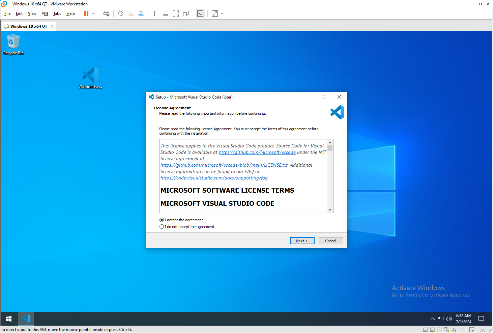

## 插件安装

先把CMake相关的插件装一下

第一个是CMake语言的支持插件，装了这个写CMakeLists.txt就有语法提示和高亮了。

```
Name: CMake
Id: twxs.cmake
Description: CMake langage support for Visual Studio Code
Version: 0.0.17
Publisher: twxs
VS Marketplace Link: https://marketplace.visualstudio.com/items?itemName=twxs.cmake
```

第二个是CMake插件，就是让VSCode支持打开和管理CMake项目用的

````
Name: CMake Tools
Id: ms-vscode.cmake-tools
Description: Extended CMake support in Visual Studio Code
Version: 1.18.42
Publisher: Microsoft
VS Marketplace Link: https://marketplace.visualstudio.com/items?itemName=ms-vscode.cmake-tools
````

> 像是等下会在左下角出现的编译、调试、测试按键，自动Config，侧边栏的CMake相关设置等等，都是这个插件提供的

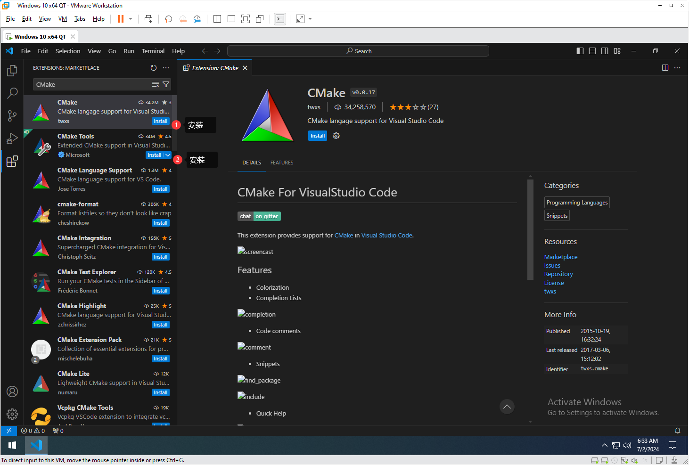

接下来安装C/C++相关的插件

第一个是C/C++语言支持插件，也就是LSP，就是提供一些语法提示，debug支持等功能的

```
Name: C/C++
Id: ms-vscode.cpptools
Description: C/C++ IntelliSense, debugging, and code browsing.
Version: 1.20.5
Publisher: Microsoft
VS Marketplace Link: https://marketplace.visualstudio.com/items?itemName=ms-vscode.cpptools
```

第二个具体功能忘了，不装有些关键功能会用不了，直接装就行了

```
Name: C/C++ Extension Pack
Id: ms-vscode.cpptools-extension-pack
Description: Popular extensions for C++ development in Visual Studio Code.
Version: 1.3.0
Publisher: Microsoft
VS Marketplace Link: https://marketplace.visualstudio.com/items?itemName=ms-vscode.cpptools-extension-pack
```

> 有些人喜欢用clangd，我个人不太喜欢，这边就用微软官方的C/C++插件了，如果你自己有需求的再去设置就好了。

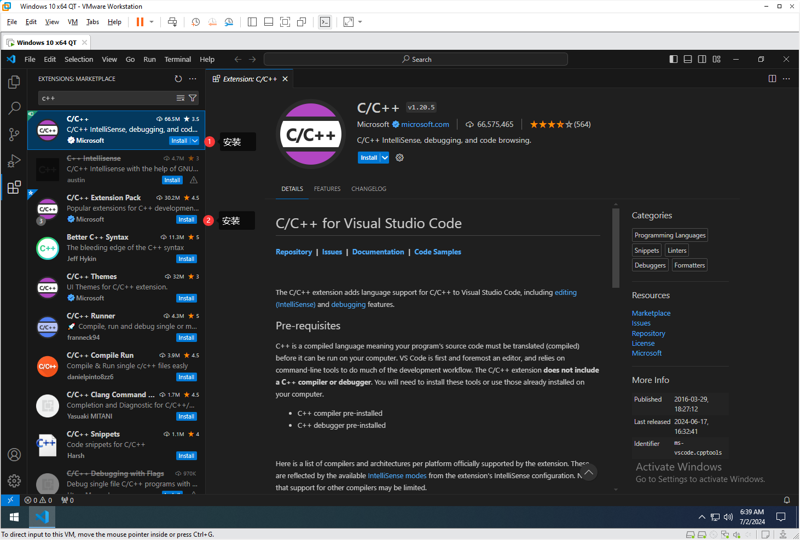

安装好后，应该有这五个插件

> 其实有一个是捆绑自动安装的，无所谓，不用理它。

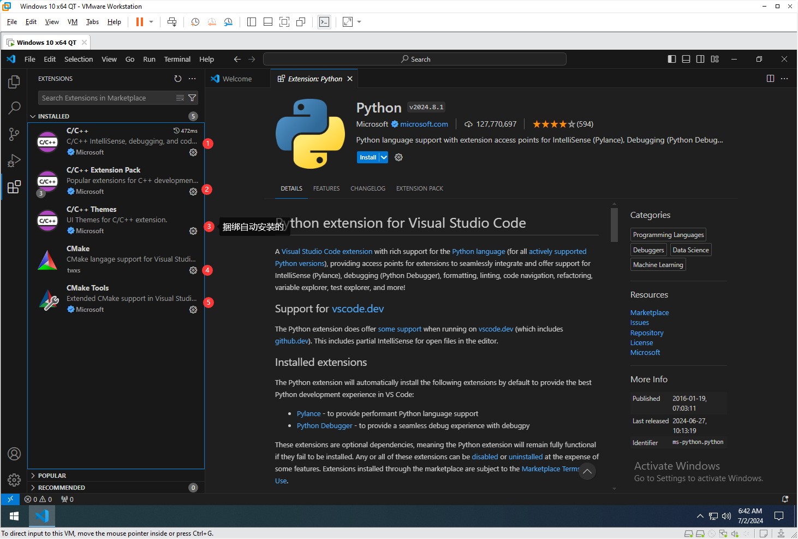


## 复制测试项目

好了，现在可以把测试项目复制过来了

> 不要把之前VS那个配置好的项目复制过来，后面会讲原因，直接去下载地址重新下一份放过来。


## 尝试打开项目

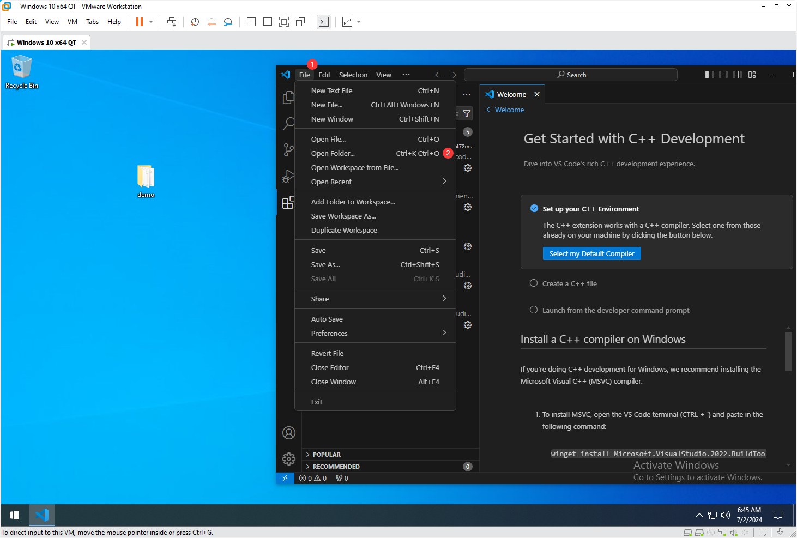

点击Open Folder，选择项目的文件夹

> 注意，一定要选择顶层CMakeLists.txt所在的文件夹，而不是上一级或下一级，这样CMake插件识别都有可能会有问题。

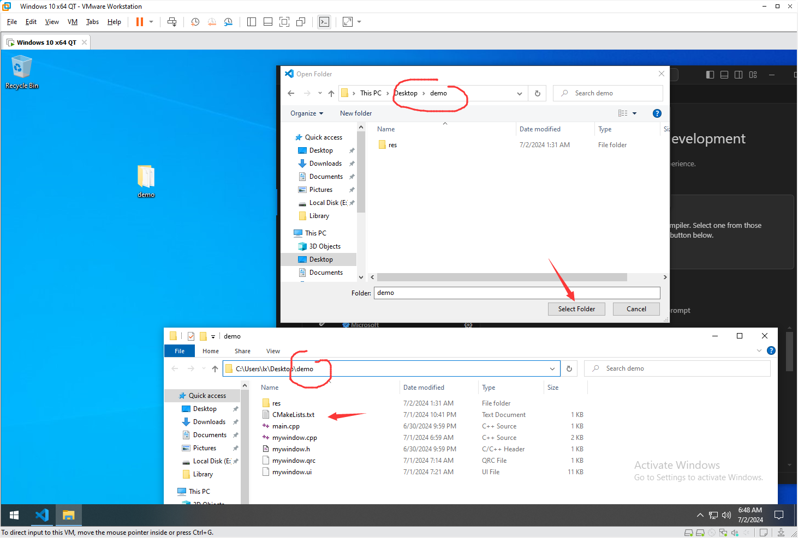

如果有安全警告，直接打勾，确认就行了

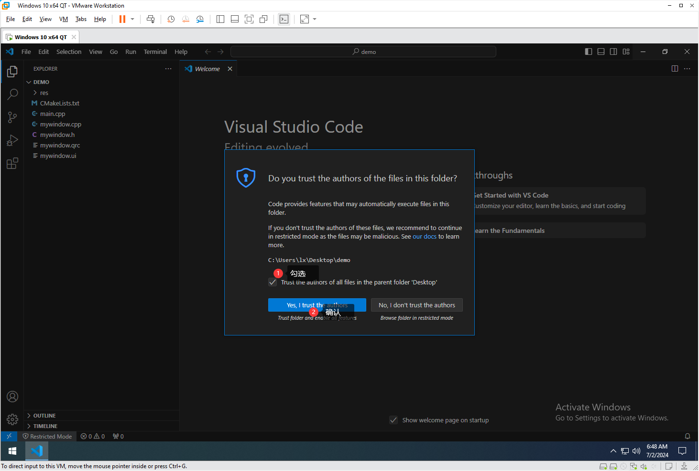

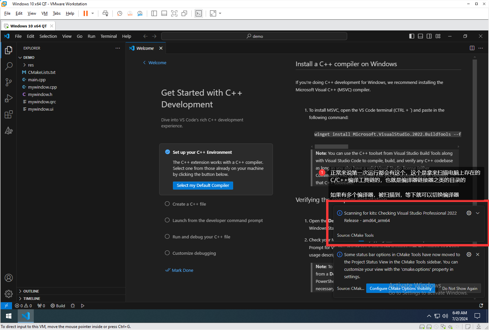


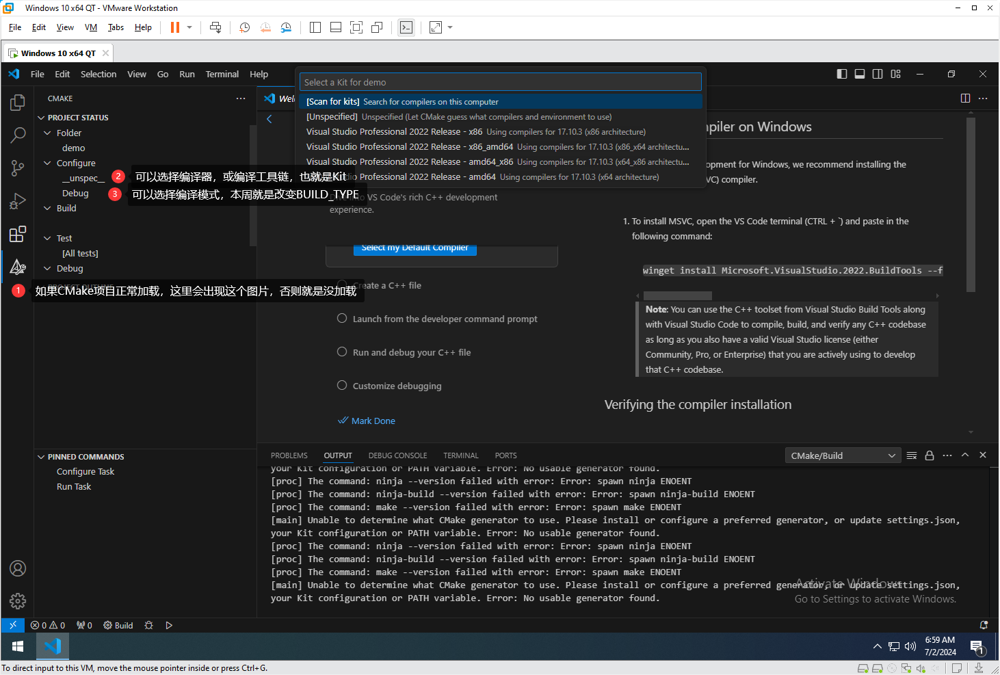


当然这里你随便选，只要是MSVC的编译器，都是不能编译的，即使是个hello world也编译不过去。

## 正确的打开方式

好了，先把刚刚的VSCode窗口关了吧。

再次打开上次我们编译的时候使用的`x64 Native Tools Command Prompt for VS 2022`

之前应该解释过了，这个其实就一个bat脚本，执行之前会配置很多和MSVC相关的环境变量

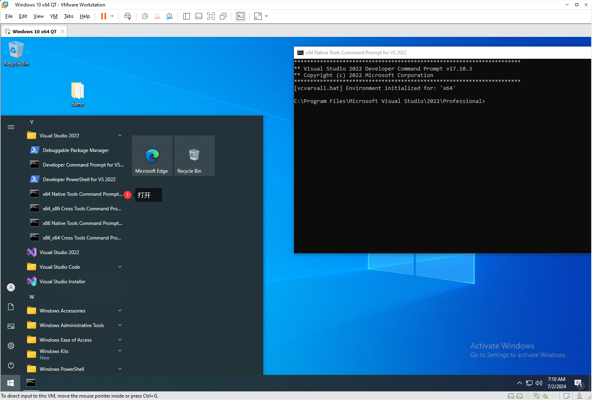

从这个cmd窗口启动vscode就可以把这些环境变量继承过来，这样就可以正常使用MSVC编译器了，其实也还有种方法可以达到差不多的目的，但最好就是用这个方法来做，（因为我踩过坑）

先加一个qt库到临时的path环境变量(VS配置那篇文章说了)

然后cd到项目的目录，然后code .来用vscode打开当前文件夹

> code其实就是vscode，点就是表示当前目录

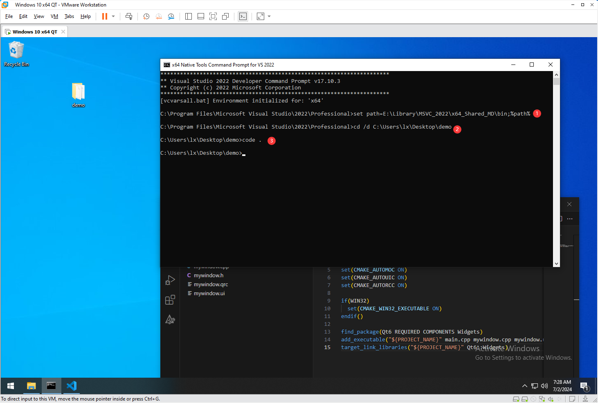

然后在vscode里找到CMakeLists.txt按一下CTRL+S会自动开始Config

一般提示Generating done就没什么问题了

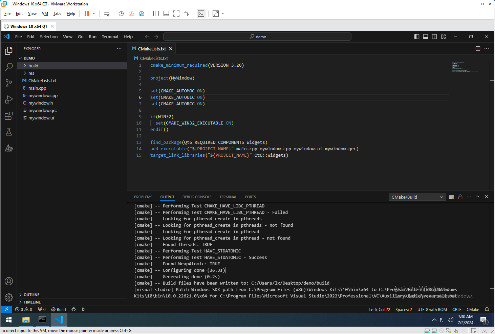

现在开始编译

> 默认应该是编译的x64 Debug，所以没必要选，如果不是，记得去侧边栏那个CMake图标里改一下，因为我们打开的是x64 Native的环境，不要去编译x32的东西。

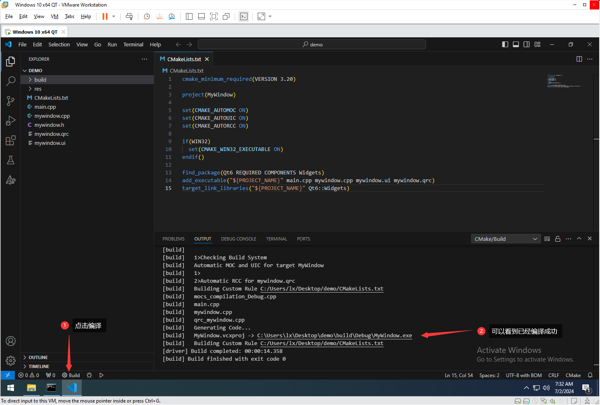

可以发现正常运行了

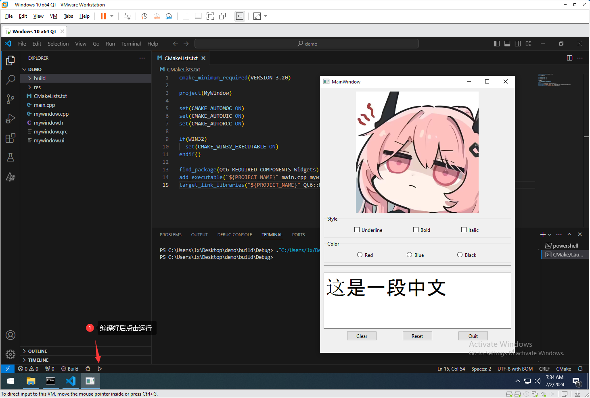

可以发现，步骤和VS没什么差别，就是要从`x64 Native Tools Command Prompt for VS 2022`启动，来继承一些MSVC的编译环境

接下来就是最后一个问题了，那就运行时的链接，现在是动态链接的运行时

之前VS我们是写在CMakePresets.json里面的，其实这里也可以用

直接把CMakePresets.json复制过来，

把build目录删一下（因为CMakePresets.json里把generator默认改成了Ninja）

然后重新打开VSCode就好了

现在就和VS一样了，可以选`x64 Release Static Runtime`了

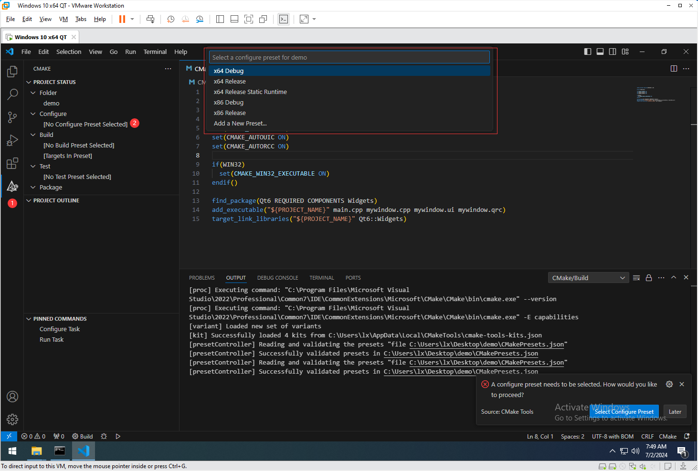

不过，现在你会发现，它不让你选编译器了，只能选在json里写的配置了，说实话我也没搞懂为什么这样设计，可能是它觉得，既然你都自己写Config了那就干脆都你自己搞好了（

CMakePresets.json本身就是CMake支持的，所以这里也可以使用，里面的内容其实不复杂，可以自己去看看，本质上来说就是把一堆CMake的set操作，写到了这个json里，不同的配置方案可以继承，可以写很多种配置方案，好处就是可以随便切换，不用在CMake里写if或-D参数，算是迈进了半现代化吧（，目前这个VS自动生成的，默认把编译器设置成了cl，也就是MSVC，要支持其它的编译器也不难，就是改那个cacheVariables就好了，改了后只要环境变量有对应的编译器工具链，CMake会自动配置，理想的情况，你可以为不同平台写不同的配置而不需要去改动CMakeLists.txt或很少改动，反正这东西还是挺好的，有兴趣可以自己再去了解一下、