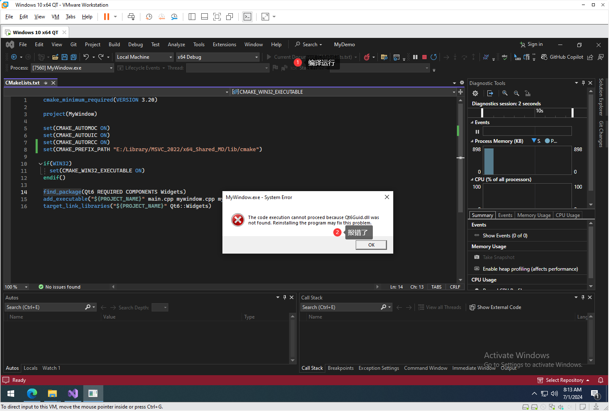
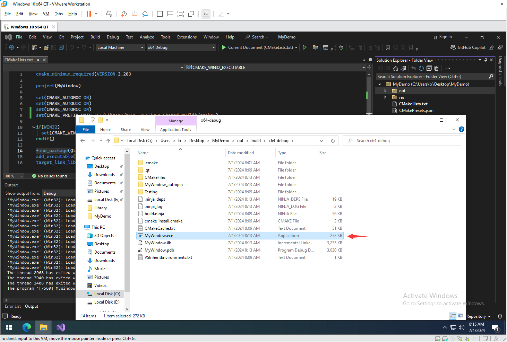
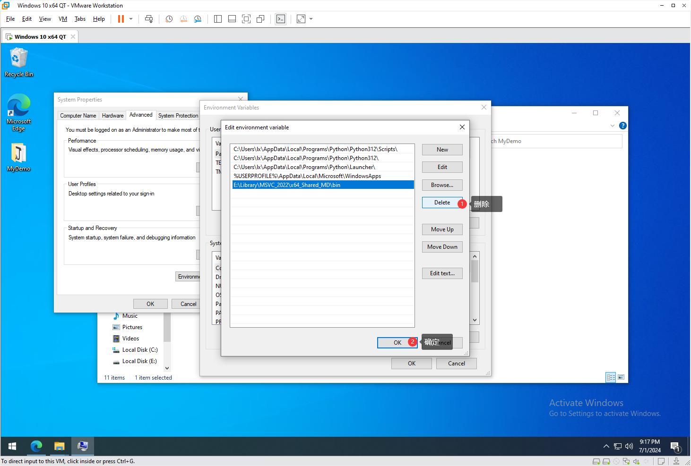
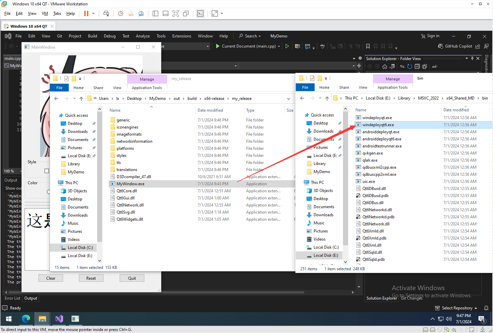

# QT6 CMake项目配置 (Visual Studio)

上一节已经编译好了动态和静态的QT库，接下来在CMake中引入。

这边主要介绍使用Visual Studio的配置方法


## 测试环境

首先使用VS创建一个项目来测试CMake能否正常使用。

如果是首次打开VS会有个配置主题的界面，自己选一下就好了

首先我们来创建一个CMake项目

打开VS后，选择`Create a new project`


选择CMake项目并创建


设置项目名称和路径


创建后稍微等一下，可以看到Output窗口提示完成，即CMake已经生成构建后端的项目文件


尝试运行，可以发现正常输出，说明环境没有问题。


接下来可以关闭VS了


## 复制测试项目

用文件管理器打开刚刚创建的项目的文件夹

删除除了CMakePresets.json以外的全部文件


为什么要留下CMakePresets.json？

其实是因为VS会识别CMakePresets.json里的配置信息，这样才可以在状态栏选择x64 Debug，x64 Release之类的模式。

> 如果没有CMakePresets.json，VS默认就只有个x64 Debug模式，这也是CMake默认没有设置BUILD_TYPE时的模式。
>
> 其实CMakePresets.json就和它的名字一样，就是预先设置了一些东西，比如BUILD_TYPE，Generator之类的，可以切换不同的配置，由于VS用它来识别构建类型，我们就留着，免得再去写了。
>
> 这里还有个坑，如果用VS打开没有CMakePresets.json这个文件的项目，当在VS上选构建类型时会发现只有个x64 Debug，所以你会选择管理配置，结果VS会给你加一个CMakeSettings.json，当然了CMakeSettings.json也没有什么不好，但微软自己都推荐用CMakePresets.json，所以就不要去折腾这东西了。


把测试项目复制进来，再次用VS打开


可以发现VS报错了，提示找不到QT6


## 链接库

好了现在的目标是让CMake能找到QT的库，为了让CMake能找到QT的库有好几种方法。

先来简单看一下测试项目的CMakeLists.txt

```cmake
// 设置版本要求
cmake_minimum_required(VERSION 3.20)

// 设置项目名
project(MyWindow)

set(CMAKE_AUTOMOC ON) // 自动调用MOC来转换文件
set(CMAKE_AUTOUIC ON) // 自动调用UIC来转换文件
set(CMAKE_AUTORCC ON) // 自动调用RCC来转换文件

// 这里的作用是让CMKAE把入口点改成WinMain，
// 因为以main为入口点在Windows上被视为控制台程序，
// 会自动打开一个控制台窗口，而GUI程序以WinMain为入口点，不会自动分配控制台窗口
if(WIN32)
  set(CMAKE_WIN32_EXECUTABLE ON)
endif()

// 添加Qt6中的Widgets模块
// 原理是找Qt6Config.cmake或qt6-config.cmake来配置QT库，
// 我们什么都没设置肯定是找不到的
find_package(Qt6 REQUIRED COMPONENTS Widgets)
// 添加可执行程序
add_executable("${PROJECT_NAME}" main.cpp mywindow.cpp mywindow.ui mywindow.qrc)
// 链接Widgets模块
target_link_libraries("${PROJECT_NAME}" Qt6::Widgets)
```

现在我们应该知道了，最主要的目标是让 `find_package(Qt6 REQUIRED COMPONENTS Widgets)`这行有效，也就是能找到Qt6Config.cmake或qt6-config.cmake文件。


### 方法1: 设置CMAKE_PREFIX_PATH

**这个方法的核心就是通过设置CMAKE_PREFIX_PATH来添加Findxxx.cmake文件的搜索路径。**

如下图，添加这行代码即可

```cmake
set(CMAKE_PREFIX_PATH "E:\Library\MSVC_2022\x64_Shared_MD\lib\cmake")
```

库的路径是我们上一节编译的，具体依据自己库的位置来设置，**注意Windows路径的斜杠要换**。

> 在lib目录下有个cmake目录，把CMAKE_PREFIX_PATH设置到这个路径即可，如果我们查了这个路径下的文件，就可以发现，里面基本都是FindXXX.cmake的这种文件，这种文件就是供find_package用来找库的。


添加完代码按CTRL+S，CMake就会自动开始Config。

如果CMake Config没有问题，就可以直接点击绿色按钮，编译运行看看，发现正常编译，但运行出错了。

这里的提示是没找到Qt6XXX.dll的动态库，不对吧？我们不是编译了动态库的文件？为什么没找到？



打开out/build目录看看，可以发现就只有孤零零的一个exe文件，其它dll文件呢？



再次打开上次编译的动态库的目录，发现刚刚提示没找到的dll文件都在这里

难道要全部复制过来？如果全部复制过去，发现确实运行了，或换一个思路

把MyWindow.exe复制到bin目录，双击，发现正常运行了

> 字体是因为英文环境没微软雅黑所以显示有点问题


不过这样就有点难蚌了，要么得把这一大堆东西复制过来，要么得每次编译后把exe复制过去，这也太难受了。

当然如果上网搜索，可以知道，qt官方有个工具能把所有的dll自动复制过来

这个东西叫 windeployqt.exe，在bin目录下就有

只需要把MyWindow.exe直接拽到windeployqt.exe上就可以把依赖的dll复制过来了。


这个工具似乎也还不错，解决了手动复制的问题，也许用CMake写一个脚本，每次执行一下命令就可以完成拷贝dll了。

到目前为止，似乎已经配置好了CMake的环境，至少是能用了吧，但就是有那么点破破烂烂的感觉。

首先看CMakeLists.txt

有一个硬编码的路径，如果把项目发给别人，那人的QT库路径和我们一样吗？很难说

那就叫他改呗！

也是个不错的办法，前提是你告诉它在哪改，当然这个CMakeLists.txt没几行，一眼就知道在哪改了，如果有几千行怎么办？

而且当打算用windeployqt来解决刚刚找不到dll的问题的时候，又会出现新的硬编码路径，那就是windeployqt的路径

这下把项目发给别人居然要改两个地方了！

这种方法显然是有点不太合适的


### 方法2: 添加Path

**这个方法的核心就是把qt库下的bin目录的路径添加的系统环境变量Path里，这样CMake就可以自动找到qt库，并且编译的exe可以自动找到需要的dll，而不至于提示找不到dll。**

那没有用一种方法可以解决这个问题？还真有

首先把刚刚添加的这个代码删了

```cmake
set(CMAKE_PREFIX_PATH "E:/Library/MSVC_2022/x64_Shared_MD/lib/cmake")
```

build目录刚刚复制过来的一堆东西也可以删了

然后VS关了

打开系统属性

把QT库的bin目录加到Path里


再次用VS打开项目

可以发现这次可以直接找到QT库了

直接编译一下，也正常


可以发现正常运行了

这个方法似乎比刚刚的那个好多了，只要加一个Path环境变量，也没有硬编码路径

如果把项目发给别人，也只需要在Path里把QT库的bin路径加一下就好了。

但这又引入了一个问题，这里修改的Path是全局的，如果想换库呢？

比如现在用的动态库，想换成静态的库怎么办？想换QT版本怎么办？

只能修改Path了，但Path又是全局的，会影响别的程序

这似乎不是一个很好的方案，除非你只用一个QT库


### 方法3: 临时Path

**这个方法的核心思想就是临时修改当前进程的环境变量Path，并且通过子进程继承环境变量，来达到和修改系统环境变量一样的效果**

如果我们知道这样一个概念

即 可以用过`set xxx=ccc`来设置临时的环境变量，而不会写入系统的环境变量。

那么只需要打开一个控制台窗口，设置临时path，然后运行相应的程序，就会继承当前设置的临时环境变量

这样就不需要去改系统的path环境变量了。

> 每次打开一个cmd窗口，先通过set来设置临时的环境变量，即把qt库的bin路径设置进临时的Path环境变量，设置好后这个cmd窗口的进程就有了能正确找到qt库的环境变量了，而且只是在当前进程修改了环境变量，并不会写入的系统，也不会影响其它进程，当然这是临时的，所以如果关闭这个cmd窗口，那么下次打开也还需要手动设置一下。
>

设置环境变量后，一定要从这个cmd窗口启动VS才能继承刚刚设置的临时环境变量，而且VS再去启动CMake进程，也会继承这个环境变量，这也就使得CMake可以找到qt库。

现在关闭VS，然后顺便把CMake生成的Config文件也删了（都在out文件夹里）


然后之前设置的全局的系统环境变量Path也删了



如果现在使用VS打开项目，肯定是找不到qt库的

现在打开一个cmd窗口

用set命令来设置临时环境变量

> Powershell的命令不一样，自行查阅
>

```shell
> set path=E:\Library\MSVC_2022\x64_Shared_MD\bin;%path%
```

`%path%` 表示当前的path环境变量的值，这行命令的意思也就是把当前path环境变量的值前面加上qt库bin目录的路径

> 注意要用分号隔开
>

加好了之后可以用

```shell
> echo %path%
```

来打印一下path环境变量的信息

可以发现，已经成功添加了


而且也不会影响系统的环境变量


好了，现在必须在这个cmd窗口启动VS才能继承这个临时的环境变量

如果直接从开始菜单打开VS，那依旧是使用系统的环境变量，肯定是找不到qt的

那么要如何在cmd窗口启动VS呢？

很简单，直接输入

```shell
> start devenv
```


当然也可以在后面加项目的路径，让VS直接打开项目

```shell
> start devenv "C:\Users\lx\Desktop\MyDemo"
```

可以发现成功打开了项目，并且CMake的Config也是正常的，说明已经找到qt库了


其实这个命令可以再简化一下

可以先cd到项目的目录

```shell
> set path=E:\Library\MSVC_2022\x64_Shared_MD\bin;%path%
> start devenv .
```

也就是使用点来表示当前路径


还可以把指令存到一个bat文件里，下次双击就可以运行了。

这里就准备了两个bat脚本，一个用来设置动态编译的qt库，另一个用来设置静态编译的qt库

`Open_VS_With_Static_QT .bat`

```shell
set path=E:\Library\MSVC_2022\x64_Static_Release_MT\bin;%path%
start devenv .
pause
```

`Open_VS_With_Shared_QT.bat`

```shell
set path=E:\Library\MSVC_2022\x64_Shared_MD\bin;%path%
start devenv .
pause
```

可以在最后加一个`pause`防止cmd窗口自动退出，以免有报错信息没看到。


先执行`Open_VS_With_Shared_QT.bat`看看效果


没有问题，debug模式成功编译，并且可以通过VS直接运行


Release模式也正常


但如果去out文件夹找编译好的exe，直接运行，发现是不行的

因为直接运行并不会继承刚刚设置的临时环境变量


这个时候要是想发布程序，那很简单，

只需要和之前一样把程序拉到windeployqt6.exe上就会把依赖文件都复制过来

这样就可以直接发布了



当然还有另一种单文件发布的方法，那就用之前编译的静态库

先关闭VS，并把out文件夹删了

> 不删的话，CMake即使重新Config，缓存里也还是之前的配置信息，当然也有办法不用全删的，大多数时候，只要把CMakeCache.txt删了就可以了，但为了保险起见，最好全删了，因为有时候没删会有莫名其妙的问题
>

执行`Open_VS_With_Static_QT .bat`

然后把构建的模式选`x64 Release`，因为我们编译的只有Release版的静态库

如果打开VS后没有自动Config，那就在侧边栏选择CMakeLists.txt并打开

> 我们这个项目只有一个，如果有多个，就找最顶层的那个CMakeLists.txt

按一下CTRL+S，就会开始Config了

Config好后，直接编译，发现一堆报错


看报错信息就会发现，它提示Runtime不匹配

这个是因为之前编译静态库的时候打开了`-static-runtime`，也就是把VC的runtime静态编译了

> 默认是动态链接vcruntime的，也就是它会去找vcruntime的dll，这就要求用户电脑装了vcruntime才能启动程序
>
> 如果使用静态编译runtime的话，就不会有这个问题
>

现在把当前项目的runtime链接方式改一下

只需要在CMakeLists.txt加一行

```cmake
set(CMAKE_MSVC_RUNTIME_LIBRARY MultiThreaded)
```

> 要注意的是CMAKE_MSVC_RUNTIME_LIBRARY只有在cmake要求 >= 3.15的版本才有，我这里设置的是3.20所以可以直接用
>
> https://cmake.org/cmake/help/latest/variable/CMAKE_MSVC_RUNTIME_LIBRARY.html
>
> 如果设置的cmake要求版本是3.8这种，是没办法直接用的，要通过policy `CMP0091` 来启用新版本的工具，具体可以去查阅资料。
>


好了，到这就已经成功了，不过这样似乎不太合理

因为`set(CMAKE_MSVC_RUNTIME_LIBRARY MultiThreaded)`

在debug模式下也会生效啊

在使用动态库的时候也会生效啊

这样会拖慢编译速度

首先来解决在debug模式下也会静态编译runtime的问题，这个很简单，加if就好了

```cmake
if(MSVC)
    if(CMAKE_BUILD_TYPE STREQUAL "Release")
    	set(CMAKE_MSVC_RUNTIME_LIBRARY MultiThreaded)
    endif()
endif()
```

重新删除out文件夹，编译，没问题


不过还是有问题的，如果用动态库的qt库，使用release模式依旧会链接静态的VC运行时

> 不过这个好像也不是什么大问题，甚至是好处，因为如果采用动态发布，一般会把qt的dll都复制过去
>
> 但如果用户电脑上没装vc的runtime，依旧是跑不起来的，但静态编译runtime那就没这个问题
>

换成动态的qt库在release模式下编译看看，发现exe确实大了不少


如果真的不想要在动态链接的时候编译静态的vcruntime，那么要怎么办呢？

其实有个更简单的方法，还记得之前那个`CMakePresets.json`文件吗？

这个json文件里面的模式正是和VS上状态栏选择的模式对应的

能不能加一个`x64 Release Static Runtime`模式？完全可以


添加

```
    {
      "name": "x64-release-static-runtime",
      "displayName": "x64 Release Static Runtime",
      "inherits": "x64-debug",
      "cacheVariables": {
        "CMAKE_BUILD_TYPE": "Release",
        "CMAKE_MSVC_RUNTIME_LIBRARY": "MultiThreaded"
      }
    },
```

实际上就是把set(CMAKE_MSVC_RUNTIME_LIBRARY)写到了这个json文件而已

CMakeLists.txt那边的set(CMAKE_MSVC_RUNTIME_LIBRARY)就可以删了


可以发现，现在VS就可以选择这个刚刚添加的模式了


build目录下也会多出来这个模式的文件夹


这样就可以非常方便的切换release模式下vc runtime 的动态/静态链接了

好了，至此VS的配置就讲完了

通过临时环境变量+CMakePresets.json的方式，不用改CMakeLists.txt就可以非常方便的引入QT库和切换版本

不过这个方法还是存在一个问题，那就切换不同QT库的时候要把项目关了，虽然也是有方法可以直接切换，那就是再次修改环境变量，因为环境变量有优先级，可以把需要用到的库的路径覆盖掉之前的（没找到好的方法能直接删除临时Path中某一项，或直接还原的），但总的来说不推荐这样，还是推荐关了项目重新打开
