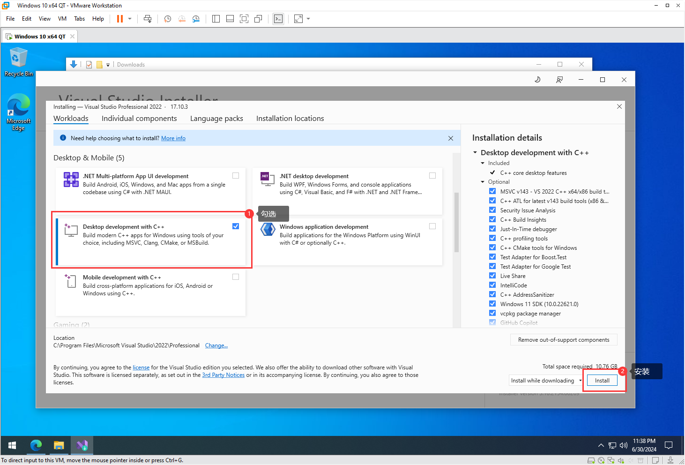
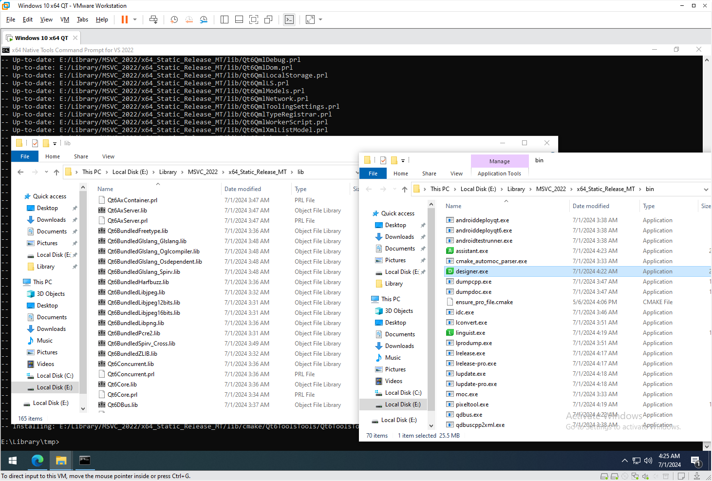

# QT6.7.2 MSVC源码编译 静态库 动态库 

也可以参考官方的文档 https://doc.qt.io/qt-6/build-sources.html

## 环境搭建

为了操作更有可复制性，这里在虚拟机中采用全新安装的系统进行配置。

*系统镜像为*：`en-us_windows_10_enterprise_ltsc_2021_x64_dvd_d289cf96_2.iso`

### 安装 Visual Studio 2022

https://visualstudio.microsoft.com/downloads/

个人用就下个`Professional`版，公司用就自己掂量一下了。


下好后找到`VisualStudioSetup.exe`打开

打开后把`Desktop development with C++`勾上就行了

> 勾上后默认安装MSVC编译器，CMake支持等，反正就是配置正常的C++开发环境
>



安装好后其实基本环境就有
在开始菜单找到 `Visual Studio 2022 /  x64 Native Tools Command Prompt for VS 2022` 点击运行

> 这其实是一个bat脚本，用于初始化一些MSVC的编译环境，点击运行后会打开一个cmd窗口，在这个窗口打开的程序会继承一些环境变量，这对于使用MSVC进行编译很重要。比如在VSCode中使用MSVC编译就需要在这个CMD窗口里启动VSCode，才能获得MSVC需要的编译环境（实际上就是设置了一些环境变量）。当然这启动的是64位的环境，如果需要编译32位的，则运行 `x86 Native Tools Command Prompt for VS 2022`

  

在CMD窗口依次输入

```shell
where ninja
where cmake
where python
```

可以查看环境中是否存在`ninja`和`cmake`，这两个是编译QT6所需要的。

> cmake是meta构建工具，有点类似于C++里模板的概念，它本身不构建项目，而是生成构建后端的项目文件，这个后端也叫generator，比如后端是make，则cmake生成makefile，后端是vs，则生成sln项目，之后再使用make或vs去编译。qt官方要求使用的构建后端是ninja，所以等下cmake会生成ninja的项目文件，通过ninja来调用msvc编译器，从而编译qt源码。当然这个generator也是可以换了，不一定必须要ninja。

从图中可以看到，缺少python环境。


去python官方下载安装包 https://www.python.org/

> 有些地区由于网络问题，会很慢


记得把`Add python.exe to PATH`勾上，然后安装。

> 不勾的话，就会造成找不到python的情况


安装好python后，把刚刚的CMD窗口关了，重新从开始菜单打开。

> 不重新打开的话，环境变量不会刷新，依旧找不到python，当然你要有办法刷新环境变量也可以


重新检查一下 cmake，ninja，python

```
cmake --version
ninja --version
python --version
```

可以发现都显示出了对应的版本号，再去qt官方对一下版本要求，如果都符合就可以了。


## 下载源码

条件允许的话可以直接从官方下载，当然镜像也可以

https://download.qt.io/

https://mirrors.nju.edu.cn/qt/

在 `official_releases/qt/6.7/6.7.2/single/` 找到`qt-everywhere-src-6.7.2.zip`下载即可

> single的话就是下载所有的源码，当然也可以下载单独的一个模块，也就是从submodules文件夹下找，
>
> 但如果下载单独的模块就会有依赖问题，因为单独的模块可能依赖其它模块，所以还要处理依赖，
>
> 我们常用的widget，core其实都是在qtbase模块里，如果只是使用widget进行开发，单独编译这个就够了，
>
> 这个模块没有其它依赖，毕竟base嘛（，但一般我们还需要用到designer，designer是在qttools模块里，
>
> 这个模块有一些其它的依赖，单独是没办法编译的，所以为了省事，我们把全部源码都下了，到时候可以选择需要的模块进行编译。


## 存放源码

下载源码zip压缩包后，需要找个地方存放，最好是找固定的位置放，以后编译出来qt库也放在一起。

> 这样的目的是因为在编译debug版的时会产生pdb文件，pdb文件中描述了源码在什么位置，有了这个信息就可以源码调试qt的库，当然如果没有这个需求，那编译好后的文件就可以随便挪动，源码也可以删了。如果是编译不带调试符号的release版的话，也是一样，没有固定位置的需要。

我这里就放在到`E`盘的`Library`目录下，同时解压源码。

> 解压可能很慢，推荐装一个7zip来解压

```
E:.
└───Library
    ├───src
    │   │   qt-everywhere-src-6.7.2.zip
    │   │
    │   └───qt-everywhere-src-6.7.2
    │		├───cmake
    │		├───qtbase
    │		....
    │
    └───tmp
```

`Library`文件夹下有两个目录，`src`和`tmp`，`src`用于存放源码，`tmp`充当编译的临时目录，编译完成后可以删除。

`src`目录里放了源码的zip文件，和一个源码解压后的文件夹

> 硬盘可用空间最好有60G以上


## 编译源码

在源码解压后的目录下有个`configure.bat`脚本，这个脚本会利用`cmake`生成`ninja`的项目文件，有了`ninja`的项目文件，我们就可以编译了。

> 但这个脚本默认把项目文件生成在当前目录下，如果直接在源码目录执行，那么生成的ninja项目文件会和源码混在一起，当然如果你编译完后就把源码删了那也许可以这样（没试过），所以我们需要一个tmp目录来存放生成的项目文件，编译完成安装库后就可以把这个ninja项目的临时文件删了。

回到`x64 Native Tools Command Prompt for VS 2022`的CMD窗口，切换目录到刚刚创建的`tmp`文件夹

```
> cd /d E:\Library\tmp
```


现在就可以执行`configure.bat`脚本来生成ninja项目文件了，但`configure.bat`脚本并不在当前目录下，那怎么办呢？

可以使用`../`来表示上一级路径，这样就可以表示出`configure.bat`脚本的路径了，

> 如果直接输入`configure.bat`脚本的全路径应该也可以

下面就表示了`configure.bat`脚本的路径

```shell
"../src/qt-everywhere-src-6.7.2/configure.bat"
```

> 为什么要用引号括起来？当然这里其实可以不用，但如果路径中有空格就需要了

先不急着执行这个脚本，先看看帮助信息

```shell
"../src/qt-everywhere-src-6.7.2/configure.bat" --help
```

> 如果直接执行configure.bat就是用默认的配置生成构建项目文件，但我们可以加一些参数来改变生成的构建项目的参数，比如我们想要同时编译debug和release版，或只想编译某一个模块，或只想编译静态库，或只想用静态运行时等。之所以叫configure.bat当然是因为能config啊（

下面是我们需要用到的几个参数

`-static` 编译静态库
`-static-runtime` 使用静态运行时（MD）
`-debug-and-release` 同时编译release版和debug版
`-release` Release模式编译
`--prefix` 编译后库的安装位置
`-submodules` 选择要编译的模块

> 这里选择编译了qtbase和qttools模块，正常widget开发够用，如果要安装别的模块可以用逗号隔开，要安装所有就把这个指令删了（-submodules qtbase,qttools），qbase主要包括widgets，gui，core这些，qttools主要是为了编译designer


### 编译动态库

下面我们通过组合参数来编译动态库，也就是把库编译成dll，主要用于在开发阶段使用，因为动态库链接速度快（只需要导入个函数就行了），所以为了开发阶段快速编译，一般都是采用动态库（当然如果是闭源软件，那为了不被qt发函，最好也用动态库）

```shell
"../src/qt-everywhere-src-6.7.2/configure.bat" -debug-and-release --prefix="../MSVC_2022/x64_Shared_MD" -submodules qtbase,qttools
```

`-debug-and-release` 同时编译debug和release版，如果不需要debug版，改成`-release`即可

`--prefix="../MSVC_2022/x64_Shared_MD"` 表示等下编译完成后安装的目录，也就是当前目录的上一级目录下的`MSVC_2022/x64_Shared_MD`文件夹，说是安装其实就是把库的头文件，动态库，cmake配置文件复制出来

`-submodules qtbase,qttools` 这里表示要编译两个模块，`qbase`一般都需要，`qttools`主要是因为`designer`在里面，如果你不需要`designer`就可以删了这个，写成这样 `-submodules qtbase`，当然如果你想编译全部源码，那直接把`-submodules qtbase,qttools`整个删了就好了，默认是编译全部的。

> 当然你也可以加一些别的指令，比如skip跳过某些组件的编译，具体可以看help
>

执行命令后会开始配置

> 其实看命令行也知道，configure.bat的作用就是依据参数，去设置cmake的编译参数，也可以自己手动配置cmake的编译参数达到一样的效果，但大可不必，毕竟它都帮你写好了。
>


执行完成后就可以看到`tmp`目录下有一堆文件了


如果`config`成功，最后会提示你如何编译、如何安装

> 这里的编译和安装命令可能会依据配置情况，会有所不同，所以一定要看提示。

这里提示使用`cmake --build . --parallel`进行编译，那么直接执行这个指令就好了，接下来就是耐心等待了，注意硬盘可用空间。


编译过程中有一些警告很正常，只要不是error就可以。

编译完成后执行 `ninja install` 来安装库

> 按照提示来执行，也有可能不是这个命令


安装好后查看`Libaray`文件夹下多出来了个`MSVC_2022`文件夹里面有个`x64_Shared_MD`文件夹


进入`bin`目录，可以发现`pdb`符号和后缀为`d`的`debug`动态库都有了


至此动态库编译完成


### 编译静态库

步骤差不多，先把`tmp`目录清空

> 记得清空tmp目录


确认一下，CMD当前目录是在`tmp`里，如果不是请`cd`到`tmp`目录。


执行以下指令

```
"../src/qt-everywhere-src-6.7.2/configure.bat" -static -static-runtime -release --prefix="../MSVC_2022/x64_Static_Release_MT" -submodules qtbase,qttools
```

`-static` 表示编译静态库

`-static-runtime` 表示使用静态的VC运行时（就是把VC的运行时编译进exe，这样就不会出现在一些电脑上找不到运行时情况了）

`-release` Release模式编译

> 如果加了-static-runtime，编译我们自己项目的时候release要设置MT编译参数，否则可能会链接出错。debug则要设置MTd编译参数，当然一般没人debug都静态编译，因为静态编译比较慢。
>
> 也可以把-static-runtime删了，这样就不需要额外设置MD编译参数了，但这样只有qt的库是静态编译的，当然编译出来确实是一个exe单文件，但这个exe还是依赖vc的运行时dll的，如果电脑上没有安装vc的运行时，也是没办法运行的，所以为了一`静`到底，干脆也把vc的运行时静态编译进去exe了。

执行指令后等待`Config`


仔细阅读提示，发现编译命令和之前一样，但安装命令变了

> 仔细看的话还有个警告，说QDoc不会编译，和clang有关，需要配置clang，这个的话我们这边不关心，有需要的话可以在官方进一步了解
>


直接执行编译命令即可


编译好后执行安装


安装后`MSVC_2022`下就多出来了一个文件夹`x64_Static_Release_MT`



至此静态库的编译也完成了

> 用MSVC2022编译的库，不要给MinGW用，也不要给GCC之类的用，而且也不要去换MSVC的版本，如果要换编译器或换版本，就全部都换掉，然后重新编译。


记得把`tmp`目录删了，这东西很大，编译好，安装后一般就没用了

src源码目录，看自己情况，如果你需要qt源码调试，就留着，因为符号文件pdb里的路径是指向这些源码文件的，如果不需要就删了。
