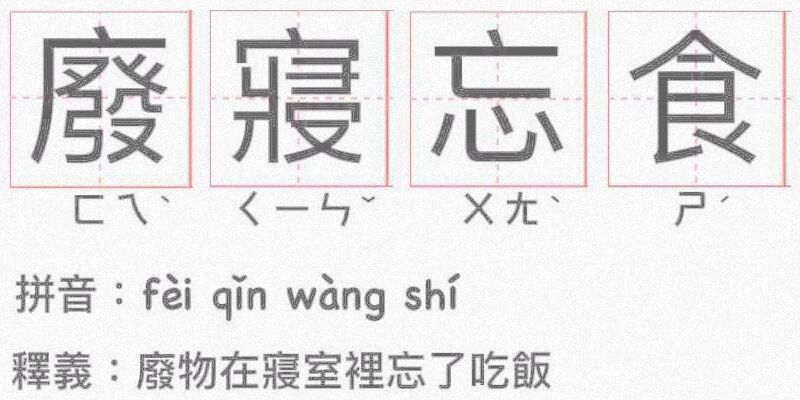

# Dir-A_Essays_MD
自己的一点感悟  
有对有错，自行斟酌  
欢迎提issues pr 修正完善  

# 目录

## 提高姿势水平！
你们啊，毕竟还 "too young too simple sometimes naive" 还是需要学习一个！提高姿势水平！口-口

## 引擎逆向
Galgame引擎逆向的皮毛┗( T﹏T )┛

### YU-RIS 引擎
使用该引擎的会社:
| 标题 | 日期 |
| :-----: | :-----: |
| [免封包处理](https://github.com/Dir-A/Dir-A_Essays_MD/blob/main/%E5%BC%95%E6%93%8E%E9%80%86%E5%90%91/YU-RIS/%5BYU-RIS%5D%20%E5%85%8D%E5%B0%81%E5%8C%85%E5%A4%84%E7%90%86.md) | |
| [寻找脚本密钥](https://github.com/Dir-A/Dir-A_Essays_MD/blob/main/%E5%BC%95%E6%93%8E%E9%80%86%E5%90%91/YU-RIS/%5BYU-RIS%5D%20%E5%AF%BB%E6%89%BE%E8%84%9A%E6%9C%AC%E5%AF%86%E9%92%A5.md) | |
| [编码范围](https://github.com/Dir-A/Dir-A_Essays_MD/blob/main/%E5%BC%95%E6%93%8E%E9%80%86%E5%90%91/YU-RIS/%5BYU-RIS%5D%20%E7%BC%96%E7%A0%81%E8%8C%83%E5%9B%B4.md) | |
| [Whirlpool社的一些观察](https://github.com/Dir-A/Dir-A_Essays_MD/blob/main/%E5%BC%95%E6%93%8E%E9%80%86%E5%90%91/YU-RIS/%5BYU-RIS%5D%20Whirlpool%E7%A4%BE%E7%9A%84%E4%B8%80%E4%BA%9B%E8%A7%82%E5%AF%9F.md) | |
| [无法直接运行的解决方法](https://github.com/Dir-A/Dir-A_Essays_MD/blob/main/%E5%BC%95%E6%93%8E%E9%80%86%E5%90%91/YU-RIS/%5BYU-RIS%5D%20%E6%97%A0%E6%B3%95%E7%9B%B4%E6%8E%A5%E8%BF%90%E8%A1%8C%E7%9A%84%E8%A7%A3%E5%86%B3%E6%96%B9%E6%B3%95.md) | |
| [收费组补丁破解之Kiss&Crisis](https://github.com/Dir-A/Dir-A_Essays_MD/blob/main/%E5%BC%95%E6%93%8E%E9%80%86%E5%90%91/YU-RIS/%5BYU-RIS%5D%20%E6%94%B6%E8%B4%B9%E7%BB%84%E8%A1%A5%E4%B8%81%E7%A0%B4%E8%A7%A3%E4%B9%8BKiss%26Crisis.md) | |
| [收费组补丁破解之ペトリコール](https://github.com/Dir-A/Dir-A_Essays_MD/blob/main/%E5%BC%95%E6%93%8E%E9%80%86%E5%90%91/YU-RIS/%5BYU-RIS%5D%20%E6%94%B6%E8%B4%B9%E7%BB%84%E8%A1%A5%E4%B8%81%E7%A0%B4%E8%A7%A3%E4%B9%8B%E3%83%9A%E3%83%88%E3%83%AA%E3%82%B3%E3%83%BC%E3%83%AB.md) | |
| [SDK编译器调用](https://github.com/Dir-A/Dir-A_Essays_MD/blob/main/%E5%BC%95%E6%93%8E%E9%80%86%E5%90%91/YU-RIS/%5BYU-RIS%5D%20SDK%E7%BC%96%E8%AF%91%E5%99%A8%E8%B0%83%E7%94%A8.md) | 2023年6月23日 |

### ACV1 引擎
使用该引擎的会社:
| 标题 | 日期 |
| :-----: | :-----: |
| [寻找Script封包密钥](https://github.com/Dir-A/Dir-A_Essays_MD/blob/main/%E5%BC%95%E6%93%8E%E9%80%86%E5%90%91/ACV1/%5BACV1%5D%20%E5%AF%BB%E6%89%BEScript%E5%B0%81%E5%8C%85%E5%AF%86%E9%92%A5.md) | |
| [寻找ScriptHook地址](https://github.com/Dir-A/Dir-A_Essays_MD/blob/main/%E5%BC%95%E6%93%8E%E9%80%86%E5%90%91/ACV1/%5BACV1%5D%20%E5%AF%BB%E6%89%BEScriptHook%E5%9C%B0%E5%9D%80.md) | |
| [脚本处理 导入](https://github.com/Dir-A/Dir-A_Essays_MD/blob/main/%E5%BC%95%E6%93%8E%E9%80%86%E5%90%91/ACV1/%5BACV1%5D%20%E8%84%9A%E6%9C%AC%E5%A4%84%E7%90%86%20%E5%AF%BC%E5%85%A5.md) | |
| [脚本处理 导出](https://github.com/Dir-A/Dir-A_Essays_MD/blob/main/%E5%BC%95%E6%93%8E%E9%80%86%E5%90%91/ACV1/%5BACV1%5D%20%E8%84%9A%E6%9C%AC%E5%A4%84%E7%90%86%20%E5%AF%BC%E5%87%BA.md) | |

### Malie 引擎
使用该引擎的会社:
| 标题 | 日期 |
| :-----: | :-----: |
| [寻找密钥 P1](https://github.com/Dir-A/Dir-A_Essays_MD/blob/main/%E5%BC%95%E6%93%8E%E9%80%86%E5%90%91/Malie/%5BMalie%5D%20%E5%AF%BB%E6%89%BE%E5%AF%86%E9%92%A5%20P1.md) | |
| [寻找密钥 P2](https://github.com/Dir-A/Dir-A_Essays_MD/blob/main/%E5%BC%95%E6%93%8E%E9%80%86%E5%90%91/Malie/%5BMalie%5D%20%E5%AF%BB%E6%89%BE%E5%AF%86%E9%92%A5%20P2.md) | |

### CMVS 引擎
使用该引擎的会社:
| 标题 | 日期 |
| :-----: | :-----: |
| [紫社引擎 折腾日记 Purple software](https://github.com/Dir-A/Dir-A_Essays_MD/blob/main/%E5%BC%95%E6%93%8E%E9%80%86%E5%90%91/CMVS/%5BCMVS%5D%20%E7%B4%AB%E7%A4%BE%E5%BC%95%E6%93%8E%20%E6%8A%98%E8%85%BE%E6%97%A5%E8%AE%B0%20Purple%20software.md) | |

### QLIE 引擎
使用该引擎的会社:
| 标题 | 日期 |
| :-----: | :-----: |
| [封包接口Hook](https://github.com/Dir-A/Dir-A_Essays_MD/blob/main/%E5%BC%95%E6%93%8E%E9%80%86%E5%90%91/QLIE/%5BQLIE%5D%20%E5%B0%81%E5%8C%85%E6%8E%A5%E5%8F%A3Hook.md) | |

### AGE 引擎
使用该引擎的会社:
| 标题 | 日期 |
| :-----: | :-----: |
| [Eushully ASProtect 脱壳](https://github.com/Dir-A/Dir-A_Essays_MD/blob/main/%E5%BC%95%E6%93%8E%E9%80%86%E5%90%91/AGE/%5BAGE%5D%20Eushully%20ASProtect%20%E8%84%B1%E5%A3%B3.md) | |
| [Eushully 过注册检查弹窗](https://github.com/Dir-A/Dir-A_Essays_MD/blob/main/%E5%BC%95%E6%93%8E%E9%80%86%E5%90%91/AGE/%5BAGE%5D%20Eushully%20%E8%BF%87%E6%B3%A8%E5%86%8C%E6%A3%80%E6%9F%A5%E5%BC%B9%E7%AA%97.md) | |

### Minori 引擎
使用该引擎的会社:
| 标题 | 日期 |
| :-----: | :-----: |
| [[Minori]英文版引擎汉化处理](https://github.com/Dir-A/Dir-A_Essays_MD/blob/main/%E5%BC%95%E6%93%8E%E9%80%86%E5%90%91/Minori/%5BMinori%5D%E8%8B%B1%E6%96%87%E7%89%88%E5%BC%95%E6%93%8E%E6%B1%89%E5%8C%96%E5%A4%84%E7%90%86/%5BMinori%5D%E8%8B%B1%E6%96%87%E7%89%88%E5%BC%95%E6%93%8E%E6%B1%89%E5%8C%96%E5%A4%84%E7%90%86.md) | 2023年9月24日 |

## 方法论
不要在错误的方向一路狂奔(°ー°〃)

| 标题 | 日期 |
| :-----: | :-----: |
| [免封包略谈](https://github.com/Dir-A/Dir-A_Essays_MD/blob/main/%E6%96%B9%E6%B3%95%E8%AE%BA/%5B%E5%B0%81%E5%8C%85%5D%20%E5%85%8D%E5%B0%81%E5%8C%85%E7%95%A5%E8%B0%88.md) | |
| [VFS的实现思路](https://github.com/Dir-A/Dir-A_Essays_MD/blob/main/%E6%96%B9%E6%B3%95%E8%AE%BA/%5B%E6%96%B9%E6%B3%95%E8%AE%BA%5D%20VFS%E7%9A%84%E5%AE%9E%E7%8E%B0%E6%80%9D%E8%B7%AF.md) | |
| [封包逆向入门](https://github.com/Dir-A/Dir-A_Essays_MD/blob/main/%E6%96%B9%E6%B3%95%E8%AE%BA/%5B%E6%96%B9%E6%B3%95%E8%AE%BA%5D%20%E5%B0%81%E5%8C%85%E9%80%86%E5%90%91%E5%85%A5%E9%97%A8.md) | 2023年9月29日 |

## 编程语言
三年？三年才入门！ w(ﾟДﾟ)w

### C++
| 标题 | 日期 |
| :-----: | :-----: |
| [C++文本处理基础知识](https://github.com/Dir-A/Dir-A_Essays_MD/blob/main/%E7%BC%96%E7%A8%8B%E8%AF%AD%E8%A8%80/C%2B%2B/%5BC%2B%2B%5D%20C%2B%2B%E6%96%87%E6%9C%AC%E5%A4%84%E7%90%86%E5%9F%BA%E7%A1%80%E7%9F%A5%E8%AF%86.md) | |
| [初步了解C++对数据封装的设计思维](https://github.com/Dir-A/Dir-A_Essays_MD/blob/main/%E7%BC%96%E7%A8%8B%E8%AF%AD%E8%A8%80/C%2B%2B/%5BC%2B%2B%5D%20%E5%88%9D%E6%AD%A5%E4%BA%86%E8%A7%A3C%2B%2B%E5%AF%B9%E6%95%B0%E6%8D%AE%E5%B0%81%E8%A3%85%E7%9A%84%E8%AE%BE%E8%AE%A1%E6%80%9D%E7%BB%B4.md) | |

## 壳
能翻墙就别拿锤子砸门 ┑(￣Д ￣)┍

### The Enigma Protector
| 标题 | 日期 |
| :-----: | :-----: |
| [一些小线索](https://github.com/Dir-A/Dir-A_Essays_MD/blob/main/%E5%8A%A0%E5%A3%B3/The%20Enigma%20Protector/%5BTEP%5D%20%E4%B8%80%E4%BA%9B%E5%B0%8F%E7%BA%BF%E7%B4%A2.md) | |
