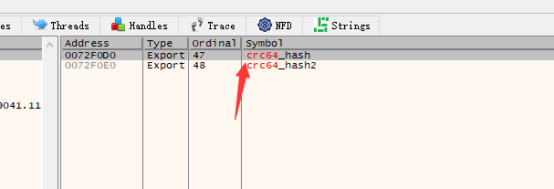
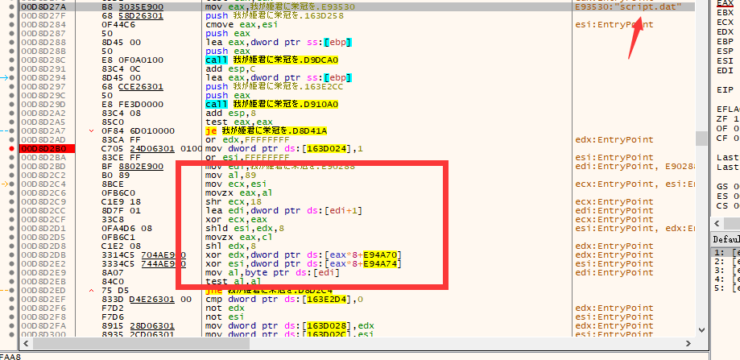

# [HorkEye] 寻找Script封包密钥

## 0x01 识别引擎

引擎封包的文件头会写一个 ACV1

封包名一般为arc0.dat arc1.dat arc1.dat script.dat

## 0x02 为什么要寻找封包密钥

从[vn_re](https://github.com/Forlos/vn_re/tree/master/docs/acv1)这个开源项目可以看到，这个引擎的script.dat文件是需要一个密钥的

也就是说需要这个密钥才能解开这个封包。

同时这个项目也提到密钥为游戏名的crc64的前四个字节。

## 0x03 寻找密钥

既然已经知道密钥是通过crc64函数算出来的，我们只需要找到这个函数即可

对于老版本的ACV1引擎，crc64函数是直接导出的

从这里可以看到crc64_hash这个函数，对这个函数头下断点

等到游戏传进来一个游戏名的参数，既可以得到解包的密钥

对于新版本的，这个函数进行了inline

虽然也同样导出了crc64，但是你断下发现并不会传入游戏名

这时可以搜索字符串 script.dat 可以找到唯一的结果

转到该字符串的使用处

可以看到明显进行了inline

其实老版本也可以用这个方法，只不过搜索script.dat有两处，其中一处和图中类似。