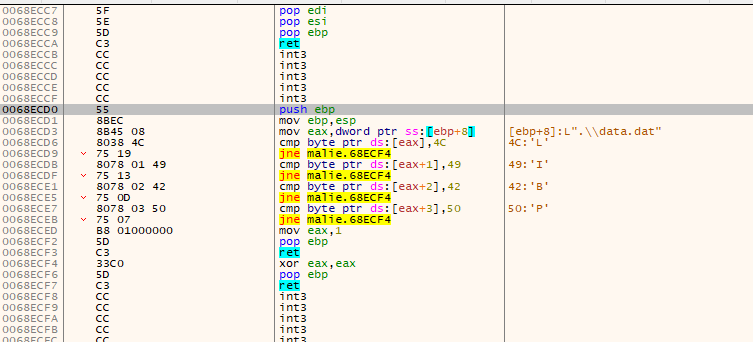
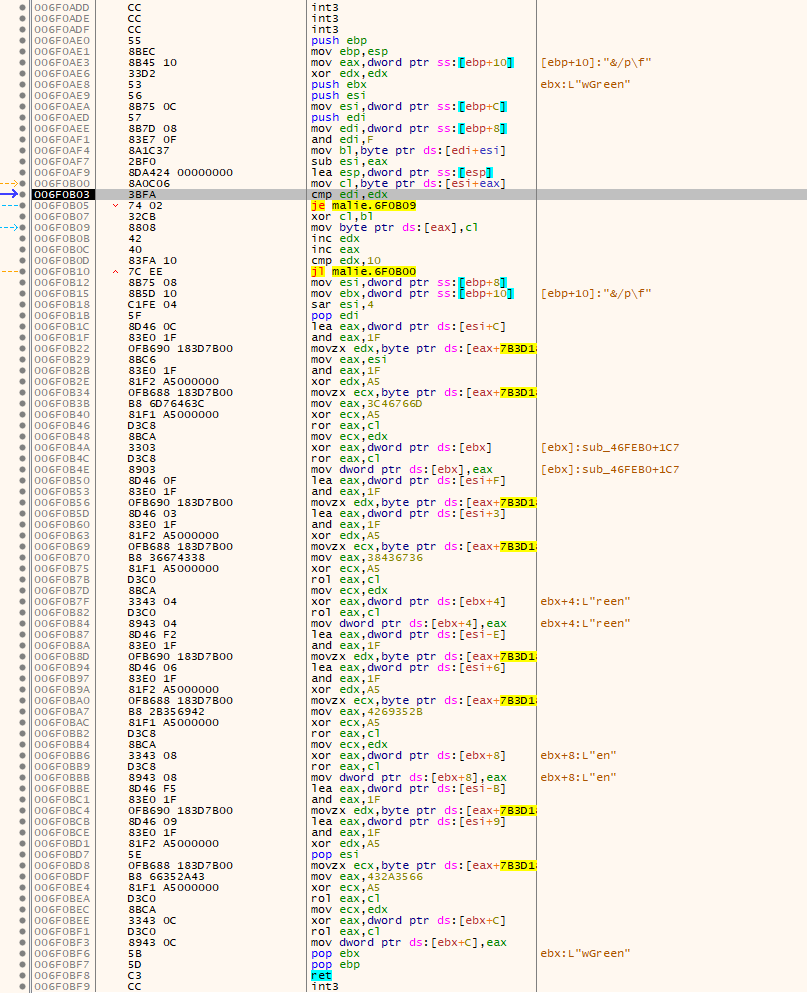
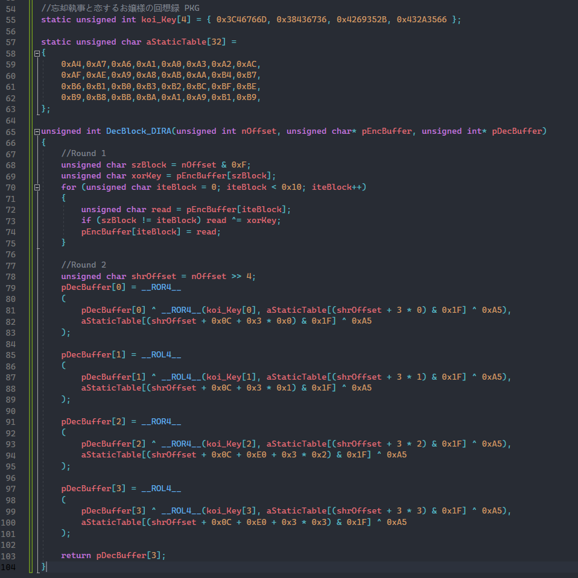
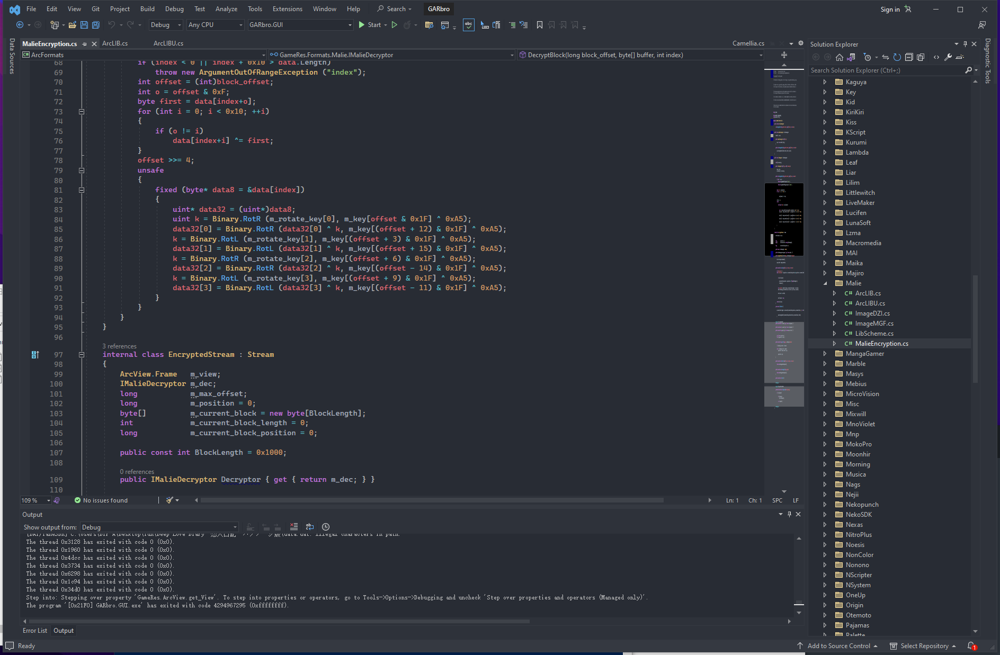

# [Malie引擎] 寻找密钥 P2

接着P1开始讲

## 书接上文

找了几个16年以前的游戏，找密钥导入exdieslib编译解密，都没什么问题。

然后我准备找恋音セ・ピアーチェ的密钥，结果就出现问题了。

发现，在那个统一的接口上确实也和以前一样出现了那个写死的参数，也是一串奇奇怪怪的密文，我寻思跟着走到生成密钥的函数就行了，结果发现它并没有和之前一样有个生成密钥的函数了。并且虽然有这个参数，但是并没有去使用。

想着有点奇怪，而且这个游戏还是加Playdrm的，分析比较麻烦一点，就去看看体验版，确实有体验版，把体验版下了之后发现更奇葩了，体验版是和之前那些一样的，有生成密钥的函数，写死的那个参数也是有用的。这下就说明正式版和体验版可能用了不同的加密方法，至少形式不一样。

这里我们就换成 忘却執事と恋するお嬢様の回想録（メモワール）PKG版

由于这个也是加Playdrm的，还是和之前一样，直接ReadFile断下。等到ReadFile读取大小那个参数为0x1000的时候我们知道它就是在读取文件的前0x10个字节，然后判断是否为LIBP，注意下硬件断点的时候不要在buffer的第一个字节下，最好下在第四个字节处，因为第一个字节它别的函数会读一下，影响我们断在正确的位置。

第二次ReadFile的时候正确下断点，找到Copy出来的0x10个字节继续下断点，然后运行就会停在这个位置，对的，这个位置就是这个游戏的解密函数。

看着和原来的Camellia 加密有点像。这个函数我整理了一下

经过对几个相同加密的游戏对比发现aStaticTable是不变的。只有图上那四个一大串的数值会变化。

这个我已经接入exdieslib 可以在这里下到https://github.com/Dir-A/MalieTools

今天晚上写文章整理的时候发现Garbro也有实现这种加密的支持，Garbro里叫 MalieEncryption

如果给Garbro添加密钥也是可以支持这种版本的解密的，不过由于我水平有限，才学浅陋，只能点到为止，有能力的自己去添加吧。

## 总结

其实 Malie 这个引擎有两套加密方法，至少我目前看到的是这样，

第一套是 Camellia  多见于16年以前的游戏和游戏的体验版

第二套是 MalieEncryption 看着和 Camellia 有点像。

核心本质是，Malie的封包结构基本不变，只是在原有封包的基础上，对封包数据全部进行 Camellia  或者 MalieEncryption 的加密。

而且Malie通过套皮fread fopen 这些库函数实现了一个自己的文件系统，可以依据传入的MODE来切换加载加密封包和非加密封包亦或者不封包的文件。