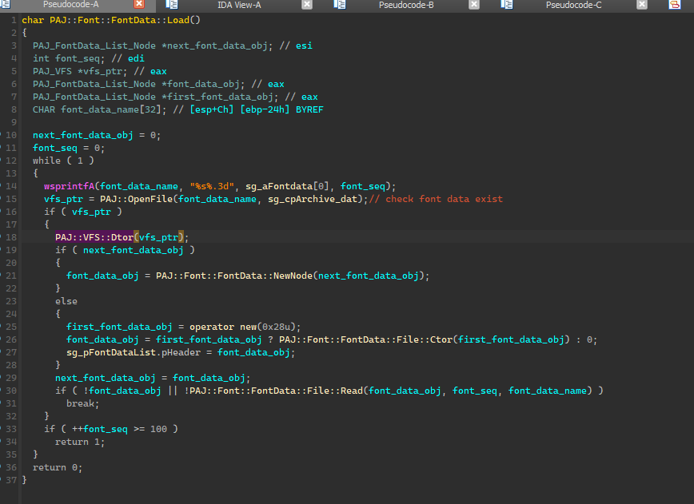
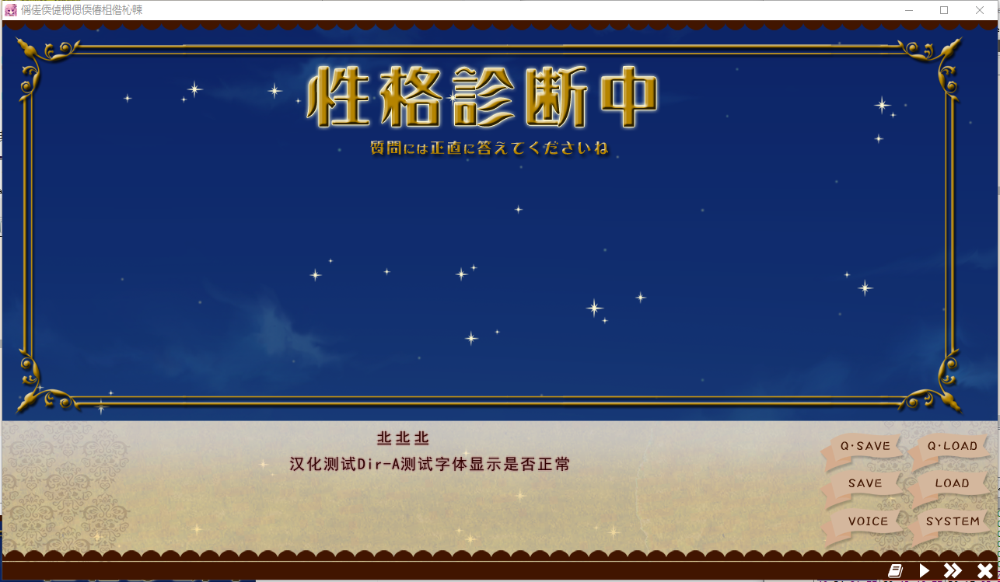

# [PJADV] 字体渲染分析

## 背景知识

​	这块本来想单独写一篇文章的，但渲染方式很多，目前来说还不好单独写，就先写在这个文章下面，到时候有机会再把这块替换成文章的链接

​	也可以直接去看MSDN，不过MSDN很多都是机翻的，效果很烂，最好是读英文原版，或者至少把英文原版通过别的工具翻译，因为MSDN官方的机翻，效果很差，读起来不知所云。

- https://learn.microsoft.com/en-us/windows/win32/gdi/fonts-and-text
- https://learn.microsoft.com/en-us/windows/win32/gdi/raster--vector--truetype--and-opentype-fonts
- https://learn.microsoft.com/en-us/windows/win32/gdi/font-and-text-functions

### 原始数据

​	对于字体的原始数据，大概可以分成这两类，点阵数据、矢量数据。

（当然这块概念是为了方便讲解，我自己零时想的，如果你想了解详细专业的概念分类，可以去查找相关资料）

​	首先要了解的一个基本事实是，现在用的屏幕都是以像素为单位的，也就是显示出来的图像都是**点阵数据**，也就是位图，其原始数据都是一个个像素组成的，放大后会出现锯齿或糊了，与之对应的概念是**矢量数据**，也就是矢量图，其原始数据是通过一系列数学公式及指令表示的，真正呈现在屏幕上的时候通过解析这些指令公式来画出点阵数据，也就是画出一个个像素，最终显示在屏幕上。

​	字体需要在不同分辨率的设备上显示，自然首选矢量数据，这样可以根据不同设备的分辨率重新绘制出一个清晰的点阵图像，但缺点是什么？由于矢量数据在使用的时候要重新绘制，所以性能上就有问题，但如果目标设备的分辨率是固定的，那么这时候预先把矢量数据都转换成目标设备分辨率的点阵数据来加速绘制也是常用的方法。

​	我们常用的[`ttf`，`otf`](https://learn.microsoft.com/en-us/windows/win32/gdi/raster--vector--truetype--and-opentype-fonts)字体其原始数据就是矢量的，游戏显然某个字符的时候，其中一种做法就会把这些矢量数据按照某个分辨率转换成点阵数据，并用图形API绘制到指定位置上，也就是说这种做法，其实一个字符在屏幕上显示的时候，就是把一张图片贴上去。这个过程可以通过系统API来进行，也可以通过半手动进行，也可以全手动进行。

### 渲染流程

​	刚刚我们已经讨论到了，系统API/半手动/全手动，三种方式来进行字体渲染，接下里我们分别来简单了解这三种方式。

​	在开始之前，需要简单了解一下Windows的图形界面编程概念。

- **[HWND](https://learn.microsoft.com/en-us/windows/win32/learnwin32/what-is-a-window-#window-handles)**，这个东西其实就是窗口的标识或者可以理解为窗口的ID，也称为窗口句柄，Windows编程里有很多Handle的概念，一般类型开头是H的，这个H就是Handle的意思，因为它不想让你直接操作具体的对象，而是通过Handle来间接操作对象，其实也是一种面向对象思维的体现。
- **[HDC](https://learn.microsoft.com/en-us/windows/win32/gdi/device-contexts)**，这个是GDI里的概念，就是说你有了窗口后，你还需要有个玩意能管理在窗口中某个区域的绘制，比如说你要用什么颜色的画笔来绘制，绘制有什么效果，粗线还是细线还是虚线。常见的HFONT是由 [**CreateFont**](https://learn.microsoft.com/en-us/windows/win32/api/wingdi/nf-wingdi-createfonta) 创建而来的字体对象，它可以用来控制绘制字体的样式，这个对象会挂载进DC，这些东西相当于DC绘制时候的属性或者说相当于人画画时候的工具，这种对象叫[**Graphic Object**](https://learn.microsoft.com/en-us/windows/win32/gdi/graphic-objects)。

​	**系统API绘制**，就是你给它指定一个区域，系统API自己往上面画，细节你都不需要关心，但可定制自由度比较低。比如 [TextOutA](https://learn.microsoft.com/en-us/windows/win32/api/wingdi/nf-wingdi-textouta)

```C
BOOL TextOutA(
  [in] HDC    hdc,
  [in] int    x,
  [in] int    y,
  [in] LPCSTR lpString,
  [in] int    c
);
```

可以看到，参数很简单，第一个就是HDC，就是你要绘制的区域的句柄，注意这个区域是有属性的，也就是这个区域可以挂载自己画笔，自己的字体，所以可以通过CreateFont来创建HFONT并把HFONT挂载进这个HDC来实现改变字体样式，当然也还有一些其它的操作字体样式的API可以对HDC施加影响。第二第三个就是位置了。第四个就是你要显示的字符串。第五个是字符串长度。你只需调用这个函数就可以把字体画到对应的位置上，也有一些引擎是通过这个API绘制字体的，不过通常不会给lpString传递完整的字符串，而是一个个字符来绘制，应该是为了实现一些字体显示的特效之类的。

​	**全手动绘制**，就是你自己整出一个字符的图片，然后调用图形API把这个图片贴到对应的位置。比如你可以自己解析ttf字体文件，解析它的原始数据进行，生成某个字符的位图数据、点阵图数据，其实就相当于一张bitmap图片了，然后使用图形API的贴图功能，贴到对应位置即可。这种自由度就很高了，由于全过程都是你自己控制，中间加点特效啥的也方便，但性能可能就会有问题。虽然说是全手动，但你依然可以借助一些不依赖系统API的开源库来解析ttf，otf之类的字体文件，得到某个字符的图形数据，然后用图形API来贴图。比如[**FreeType**](https://freetype.org)。不过gal引擎还会自己编写自己的字体解析库，但这些库并不是解析常见的ttf或者otf字体文件，而是自定义的字体文件，这些字体文件通常是点阵字体，也就是这些字体文件内部的原始数据其实就是一张张图片，因为这样实现简单，性能也还行，而且游戏通常也只需要固定几种分辨率的字体，这也是gal引擎自己搞一套字体文件的常见实现方法，不过由于这种方法通常不会覆盖超出SJIS编码的字符，或者说通常不会包含游戏根本用不到的字符，所以汉化的时候通常都是不能直接显示中文字符的。

​	**半手动绘制**，这是一种gal引擎里比较流行的做法，就是通过系统API [**GetGlyphOutline**](https://learn.microsoft.com/en-us/windows/desktop/api/Wingdi/nf-wingdi-getglyphoutlinea) 来获取某个字符的图形数据，然后对图形数据进行处理，最终使用D3D，D2D，GDI之类的图形API来贴图。

```C
DWORD GetGlyphOutlineA(
  [in]  HDC            hdc,
  [in]  UINT           uChar,
  [in]  UINT           fuFormat,
  [out] LPGLYPHMETRICS lpgm,
  [in]  DWORD          cjBuffer,
  [out] LPVOID         pvBuffer,
  [in]  const MAT2     *lpmat2
);
```

值得注意的是 `GetGlyphOutline` 也有个`HDC`，但这个`HDC`其实并不需要真实存在，可以是一个[**内存DC**](https://learn.microsoft.com/en-us/windows/win32/gdi/memory-device-contexts)，也就是一个虚拟的DC，主要是因为 `GetGlyphOutline` 需要获取`DC`中的字体相关信息，比如`CreateFont`创建的字体对象。`uChar`是具体某个字符，说白了其实就是某个字符对应的编号，比如 `8C EA` 在`SJIS`里是 `語` 在`GBK`里是 `岅`，那么这个函数究竟返回哪个字符的图形数据呢？这里就取决于`CreateFont`中的`charset`了，如果`chaeset`是`0x80`那么返回的是 `語` 的图形数据，如果是`0x86`那么返回的就是 `岅` 的图形数据了，当然`charset`也有可能是`0x1`也就是依据当前系统语言区域决定，那么中文系统自然就是`0x86`了，这也就是gal显示文本会乱码的根本原因。`GetGlyphOutline`本质其实就是系统提供的解析`ttf、otf`之类字体文件的接口，而这些`ttf、otf`字体文件有些是系统已经安装的，有些可以通过系统API从具体路径下的[**加载字体文件**](https://learn.microsoft.com/en-us/windows/win32/api/wingdi/nf-wingdi-addfontresourceexa)。`cjBuffer pvBuffer` 前者是返回图形数据的大小，后缀是接受数据的缓冲区。`fuFormat`是图形数据的格式，`lpmat2，lpgm`就大家自己去了解了。看完了这个函数，其实不难发现，很容易自己就可以写一个库来替换这个函数，毕竟它的本质就是返回某个字符的图形数据，可以用`FreeType`来解析`ttf、otf`字体文件来获取图形数据，也可以通过把这些图形数据预先解析到某个分辨率并统一存储在一个文件里形成一个自己的字体文件格式，然后写一个接口来获取对应字符的图形数据，这也就是游戏私有字体文件格式的概念。

### 总结

抽象一下手动渲染流程

```
原始数据文件  -->  获取原始数据  -->  处理数据  --> 图形API贴图
```

原始数据文件一般有

- TTF

- OTF

- 自定义的某种格式

  

获取原始数据的方法一般有

- 系统API

  - GetGlyphOutline
    - 通过CreateFont来改变字体的样式、编码

- 自定义库

  - FreeType等开源库

    - 解析常见字体格式、转换矢量数据为位图数据

  - 自己编写处理库
  
    - 通常处理自定义的点阵、位图数据
    
    

处理数据的方法一般最终都是转换成RGBA或者图形API需要的格式

最后说一下，字体渲染的流程不是非黑即白，通常gal引擎可能会结合上述三种方法来渲染字体，一定要能够灵活的从三种概念方法中互相转换，利用他们的特征来互相识别定位。因为有些概念其实是很简单的，就和我们从课本中背诵概念一样，但实际上会和我们想象的不一样，或者和概念所说的一样，但并不符合我们对概念的认知，因为我们并没有从实践中总结出概念，而是直接了解了概念本身，因此会造成很大的认知差距。

## 收集数据

在开始分析前先收集好数据，这里选择的目标游戏依旧是 `ティンクル☆くるせいだーすPSS v.1.19`

先进入到游戏的设置界面，可以发现游戏有三种字体可以切换，为了验证这些字体绘制是否从GDI获取图形数据，可以断CreateFont然后改变charset来观察绘制的文本是否乱码，以此来判断。因为不一定调用CreateFont就是GDI绘制，如果改变了charset出现了乱码或样式改变则证明其从GDI获取字符的图形数据。


重新启动游戏，把每次CreateFont的调用的参数charset都改成0x86，也就是GBK，这样以SJIS编码的日文数据如果用GDI渲染字符肯定就乱码了。

对于这个游戏而言，它是CreateFontIndirectA（你在exe导入函数表里搜索也就只有这个），断下后启动游戏可以发现，就算进入设置界面也没有任何一次调用，这时游戏默认选择的是第一个字体，并且这个字体样式一点也没改变，切换到第二个或第三个字体发现断下了。来到调用的地方发现它的参数很直接的写了0x80，重启游戏再修改这个0x80为0x86可以发现第一个字体依旧正常显示，第二个字体乱码，第三个字体乱码。


还可以发现程序导入了GetGlyphOutlineA，也断一下，可以发现它在第二个第三字体选项的情况下，会频繁断下。

这时候就可以判断出第二第三个字体选项肯定是用了GDI绘制，至于第一个，有可能是其它与文本绘制相关的API，或者是它的私有字体文件格式，还不能下定论。

不过把鼠标移动到第一个字体的选项上，它的提示说明了，这个字体是引擎私有的字体格式。那么它应该会有个私有的字体文件，如果你看过我在B站发的 [PJADV引擎虚拟文件系统分析](https://www.bilibili.com/video/BV1Gk4y1U7RF/) 和 [PJADV引擎封包结构分析](https://www.bilibili.com/video/BV1vi4y1W7df/)，应该还有印象，当时debug的时候发现它在不断加载字体。


对于这个游戏而言，字体文件在archivesys.dat封包里


解包后用winhex查看结构，一般来说这样很难看出来。


现在我们大概知道了，引擎有两种渲染字体的方式，一种是用GDI的GetGlyphOutlineA来获取图形数据，另一种是通过fontdata.xxx的私有字体文件来获取图形数据。

## 加载位置

之前我们已经分析过了引擎的文件加载和封包结构，直接对 `PAJ::OpenFile`下断点，或者`PAJ::VFS::Open`也可以。如果你在IDA里已经把函数都命名了，就可也重新导出数据到x64dbg里，函数就有名字了


可以发现，断了四五下就开始读取字体文件了。在IDA里定位到这块地址，稍微整理一下


## 字体加载

可以发现，它用sprintf不断格式化出字体名，然后打开字体文件，比如fontdata.000，fontdata.001，fontdata.002最多尝试打开100个。下面那些还不知道作用的函数，和全局变量大家可以去调试分析，还有谁调用了这个函数可与去回溯，有些还看不出来的就暂时先留着，最终应该可以得到下图的结果。



像是图上的`PAJ::Font::FontData::NewNod`和`PAJ::Font::FontData::File::Ctor` 可能一时半会还看不出来，但`PAJ::Font::FontData::File::Read`你点进去就会发现它在读取字体文件，这个很容易看出来。对于`PAJ::Font::FontData::File::Ctor`其实也不难发现，它前面有个operator new在提示我们它结构的大小。对于那个`dword_8036A8`只有等分析了`PAJ::Font::FontData::File::Read`才好确定

来到`PAJ::Font::FontData::File::Read`其实看着还是蛮简单的，前提是你把文件系统分析好。


22行之前，其实就是在把fontdata文件读到内存里，也就是font_file_buffer里，接着用fontdata的文件里的几个成员给this的成员赋值，然后还会开一个索引表，接着就是循环填充索引表了，这里它字符图形有两种大小，通过判断字符值来给定大小，也就是&0xFF00，判断双字节字符还是单字节字符。自己可以仔细去调试，整理，可以得到如下结构。

```C
struct PAJ_FontData_List
{
  PAJ_FontData_List_Node *pHeader;
};

struct PAJ_FontData_List_Node
{
  PAJ_FontData_List_Node *pPrev;
  PAJ_FontData_List_Node *pNext;
  uint32_t uiFontSeq;
  uint8_t *pFontFile;
  PAJ_FontData_List_Node_Entry *pIndex;
  uint32_t uiGlyphCount;
  uint32_t uiGlyphDataSize;
  uint32_t uiGlyphDataSize_Half;
  uint32_t uiFontRect;
  uint32_t uiFontRect_Half;
};

struct PAJ_FontData_List_Node_Entry
{
  uint16_t usCharValue;
  uint8_t *pGlyphData;
};
```

除此之外，还能得到fontdata.xxx文件的结构

```C
struct PAJ_FontData_Entry
{
    uint16_t usCharValue;
    uint8_t aGlyphData[uiGlyphDataSize];
};

struct PAJ_FontData_File
{
    uint8_t aSignature[0xC]; // 'PF001Lillian'
    uint32_t uiEntryCount;
    uint32_t uiFontRect;
    uint32_t uiFontRect_Half;
    uint32_t uiGlyphDataSize;
    uint32_t uiGlyphDataSize_Half;
    PAJ_FontData_Entry aEntryList[uiEntryCount];
};
```

不难发现，刚刚那个`dword_8036A8`其实就是这个链表的指针。每一个fontdata.xxx文件都会有个`PAJ_FontData_List_Node`，他们的数据主要存在`pIndex`里，`pIndex`其实是指向索引表的指针，索引表里八个字节为一个成员，前4个字节标识字符值，后四个字节指向图形数据。

为什么说是图形数据呢？这个其实得结合后面的GDI绘制来看，不过也可以从经验判断，你计算一下FontRect，如果假设图形数据的每个像素一个字节，可以发现是吻合大小的。而且对于这个引擎的字体文件而已，没有压缩，你甚至可以用相关的pixel array的软件来直接查看图形。比如[PixelViewer](https://github.com/carina-studio/PixelViewer)

比如fontdata.007这个文件，它双字节的字符图形数据是100x100的8位灰阶格式


## 字体使用

经过上面的分析，我们知道了，所有的字体文件都会加载解析到一个链表里保存，那么引擎使用字体文件自然离不开这个链表，而且这个链表还是个全局变量，直接按一下x就知道谁在用它了。


除了构造和析构的地方（自己点进去看很容易就可以确定是否是析构还是构造），可以发现还有两处调用，对这两处进行调试，可以简单的得出他们大概功能，一个是用来获取字符图形的，一个是用来检查对应的字符是否在字体文件中有对应的图形数据。


先来看 `PAJ::Font::FontData::FontExist`，第一个参数指定了对应字体文件的序号（这个序号就是fontdata.xxx后面的xxx和字体大小无关），第二个则是要查找的字符，存在返回1，不存在返回0，来看看谁调用了这个函数。有两个函数调用了`PAJ::Font::FontData::FontExist`，由此推测，他们和文本绘制有关，通过调试可以大概确定函数的功能。


先来看其中一处


很明显有个if-else逻辑，也就是找到了对应字符在字体文件中存在，和不存在的情况。可以发现如果它找到了，会直接获取图形数据，如果没找到，就进入了else分支，会先开辟一个空间，这个空间刚好是字符图形数据为8位灰阶的大小，然后就是一堆局部变量的操作，最后会调用一个函数，这个函数点进去发现是调用 GetGlyphOutlineA


这个函数逻辑也比较简单，通过GetGlyphOutlineA来获取Gray8的字符图形数据，注意这个Gray8只有64灰阶，然后用GetTextMetricsA来获取字体度量数据，接着对图形数据进行逐像素迭代，把64转换成256灰阶并复制到传进来的buffer里。由此就可以推断，fontdata.xxx里的图形数据，其实是256灰阶的

再整体看if-else，可以发现，从fontdata.xxx获取图形数据，和从GDI获取也没什么不同，最终都需要给font_glyph_ptr赋值，只不过是获取图形数据的方式不一样而已。


后面这一块，应该是灰阶转rgba，还有一些缓存的操作，由于时间有限，这块我就没去看了。


另一个调用 `PAJ::Font::FontData::FontExist` 的地方也类似，不过多封装了几层


`sub_48F640`其实就封装了刚刚的GDI函数


## 模式切换

知道了上面这样内容，其实要把通过fontdata.xxx获取字符图形数据，改成用GDI也很简单，直接hook相关函数就好了。

它的模式第一步通过 `PAJ::Font::FontData::FontExist` 来检查对应字符的图形是否在fontdata.xxx文件构造的对象中，然后再以不同的模式来获取图形。说到这你可以会想，那我们把 `PAJ::Font::FontData::FontExist` 改成始终返回0是不是就可以直接使用GDI来绘制字体了呢？这样是不是意味着，可以通过直接改CreateFont就可以显示中文了，而不需要修改fontdata.xxx文件。

显然这个想法是很自然的，如果你去改了，就会发现，游戏干脆连文本都显示不出来了，进一步跟踪可以发现，它确实是进了GDI渲染的分支，但如果你观察GetGlyphOutlineA获取的数据，就会发现，居然都是空的（注意这里测试的时候应该重启游戏，而不是边改边测，因为引擎有缓存机制，会把之前获取过的图形数据缓存下来，这时候测试会发现有一部分字符可以显示），但如果你在设置里切换一次字体（如果可能的话）会发现有一部分又能够显示了。


检查一下GetGlyphOutlineA发现它的返回值直接变成了-1，说明它没有成功获取字符的图形数据，也就是说可能hdc无效，或者hfont有问题之类的。


这时候注意看这块


`PAJ::Font::RenderTarget::Global::Create`这个函数的主要作用就是给GetGlyphOutlineA提供一个可以正常获取字体位图数据的hdc，那么这块是不是出问题了呢？由于每次传递的 hCompatibleDC 都不为0，它就不会重新进来创建设备环境，我们可以强制跳转进来创建一下。

在x64dbg里找到这个位置，我们可以发现它的hfont，hCompatibleDC， fontsize居然都为0，难怪无法获取数据


手动改一下zf标志，让它进去创建一下，可以发现只绘制出了一个字符，难道要每次都进去？


那nop一下好了


好像可以了，但还是有一部分没绘制出来，会不会是缓存的问题？我们重启游戏，再次修改看看效果。


可以发现已经正常了，但这样是不是不太环保啊（，因为每次都要创建内存DC然后创建字体对象。

我们再次观察


可以发现它其实主要是和这个hCompatibleDC有关，FontSize和HFont在后续也没用到，毕竟他们都挂到hCompatibleDC里去了，不断调试可以发现，hCompatibleDC和sg_hCompatibleDC很多时候都不是同一个值，这就说明一个问题，有没可能是hCompatibleDC并没有挂载hFont？不然也不至于没办法获取图形数据，所以我们跟踪hCompatibleDC来看看它是哪来的


由于hCompatibleDC是函数参数，需要回溯函数，但这个函数其实回溯起来蛮复杂的，那能不能换一种思路呢？hCompatibleDC一般来说是通过CreateCompatibleDC创建的，但其实也不一定这个hCompatibleDC就是CreateCompatibleDC创建的，因为都是HDC没办法直接区分。那hFont呢？那肯定就是CreateFont了，我们来跟踪一下整个exe调用CreateFont的情况，可以发现，游戏给CreateFont封装了一层，全部的hFont都是由`PAJ::Font::Create`来进行创建的


这个函数的第一个参数是一个FontType，第二个是FontSize，但是观察switch可以发现，它有些情况不调用CreateFont，这可能就是为什么有些HDC没有hFont的原因了，经过调试可以发现，果然有些情况会不调用CreateFont。

主要就是这个地方


调试一下，可以发现，这个FontType其实是和fontdata.xxx后面的序号对应的，当它是fontdata.xxx对应的序号的时候，就不会调用CreateFontIndirectA也就没有hFont了，也就不会进入SelectObject来挂载hFont，那CreateCompatibleDC的hdc自然也就没hFont可用来获取数据了，所以就出现了上面那样什么都没有绘制出来的情况。这个函数其实是在初始化字体绘制的对象，这种对象一般来说会有三四个，每个对象关联一种渲染方式，就是管理不同的fontdata.xxx文件或者GDI，不过这个对象比较复杂，也不是重点，这边就不解说了。不过从这其实也有个思路，不过需要逆VM，有没有一个指令可以切换不同的字体绘制对象？或者创建一个字体绘制对象并切换为主要的绘制对象？也许存在。

不敢怎么说，现在我们知道了，在不改变游戏设置的前提下，也就是如果游戏设置里没有提供切换字体的选项的前提下，如何来改变字体渲染的方式。第一步肯定是要让`PAJ::Font::FontData::FontExist`返回0，然后不能让`PAJ::Font::Create`的FontType为可用跳过执行CreateFontIndirectA的值。

## 修改模式

首先我们来到fontdata.xxx字体文件加载的上一层函数，可用发现它与dword_5E662C的值有关，这个值和`PAJ::Font::RenderTarget`有关，不适合改动，其实还有个标记字体选择的值，和存档及其初始化有关，不过那个值在一些没有字体选择设定游戏里好像并没有，所以这里就不展开说了。

反正我们直接把`PAJ::Font::FontData::Load()`  nop掉，就不会去加载fontdata.xxx文件了，自然`PAJ::Font::FontData::FontExist`也就直接返回0了。


`PAJ::Font::Create`主要和那个switch有关，switch说白了就是一个跳转表


它依据eax的值在表里查地址，eax其实就是这个函数的第一个参数的值，直接把这个jmp和上面的ja nop掉，就直接到 jmp 0x0048A195 也就始终都调用CreateFontIndirectA了，由IDA反编译的结果也可以知道，它不同switch的区别主要是lfPitchAndFamily和lfFaceName也就是字体名。还有个要关注的是FontSize，有些时候如果调用是为fontdata.xxx准备的话，这个FontSize可能会导致字体显示过大或过小，需要我们手动改一下。还有的时候它就是传递一个固定的值，但游戏因为本身设置里没有切换字体选项，默认的size可能很难看。

比如这个它就默认传递了个28。


经过上面的修改，游戏即使没有提供切换选项也可以正常调用GDI来绘制字体了。

## 实例修改

这边我们找两个游戏来看看。

- [夏の終わりのニルヴァーナ](https://vndb.org/v11193)

- [あるいは恋という名の魔法](https://vndb.org/v21121)

这两个游戏均没办法在设置里切换为系统API渲染（GDI），默认是用fontdata.xxx渲染的。也就是说如果我们没有上述分析，就只能去修改fontdata.xxx字体文件了。

先看あるいは恋という名の魔法


可以发现，没有任何字体切换选项。不过它会去调用CreateFontIndirect，但只是用在选项文本和backlog的人物名上，正常的游戏文本是使用fontdata.xxx里的数据的。


首先断下CreateFontIndirect，由于游戏依旧会使用到GDI的字体渲染，所以进入游戏后依然可以断下，这样很容易就找到了`PAJ::Font::Create`，如果根本不调用CreateFontIndirect但GDI渲染的逻辑还在的话，可以直接在IDA里对CreateFontIndirect交叉引用，也可以在x64dbg里搜索模块内的call来定位，因为它只有一个地方会使用CreateFontIndirect


charset改一下(反正你汉化也要改)，方便我们观察是否使用了GDI渲染，同时字体名也可以改一下（这样改的话，如果用了不同样式的字体那样式都会统一）。

定位`PAJ::Font::FontData::Load`也很简单，因为它会有个sprintf来生成fontdata.xxx的格式化字符串过程，所以搜索字符串 `%s%.3d` 上图也可以看到，就在字体名下面，对首地址按一下CTRL+R也可以。


直接ret也可以，或者找到调用的地方nop掉call也可以。


最后别忘了搜索0x9F修改经典边界


修改好后保存


可以发现全乱码了，这也就证明现在是用GDI绘制的了。

再改个文本试试，可以看到正常显示了



下面来看 夏の終わりのニルヴァーナ

这个稍微有点不一样，因为它是加了alpharom的，不过其实运行起来后没什么区别，因为它底层的themida壳是老版本的，没有虚拟化代码，跑起来和没加壳一样。破解补丁记得打一下就好了。还有记得装ScyllaHide插件来过反调试。函数最好用硬件执行断点来断。

不过现在由于没脱壳，没办法直接拉到IDA里分析，当然不脱壳其实也是可以dump分析的，比较复杂这里就不说了。

不过这会由于导入表加密了，没办法直接在导入表里找到CreateFontIndirect，我们直接按CTRL+G，输入CreateFontIndirectA来断其实也行，不过由于themida可能会偷API的头部代码，因为这个版本的themida的IAT表实际上是运行的时候动态生成的，会依据API函数开头的汇编来选择加密方式。再有一个是可能并不会调用CreateFontIndirect，所以我们直接换一个思路。

直接搜索字符串(要选当前模块，因为一开始停的位置是壳的代码)


这样的话就很轻松找到位置了


这个由于加壳了，不能直接保存，参考这个项目来带壳修改https://github.com/Dir-A/lunarisfilia_cn

这个游戏还有个地方需要改，那就是字体大小，如果用它默认的大小，字体会过大，导致字体没有间隔。具体的话可以跟踪`PAJ::Font::Create`来找到，也可以先找到`PAJ::Font::FontData::FontExist`来定位，或者干脆直接hook这个函数修改大小也是可以的。

夏の終わりのニルヴァーナ这个游戏的体验版是没壳的，也可以先在体验版上找，然后迁移过来，我记得地址好像是一样的，其实体验版的exe也可以直接替换上去，不过会有个体验版检测，就是一个messagebox弹窗，直接找到调用位置nop掉也可以使用。

范围也要改


## 总结

最后总结一下，对应这个引擎来说，我觉得还是一个蛮不错的例子，整体逻辑也不复杂，同时还有两种绘制模式，方便我们学习分析gal引擎的字体绘制方法及流程。还有点的话也就是说，从文章来看大家应该也可以体会到，随着你对引擎的了解程度加深，方法会越来越简单。

一开始 --> 打算重建字体 --> 好像有个切换flag --> 哦换了个版本这flag被删了 --> 哦可以hook获取字体文件中字体图形的函数接到GDI --> 哦，好像不用了只需要给字体渲染对象加一个hfont就好了 --> 哦好像也不用了，原来内部有个字体类型枚举，只需要改个枚举类型就好了
