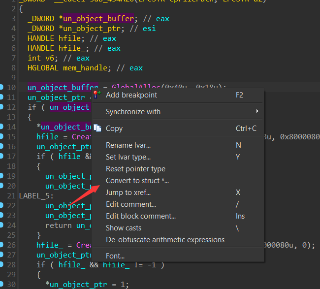
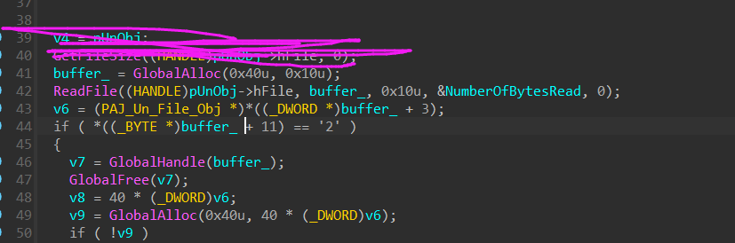
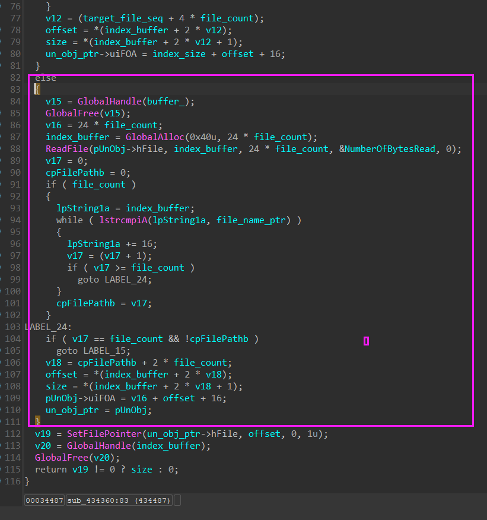

# [PJADV] 封包结构分析

目标游戏：ティンクル☆くるせいだーすPSS  v.1.19

这篇就详细写一下，后面就全当读者有相关背景知识，因为这样写实在很累（


## 假设结构

先正常安装游戏，并打上更新补丁（如果太乱可以先不打更新补丁，视情况而定）（是不是可以观察一下打补丁前后变化？补丁本身？）

先浏览一遍游戏的目录，尽可以收集信息，方便之后仔细分析。


可用看到游戏目录下有两个`ini`文件，一个记录了各个封包名的字段，一个记录了存档目录（注意这个`ini`文件的编码为sjis（从图中可见它在GBK下乱码了））

- 从`archive.ini`推测应该是和封包加载有关，或者只是个记录文件，可以尝试修改这个ini看看效果

- 从`install.ini`文件内只有个存档路径来看，有可能只是个存档路径设置文件

  

游戏封包为.dat后缀，用winhex查看并对比一下不同的封包（使用winhex查看后发现instdata.pak其实也是一样结构的封包）

对比封包的时候尽量选中体积小的，这样可以比较容易看出封包的结构，有些时候根本不用调试分析游戏，就可以直接看出结构


先来对比一个封包结构，依据经验，封包开头一般都有一段标识数据，用来识别该结构的封包文件


多查看几个封包后，可以发现，每个封包的头12个字节都是 `GAMEDAT PAC2` ，这个一般叫标识头，或者signature，反正就是拿来方便程序判断这个文件确实是它需要的文件。

然后对比紧接着的4个字节

这里是因为依据一般的封包结构，一个封包一般会有 标识头，文件索引表，文件数量等字段，索引表一般里面还包括文件名，文件数据的偏移，文件数据的大小之类的信息，而文件偏移，大小，数量，这些字段一般都是4个字节，但也不一定，所以实际上是不是这样，也不一定，比如文件数量可以通过索引表算出来，偏移和大小也不一定要同时有，文件名也不一定需要，所以对于这种猜测，应该大胆假设，小心求证，从这也说明，应该多了解几个游戏的封包文件结构，总结把握大概的雏形和规律。

可以发现，`extenPSS101.dat`的标识头后4个字节，是0xA，而`instdata.pak`是0x9，那么他们分别代表什么呢？我们可以大胆的猜，比如可能是索引表的大小？索引表的偏移？或者只是单纯的版本、优先级标记？又或者是文件数量？或者说现在还猜不出来，那么我们就先看下面的数据

下面的数据就简单了


不难发现，这个是文件名，而且每个文件名的长度最大就32个字节，由于这个封包里的文件很少（这也就是为什么选择体积小的封包分析的原因，如果体积太大，有些结构或成员可能一下子看不出来），那么我们算一下文件名的个数，恰好是10个，那么是不是证明这4个字节是文件数量？

为了求证这点，我们可以多打开几个封包算一下文件名个数，反复对比后会发现，这个4个字段确实是和文件数量对应的。

那么现在我们对封包结构的猜测可以写成这样

```C
struct PAJ_Pack_FileName
{
    char aFileName[32];
};

struct PAJ_Pack
{
    char aSignature[12];
    uint32_t uiFileCount;
    PAJ_Pack_FileName aNameList[uiFileCount];
    // data..
};
```

好了，现在，我们应该只差文件的大小和文件数据偏移了（依据最少信息可解出封包文件的原则（这原则是我瞎说的 :P ）），那么这些信息应该就在附近，继续往下看


0x0 + 0x01A49F = 0x01A49F ，0x01A49F  + 0x0EDEF0 = 0x010838F

不难发现，前两项相加等于第三项，那这不就 file_offset + file_size = next_file_offset？

所以我们可以猜测，这块的数据是8个字节一组，前四个字节是文件的偏移，后四个字节是文件大小

那么如果是这样的话，这个块的数据应该就是8*10个字节了


考虑第一项的偏移是0，那肯定就不是封包文件开头算的偏移了（这种偏移一般叫文件偏移，或称这为FOA(file offset address)），应该是封包文件中某个地址开始的相对偏移，那么这个地址是哪呢？我们很容易想到这块数据的结束位置，也就是图上0x1A0这个位置，但这个位置的数据看着就像是加密，或者说没什么特征，我们可以换一个封包看看，或者尝试从这里计算偏移，看看每一项文件的开头是否有特征，也就是看看同后缀的文件标识头是否一样。

观察可以发现这个封包里有好几个EPA后缀的文件，这种文件要是没加密标识头，应该会有一致的标识头，还有`filename.dat`这个文件，在其它封包也出现过

经过多次对比，可以发现，确实如我们猜测的那样。


那么整理猜测的封包结构

```C
struct PAJ_Pack_File_Name
{
	char aFileName[0x20];
};

struct PAJ_Pack_File_Info
{
	uint32_t uiOffset; // skip HDR
	uint32_t uiSize;
};

struct PAJ_Pack_HDR_Info
{
    char     aSignature[12]; // "GAMEDAT PAC2"
    uint32_t uiFileCount;
};

struct PAJ_Pack_HDR
{
	PAJ_Pack_HDR_Info  Info;
	PAJ_Pack_File_Name FileNameList[uiFileCount];
	PAJ_Pack_File_Info FileInfoList[uiFileCount];
};

struct PAJ_Pack
{
    PAJ_Pack_HDR HDR;
    uint8_t aData[??];
};
```

啊，肯定有人会说，你这不是事后诸葛亮？

但实际上我第一次看到这个封包的时候就猜的就是这个结构（

诸如此类的，还有ADVHD引擎的封包，其实非常多这种简单结构的，都可以直接猜测，但内部文件如果有加密，一般就比较难猜测解密方法了，当然有时候利用一些加密的特征，也可以猜出来，比如zlib这种其实也可以猜测出来。

当然有些是猜不出来的，如果整个封包都套了一层加密呢？那就没得猜了吧（

猜测终究只是猜测，是时候进入分析求证阶段了。


## 求证结构

首先标准操作

- 打开IDA Pro 载入exe
- 打开x64dbg 断CreateFile

首先被断下的相关调用是


来到调用CreateFileA的地方


发现它准备要获取大小了，这里我们先不急着往下看了，这里x64dbg的作用只是方便定位，如果这样分析下去，这篇文章就该出书了（

在IDA Pro里找到这个地方，并按TAB键反编译成C风格的代码


大体一看，这个函数好像就只是创建一个对象，然后用文件句柄、文件大小等信息填充这个对象，并返回，但下面有个函数调用，不清楚做了什么操作，我们先把已知的变量名填上。

```C
un_object_buffer = GlobalAlloc(0x40u, 0x18u);
```

GlobalAlloc就相当于malloc，0x40是个分配方式，0x18是分配内存的大小


具体参考msdn https://learn.microsoft.com/zh-cn/windows/win32/api/winbase/nf-winbase-globalalloc

可见这个对象大小为0x18，那么我们先写出这个对象的结构

可以打开这个窗口添加结构，等下方便直接套用，把偏移转换成访问成员


窗口内随便一个位置右键添加，就可以输入c语言语法的结构体了


先把大小安排好，点ok就插入完成了

在对接收GlobalAlloc返回值的指针套用这个结构



如果你和我一样，加了前缀，PAJ，那么只需要按CTRL + F 输入PAJ就能找到了


套用好后，我们可以把一些已知作用的成员命名了


对成员按n或右键-->重命名

注意一下，如果这时候你点到别的函数里去了，可以按这个箭头退回


但这个时候你会发现之前套用的结构没了，这时候按F5刷新一下就好了


像这种，也可以套用枚举类型，这里就不演示了


观察代码，很容易发现，可以分成两块，也就是上面的的CreateFile失败后会执行下面的CeateFile，如果成功则直接返回了，a2是什么？


其实是这个函数的另一个参数，我们对这个函数下断点，来看看a2会传什么值


可以发现a2其实就是封包名，说明当上面的CreateFile打开失败的情况，会直接打开封包

找到一个会进入打开封包的分支的情况，比如这个，由于游戏目录下并没有filename.dat这个文件，所以会进入第二个CreateFile打开extendPSS119.dat封包


那么这个函数的第二个参数也确定了，就是封包的路径，现在我们来观察sub_434360这个函数，它很可能就和封包读取有关。


进来第一步，先把这个结构体套上，然后参数命名好


这块是在处理什么？92是什么？

选中92右键转换成Char或按r


原来是从路径截取文件名

```C
cpFilePath: C:\Lillian\ティンクル☆くるせいだーすPSS\filename.dat
file_name_ptr: filename.dat
```

继续往下走，有两句废物代码，没必要管它，接着它分配了0x10大小的内存，并读取了封包头0x10个字节



那么依据我们猜测的结构，这个v6岂不就是封包内的文件数量？这个buffer+11就是判断"GAMEDAT PAC2"里的'2'这个字符，我们先观察一下v6


按‘\’键可以把强制转换关了，看起来更清爽

好了，我们继续看，对了，如果你没办法直接看出来，就在x64dbg找到对应位置进行调试观察

确认版本正确后进入if，先把刚刚分配的0x10的buffer释放了。

接着分配新的空间，这个空间居然是`40 * file_count`，那这个什么意思呢？还记得之前猜测的封包结构吗？文件名固定32字节，偏移4字节，大小4字节，不就正好是40字节？再看下面的`ReadFile`它其实是把这块数据都读进来，这块数据，我们给一个名字吧，就叫index


稍微整理一下，发现它把文件计数变量，错误的改成了我们定义的结构体指针了

右键set lvar type给它改成int之类的


那这块就清晰了，发现它在一个while循环里对比封包索引表里的文件，找到对应的文件名后跳到下面，那么下面这坨是什么呢？这个cpFilePath也识别错了，改成int


实际上就是这样了，也就是说 `index_buffer+ 2*v12`指向的是`PAJ_Pack_File_Info`

然后刚刚那个结构体的有一个成员也可以确定是，就是foa



然后这一块是其它版本的封包，暂时不用理他，其实看着也就大同小异了

最后的清理工作是释放索引表的buffer和回正文件指针

那么大小呢？大小好像并没有计入我们创建的结构体，但文件大小作为这个函数的参数返回了


可以看到返回值赋值给了结构体的文件大小成员

那么我们现在已经逆完了封包打开文件的流程，这里放一个我之前整理好的


总结一下

```C
PAJ_VFS *__cdecl PAJ::VFS::Open(CHAR *cpFilePath, LPCSTR cpPackPath)；
bool __cdecl PAJ::VFS::Pack::ReadEntry(PAJ_VFS *pEntry, CHAR *cpFilePath)；
    
struct PAJ_VFS
{
  uint32_t uiType;
  HANDLE hFile;
  uint32_t uiFOA;
  uint32_t uiFileSize;
  uint32_t uiFileSize_;
  uint32_t uiReadSize;
};

```

`PAJ::VFS::Open`用来打开文件，返回`PAJ_VFS`结构，其后可以用`PAJ_VFS`结构来读取文件数据

`PAJ::VFS::Open`先尝试打开文件在目录下的路径，如果文件不存在则打开封包

然后调用`PAJ::VFS::Pack::ReadEntry`解析封包结构，找到对应文件，并给PAJ_VFS结构设置大小和偏移成员