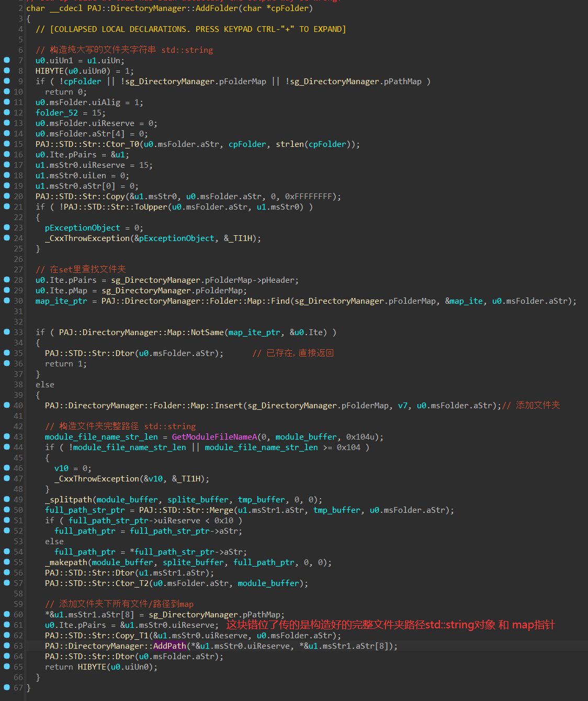
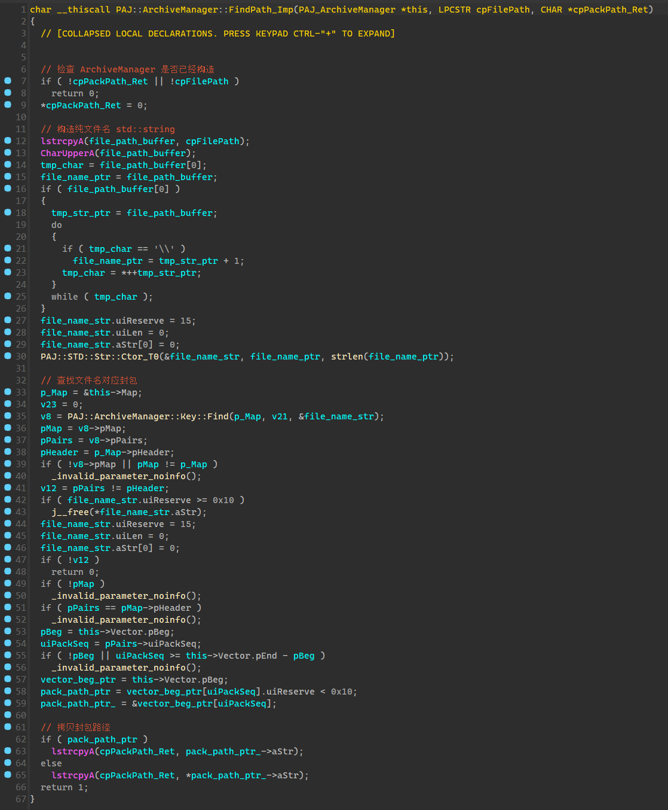

# [PJADV] 文件系统分析


## 前情

通过上一节[[PJADV] 封包结构分析 ](https://github.com/Dir-A/Dir-A_Essays_MD/blob/main/Reverse/%5BPJADV%5D%20%E5%B0%81%E5%8C%85%E7%BB%93%E6%9E%84%E5%88%86%E6%9E%90/%5BPJADV%5D%20%E5%B0%81%E5%8C%85%E7%BB%93%E6%9E%84%E5%88%86%E6%9E%90.md)我们已经分析了 `PAJ::VFS::Open` 函数的作用。

简单来说这个函数接受两个参数 [`文件名路径`]  [`封包路径`]

函数过程：先尝试从游戏目录下读取文件，如果没有就打开封包，在封包中寻找目标文件，读取成功返回`PAJ_VFS`对象指针，`PAJ_VFS`对象记录了目标文件的句柄，大小，偏移，后续可以利用这些信息来读取文件数据

`PAJ_VFS`比较怪异的是没用`this`传递对象指针，不过也没什么太大差别，它的成员函数比较少，或是说我目前看到的就那么几个，无非就获取大小，读取数据，等待异步读取完成之类的。

当然`PAJ_VFS`相关的操作函数，只是一个处理底层系统API和封包的类，上层的文件系统对`PAJ_VFS`又进行了一次封装，我们可以把`PAJ_VFS`看成是一种自己封装了一遍的`fopen`，只不过这个`fopen`的文件来源又挂了一个自定义格式封包，或者说叫 `PAJ_VFS`为`PAJ_FStream`更加合适？哎，不管怎么说吧，我也懒得改名了

```C
struct PAJ_VFS
{
  uint32_t uiType;
  HANDLE hFile;
  uint32_t uiFOA;
  uint32_t uiFileSize;
  uint32_t uiFileSize_;
  uint32_t uiReadSize;
};
```


## 入手点

首先调试`PAJ_VFS`相关成员函数，因为这个是游戏读取封包的接口，不断调试可以发现，几乎所有的封包文件读取都调用了`PAJ::OpenFile`


由交叉引用的结果也可知，调用 `PAJ::VFS::Open` 来打开文件的最多的莫过于`PAJ::OpenFile`，那么这个函数又长什么样呢？


其实它的参数和`PAJ::VFS::Open`一样，连返回值都是一样的，只不过多套了两个玩意

简单解释一下这个函数，首先还是传递文件路径和封包路径

- 先从`ArchiveManager`里查找目标文件所有的封包路径，有的话`PAJ::ArchiveManager::FindPath`返回`true`，并把封包的路径写入到` pack_full_path` 然后继续调用 `PAJ::VFS::Open`读取，这看起来是否略显弱智？确实有点弱智，也搞不懂立本人怎么想的，但这个主要是解决更新封包问题，就是相同的文件名，但在不同封包里，可以通过这个来返回最新的那个文件所在的封包路径

- 如果前面失败就从`PAJ::VFS::Open`读取

- 如果前面都失败，就从`DirectoryManager`里查找目标文件所在的路径，行为和`ArchiveManager`类似，但写入的是文件路径

其实讲到这，就会发现，这个引擎文件读取有点脑抽的感觉，`PAJ::ArchiveManager::FindPath`可以返回对应封包的路径，但却没存储相关的索引信息，比如偏移大小之类的，又要进`PAJ::VFS::Open`再次遍历文件


## DirectoryManager 构造

因为`DirectoryManager`对象是全局的，很容易就可以追踪到其使用的位置，可以发现，其在main函数中构造


首先在`main`函数里会进行`DirectoryManager`初始化，`DirectoryManager`主要由一个`set`一个`map`组成，一个保存文件夹，一个保存文件名/路径键值对，由于map和set类型，我这里为了方便套入结构，就懒得区分了。

```C
struct PAJ_DirectoryManager
{
  PAJ_DirectoryManager_Folder_Map *pFolderMap;
  PAJ_DirectoryManager_Path_Map *pPathMap;
};

struct PAJ_DirectoryManager_Folder_Map
{
  PAJ_DirectoryManager_Folder_Map_Node_Pair *pNode;
  PAJ_DirectoryManager_Folder_Map_Node_Pair *pHeader;
  uint32_t uiSize;
};

struct __declspec(align(4)) PAJ_DirectoryManager_Folder_Map_Node_Pair
{
  PAJ_DirectoryManager_Folder_Map_Node_Pair *_Left;
  PAJ_DirectoryManager_Folder_Map_Node_Pair *_Parent;
  PAJ_DirectoryManager_Folder_Map_Node_Pair *_Right;
  PAJ_STD_Str Value;
  char _Color;
  char _Isnil;
};

struct PAJ_DirectoryManager_Folder_Map_Ite
{
  PAJ_DirectoryManager_Folder_Map *pMap;
  PAJ_DirectoryManager_Folder_Map_Node_Pair *pPairs;
};

struct PAJ_DirectoryManager_Path_Map
{
  PAJ_DirectoryManager_Path_Map_Node_Pair *pNode;
  PAJ_DirectoryManager_Path_Map_Node_Pair *pHeader;
  uint32_t uiSize;
};

struct __declspec(align(4)) PAJ_DirectoryManager_Path_Map_Node_Pair
{
  PAJ_DirectoryManager_Path_Map_Node_Pair *_Left;
  PAJ_DirectoryManager_Path_Map_Node_Pair *_Parent;
  PAJ_DirectoryManager_Path_Map_Node_Pair *_Right;
  PAJ_STD_Str msFileName;
  PAJ_STD_Str msFilePath;
  char _Color;
  char _Isnil;
};

struct PAJ_ArchiveManager_Map_Ite
{
  PAJ_ArchiveManager_Map *pMap;
  PAJ_ArchiveManager_Map_Node_Pair *pPairs;
};
```

在`PAJ::DirectoryManager::Ctor`中初始化，其内部先调用`PAJ::DirectoryManager::Dtor()`先清除，之后构造头节点


路径的map长这样

```C++
path_map["BGM_FC27DQ_intro.ogg"] = "C:\Lillian\ティンクル☆くるせいだーすPSS\SE\さっちん_新着メールが届いています.wav";
```

文件夹的map长这样，应该就只是个set

```
folder_map["SE"];
folder_map["BGM"];
```

添加一个文件夹，先把文件夹压入`folder_set`里，然后开始循环遍历文件夹，把所有的文件路径和文件名加到`path_map`里




## ArchiveManager 构造

和 `DirectoryManager` 同理 ArchiveManager  保存了一个全局指针，通过这个我们可以追踪到使用该对象的地方

`ArchiveManager` 通过 `archive.ini` 里的字段来获取封包文件名列表，还记得`archive.ini`里写的一堆封包文件名吗？

简单来说`ArchiveManager`里有个`vector`存储封包名，一个`map`存储`[文件名/对应封包在vector的索引]`的键值对

```C++
struct PAJ_ArchiveManager_Map_Node_Pair
{
  PAJ_ArchiveManager_Map_Node_Pair *_Left;
  PAJ_ArchiveManager_Map_Node_Pair *_Parent;
  PAJ_ArchiveManager_Map_Node_Pair *_Right;
  PAJ_STD_Str msFileName;
  uint32_t uiPackSeq;
  uint8_t _Color;
  uint8_t ucIsNull;
};

struct PAJ_ArchiveManager_Map
{
  PAJ_ArchiveManager_Map_Node_Pair *pNode;
  PAJ_ArchiveManager_Map_Node_Pair *pHeader;
  uint32_t uiSize;
};

struct PAJ_ArchiveManager_Map_Ite
{
  PAJ_ArchiveManager_Map *pMap;
  PAJ_ArchiveManager_Map_Node_Pair *pPairs;
};

struct PAJ_ArchiveManager_Vector
{
  uint32_t uiUn0;
  PAJ_STD_Str *pBeg;
  PAJ_STD_Str *pEnd;
  uint32_t *pReserve;
};

struct PAJ_ArchiveManager
{
  uint32_t *pVtable;
  PAJ_ArchiveManager_Vector Vector;
  PAJ_ArchiveManager_Map Map;
};
```

由于涉及到`ini`文件，还需要分析`ini`文件解析，这个引擎的`ini`文件解析结果是放在一个`list`里的

它解析的`ini`文件有个固定的`key`值，比如解析`archive.ini`目标`key`值是`file`，这些值有五十个，引擎的图片加载也用到了`ini`文件


解析结果对象结构如下

```C++
struct PAJ_INI_List
{
  PAJ_INI_List_Node *pNext;
  PAJ_INI_List_Node *pPrev;
  uint32_t uiSize;
};

struct PAJ_INI_List_Node
{
  PAJ_INI_List_Node *pNext;
  PAJ_INI_List_Node *pPrev;
  PAJ_STD_Str Value;
};
```

通过 `PAJ::ArchiveManager::Init()`来初始化


`ini` 解析 获取`file`项


加载封包其实和`PAJ::VFS::Open`很像，也就是把封包的里面的文件名一个个加到`map`里


## DirectoryManager查找

在 `PAJ::OpenFile` 里找到这个函数，第一个参数是输入的文件路径，第二参数是写入该文件对应的路径的`buffer`，如果没有就不写入返回`false`


## ArchiveManager查找

在 `PAJ::OpenFile` 里找到这个函数，第一个参数是输入的文件路径，第二参数是写入该文件对应的封包路径的buffer，如果没有就不写入返回`false`




## 总结

这个引擎的封包读取逻辑，我只想说，真是啥X。

不过我认为这个引擎的文件系统，还是挺不错的学习资料。

从封包上来看，结构简单，但基本上就是一个最小封包，或者是最普遍的封包结构。

从封包接口设计上来看，读取逻辑也比较简单，没有采用stl，甚至没有使用C库函数，连内存分配都直接调用系统API，整体代码清晰易读。

从封包接口对象内存结构来看，设计也是比较简单的，成员变量、成员函数较少，逻辑结构清晰。

从整体的文件系统上来说，在简单的封包接口上，又加入了 std::map std::set等缓存/更新机制，但整体不是很复杂，由此也比较适合学习真实环境下stl相关库和内存结构，还有解析ini，和list的使用，如果能仔细分析，那也能练习到了不少内容。

总得来说，这个引擎的文件系统从最底层到最上层，设计由简单到复杂，比较适合入门分析。

透过本文的分析，也是想让大家认识到逆向文件系统的意义，传统上来说，只关注封包的文件结构，然后想方设法写一个回封程序，其实是不必要的，因为你只要分析了引擎的文件系统，就可以知道其实大部分引擎都有免封包直接读取的设计，又或者，至少你可以找到关键点或者说最好的位置来hook直接读取文件，而不是尝试在一个调试过程中随机得到的位置，用很奇葩的方法来达到免封包的目的，实际上一般情况下你要是完整分析了文件系统，甚至都不需要写任何一行代码，就可以达到一个path替换文件或者免封包替换文件的目的。

当然像这个引擎的话，读取逻辑太简单了，可能感知不强，但如果你至今都还未逆向过任何一个引擎的文件系统又或者说准备了解准备实操，那这个引擎确实是不错的选择。
