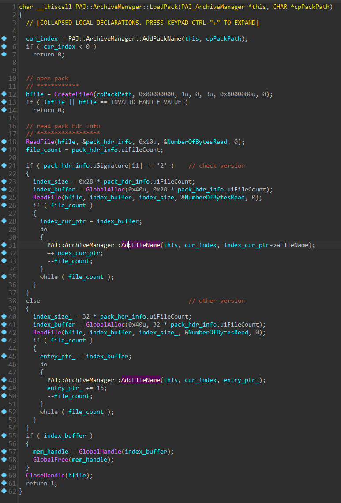

# [PJADV] 文件系统分析


## 前情

通过上一节[[PJADV] 封包结构分析 ](https://github.com/Dir-A/Dir-A_Essays_MD/blob/main/Reverse/%5BPJADV%5D%20%E5%B0%81%E5%8C%85%E7%BB%93%E6%9E%84%E5%88%86%E6%9E%90/%5BPJADV%5D%20%E5%B0%81%E5%8C%85%E7%BB%93%E6%9E%84%E5%88%86%E6%9E%90.md)我们已经了解了 `PAJ::VFS::Open` 函数的作用。

简单来说这个函数接受两个参数，一个是文件名路径，一个是封包路径，先尝试从游戏目录下读取文件，如果没有就打开封包，在封包中寻找目标文件，读取成功返回`PAJ_VFS`对象指针，`PAJ_VFS`对象记录了目标文件的句柄，大小，偏移，后续可以利用这些信息来读取文件数据

```C
struct PAJ_VFS
{
  uint32_t uiType;
  HANDLE hFile;
  uint32_t uiFOA;
  uint32_t uiFileSize;
  uint32_t uiFileSize_;
  uint32_t uiReadSize;
};
```

`PAJ_VFS`比较怪异的是没用`this`传递对象指针，不过也没什么太大差别，它的成员函数比较少，或是说我目前看到的就那么几个，无非就获取大小，读取数据，等待异步读取完成之类的。


当然`PAJ_VFS`相关的操作函数，只是一个处理底层系统API和封包的类，上层的文件系统对`PAJ_VFS`又进行了一次封装，我们可以把`PAJ_VFS`看成是一种自己封装了一遍的`fopen`，只不过这个`fopen`的文件来源又挂了一个自定义格式封包，或者说叫 `PAJ_VFS`为`PAJ_FStream`更加合适？哎，不管怎么说吧，我也懒得改名了


## 概述

简单来说要摸透文件系统，对`PAJ::VFS::Open`进行交叉引用，看看谁调用了它，又干了什么事就好了。


当然图上的是我逆好的（

调用 `PAJ::VFS::Open` 来打开文件的最多的莫过于`PAJ::OpenFile`，那么这个函数又长什么样呢？


其实它的参数和`PAJ::VFS::Open`一样，连返回值都是一样的，只不过多套了两个玩意

简单解释一下这个函数，首先还是传递文件路径和封包路径

这次先从`ArchiveManager`里查找，某个封包中是否有对应的文件名，有的话`PAJ::ArchiveManager::FindPath`返回`true`，并把封包的路径写入到` pack_full_path` 然后继续调用 `PAJ::VFS::Open`读取，这看起来是否略显弱智？确实有点弱智，也搞不懂立本人怎么想的，但这个主要是解决更新封包问题，就是相同的文件名，但在不同封包里，可以通过这个来返回最新的那个文件所在的封包路径

那下一个就是正常的从`PAJ::VFS::Open`读取，

再下一个是从目录读取，在main函数里会注册几个路径，用来从游戏目录下对应的文件夹读取文件，也就是通过`PAJ::DirectoryManager::FindPath`来找文件名对应的路径。

其实讲到这，就会发现，这个引擎文件读取有点脑抽的感觉，`PAJ::ArchiveManager::FindPath`可以返回对应封包的路径，但却没存储相关的索引信息，比如偏移大小之类的，又要进`PAJ::VFS::Open`再次遍历文件

`PAJ::DirectoryManager::FindPath`其实主要目的我认为还是给开发的时候用，可以从目录里读取，比如它一般会注册一个叫`se`的目录，你可以把`se.dat`解包后文件都丢进去，然后封包删了，方便开发的时候调试，但有些时候这玩意居然会传递压根不存在的文件名，导致前面几个都失败，然后进入`PAJ::DirectoryManager::FindPath`又失败，效率极低，而且如果真的从某个目录下读取，效率也是可想而知得差。

不管怎么说吧，反正都逆了，就来聊聊


## DirectoryManager 构造

我比较喜欢从main函数开始看，一是了解游戏的大概架构，二是很多对象都需要初始化，而它的构造函数一般都在main函数里调用


首先在`main`函数里会进行`DirectoryManager`初始化，`DirectoryManager`主要由两个`map`或者一个set一个map组成，一个保存文件夹，一个保存文件名/路径键值对

```C
struct PAJ_DirectoryManager
{
  PAJ_DirectoryManager_Folder_Map *pFolderMap;
  PAJ_DirectoryManager_Path_Map *pPathMap;
};

struct PAJ_DirectoryManager_Folder_Map
{
  PAJ_DirectoryManager_Folder_Map_Node_Pair *pNode;
  PAJ_DirectoryManager_Folder_Map_Node_Pair *pHeader;
  uint32_t uiSize;
};

struct __declspec(align(4)) PAJ_DirectoryManager_Folder_Map_Node_Pair
{
  PAJ_DirectoryManager_Folder_Map_Node_Pair *_Left;
  PAJ_DirectoryManager_Folder_Map_Node_Pair *_Parent;
  PAJ_DirectoryManager_Folder_Map_Node_Pair *_Right;
  PAJ_STD_Str Value;
  char _Color;
  char _Isnil;
};

struct PAJ_DirectoryManager_Folder_Map_Ite
{
  PAJ_DirectoryManager_Folder_Map *pMap;
  PAJ_DirectoryManager_Folder_Map_Node_Pair *pPairs;
};

struct PAJ_DirectoryManager_Path_Map
{
  PAJ_DirectoryManager_Path_Map_Node_Pair *pNode;
  PAJ_DirectoryManager_Path_Map_Node_Pair *pHeader;
  uint32_t uiSize;
};

struct __declspec(align(4)) PAJ_DirectoryManager_Path_Map_Node_Pair
{
  PAJ_DirectoryManager_Path_Map_Node_Pair *_Left;
  PAJ_DirectoryManager_Path_Map_Node_Pair *_Parent;
  PAJ_DirectoryManager_Path_Map_Node_Pair *_Right;
  PAJ_STD_Str msFileName;
  PAJ_STD_Str msFilePath;
  char _Color;
  char _Isnil;
};

struct PAJ_ArchiveManager_Map_Ite
{
  PAJ_ArchiveManager_Map *pMap;
  PAJ_ArchiveManager_Map_Node_Pair *pPairs;
};
```

在`PAJ::DirectoryManager::Init`中初始化，其内部先调用`PAJ::DirectoryManager::Ctor()`构造树，然后之后构造头节点


路径的map长这样

```C++
path_map["BGM_FC27DQ_intro.ogg"] = "C:\Lillian\ティンクル☆くるせいだーすPSS\SE\さっちん_新着メールが届いています.wav";
```

文件夹的map长这样，应该就只是个set

```
folder_map["SE"];
folder_map["BGM"];
```

添加一个文件夹，先把文件夹压入folder_map/set里


然后开始循环遍历文件夹，把所有的文件路径和文件名加到path_map里


## ArchiveManager 构造

`ArchiveManager` 通过 `archive.ini` 里的字段来构造，还得`archive.ini`里写的一堆封面名吗？

简单来说就是`ArchiveManager`里有个`vector`存储封包名，一个`map`存储文件名/封包在`vector`索引的键值对

```C++
struct PAJ_ArchiveManager_Map_Node_Pair
{
  PAJ_ArchiveManager_Map_Node_Pair *_Left;
  PAJ_ArchiveManager_Map_Node_Pair *_Parent;
  PAJ_ArchiveManager_Map_Node_Pair *_Right;
  PAJ_STD_Str msFileName;
  uint32_t uiPackSeq;
  uint8_t _Color;
  uint8_t ucIsNull;
};

struct PAJ_ArchiveManager_Map
{
  PAJ_ArchiveManager_Map_Node_Pair *pNode;
  PAJ_ArchiveManager_Map_Node_Pair *pHeader;
  uint32_t uiSize;
};

struct PAJ_ArchiveManager_Map_Ite
{
  PAJ_ArchiveManager_Map *pMap;
  PAJ_ArchiveManager_Map_Node_Pair *pPairs;
};

struct PAJ_ArchiveManager_Vector
{
  uint32_t uiUn0;
  PAJ_STD_Str *pBeg;
  PAJ_STD_Str *pEnd;
  uint32_t *pReserve;
};

struct PAJ_ArchiveManager
{
  uint32_t *pVtable;
  PAJ_ArchiveManager_Vector Vector;
  PAJ_ArchiveManager_Map Map;
};
```

由于涉及到INI文件，我们还需要逆INI文件解析，这个引擎的INI文件是放在一个list里的

```C++
struct PAJ_INI_List
{
  PAJ_INI_List_Node *pNext;
  PAJ_INI_List_Node *pPrev;
  uint32_t uiSize;
};

struct PAJ_INI_List_Node
{
  PAJ_INI_List_Node *pNext;
  PAJ_INI_List_Node *pPrev;
  PAJ_STD_Str Value;
};
```


这个加载封包其实和`PAJ::VFS::Open`很像，也就是把封包的里面的文件名一个个加到`map`里




## DirectoryManager查找

在 `PAJ::OpenFile` 里找到这个函数，第一个参数是输入的文件路径，第二参数是写入该文件对应的路径的`buffer`，如果没有就不写入返回`false`


## ArchiveManager查找

在 `PAJ::OpenFile` 里找到这个函数，第一个参数是输入的文件路径，第二参数是写入该文件对应的封包路径的buffer，如果没有就不写入返回`false`


