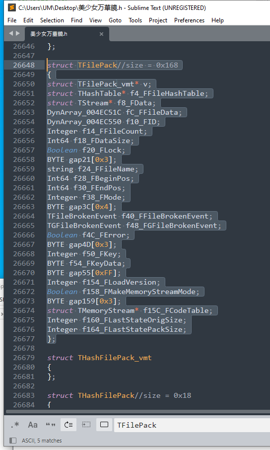

# [QLIE] 文件系统分析 [P1准备]

目标：[美少女万華鏡異聞 雪おんな](https://vndb.org/v44184)

## 前言

好几个月前有个人给提了个[issue](https://github.com/Dir-A/Dir-A_Essays_MD/issues/5)，简单来说，就是想改QLIE的`.b`后缀格式的图片，这种格式应该是一种多格式捆绑在一起的图片封包，很久以前我见过一个工具 [bExplorer](https://github.com/Inori/FuckGalEngine/tree/master/QLIE/bExplorer/bExplorer) 应该是可以编辑的，叫他去试试，他说不行，他说是`美少女万華鏡異聞 雪おんな`，我猜应该比较新的版本，可能格式变了，而且我隐约记得这个 [bExplorer](https://github.com/Inori/FuckGalEngine/tree/master/QLIE/bExplorer/bExplorer) 似乎只能编辑图片数据，但b文件其实里面是有坐标，运动之类的数据的，也许改改它的源码是可以用的，但当时没什么时间，就没继续看了，想着后面找个时间把这个引擎大概逆一下。

网上可以找到一个叫[filepack](https://github.com/hz86/filepack)的工具，可以解包封包，它的源码我粗略看过，应该是IDA里直接扣的，一堆sub开头的函数，比较奇怪的是这工具居然可以封包回去，不知道是原程序里有算法扣出来的，还是重新写的，我也懒得看，能用就先用着，不过后来发现对于`美少女万華鏡異聞 雪おんな`比较大的封包就没办法解包了，不过Garbro可以，但Garbro毕竟没办法封包，但话又说回来，QLIE本来就可以不用封包，只需要改两个flag就可以从目录下读取了。

既然有工具了为什么还要逆呢？还是因为那个老问题，工具有，但过程没有，我个人是很不喜欢的，只要知道结构和算法，工具自己可以写，而且写好的工具有问题也可以自己修，但没结构和算法，写个工具放那，还要去猜写的啥，特别是大部分写的都不怎么样（），仅仅是能用的程度，一出问题你叫我修，真不如重新逆更快。

还是先网上搜一下，有没人写过类似的，可以发现有一篇文章 [超详细!解包某知名Galgame(万华镜5)引擎——Galgame汉化中的逆向](https://www.52pojie.cn/thread-1500700-1-1.html) 粗略看了下，还是觉得不对胃口，只有一些面向过程的分析，缺少对象层面的分析，让人有种咬着数据流debug的感觉，不过有写出来已经很不错了，毕竟这圈子，有留工具的，有留补丁的，就是没留分析过程的，不过也可以理解，详细的分析过程确实很难写，而且分析的时间也长，在花几天写过程，一般人也很难受得了。

分析是前几个月的事了（好了发这篇的时候又过了两个月），本来确实懒得写这篇文章的，因为这都快毕业了，逆向是真吃不了饭，C++项目又还没着落，现在每天都想着把基础库写好了，搞点不一一样的项目，方便面试，确实很忙，但想想分析了不写出来也蛮可惜的，就留个工具实在没什么意思。

那废话就不多说了，下面就进入正题。

## 准备

### 判断框架

要说逆向，还得看正向。所以在分析前，一定要搞清楚目标程序是什么架构的，不要上来就蛮干。

先用[Detect It Easy](https://github.com/horsicq/Detect-It-Easy)看看基本信息，可以发现QLIE其实是Delphi写的

> 注意Delphi不是C/C++，但编译出来的东西其实也是Native的，其实就是带面向对象的Pascal，不过Pascal基本算是寄了，比较少人用了。

Delphi就要注意点了，毕竟不是C/C++，分析方法和技巧还是有点不一样的，可以去网上搜搜看Delphi逆向的一些技巧。

比如这个：[Tips For Analyzing Delphi Binaries in IDA (Danabot)](https://www.youtube.com/watch?v=04RsqP_P9Ss)

### 基本背景

- Delphi的调用约定

    简单来说Delphi的调用约定约等于FastCall，第一个参数是EAX，第二是EDX，第三个ECX，后面都是从栈传递，但栈传递的是顺序和cdecl stdcall是反过来的，其实倒不倒都无所谓，反正我们也没写过Delphi，不知道它源码是啥样的，只要知道参数是怎么传递就不影响分析了。

    本来这里还想说一些坑点的，但这都还没开始逆你就知道了？太假了吧！还是后面再说吧！

  - 可以通过IDR恢复一些符号信息

    通过IDR可以恢复Delphi程序的一些符号，也就一些函数名，包括函数参数的名称（包括标准库的和引擎自己写的），这里就得重提调用约定了，因为参数入栈顺序问题，所以IDR里标注是函数参数，并不是你在IDA里看到那个顺序，这个要注意。

    基本上IDR能够恢复，函数名，函数参数名，类的成员函数和数据成员，类实例化的大小（字节数），还有个就是可以看到函数参数对应的寄存器或栈的偏移位置（当然这个功能有点奇葩，有些时候会调不出来，不过问题也不大，自己可以判断）。

  - IDA需要做一些设置

    IDA也需要调整一下，因为IDA默认会把可执行文件当成C/C++编译的，全部也是按照C/C++分析，一些Delphi的库函数它没办法识别出来，当然你会说不是有IDR恢复的符号吗？确实，IDR起到了不少作用，但有些符号IDR也是没办法恢复的，因为本来就没有嘛！而且如果你要去逆Delphi的库函数，会很痛苦，和C/C++的有一定的差别，特别是它调用WinAPI的时候由于调用约定不一样，还要转换，看着会很奇葩，所以最好让它识别，避免再去分析，浪费很多时间。

### IDR配置

由于是Delphi程序，可以借助IDR来提取部分符号，并辅助分析。

去Github把整个库Clone下来 [IDR](https://github.com/crypto2011/IDR) 

然后把那一堆.bin复制到bin目录，那一堆7z也解压了丢进去

好了，这样就可以开始用了，把主程序exe拽进去，运行，有个提示，点确定就好了

等它分析完

分析完成后可以发现，有很多符号都恢复了从这个树状图，也可以读出不少信息，有类名，方法成员名，类实例化后的大小，甚至还有继承关系，和虚方法

可以发现它们都是继承自TObject的，非常浓郁的OOP风！

还可以把这些结构导出成C语言表示的结构体

这样就把类的数据成员都还原了一部分，省了很多时间

在ClassViewer里找到方法成员，双击可以转到CodeViewer

在函数名上右键，选择Edit Prototype

然后选择弹出窗口的Arguments选项，就可以看到函数参数对应的寄存器和栈偏移，到时候就可以从这里来确认参数

不过有些时候遇到传递当前函数的栈帧的调用约定，可能会导致IDR崩溃

好了，IDR值得介绍的就是这些了，接下来要把信息导入到IDA中，因为IDR的反编译没那么好用

  

### IDR导出符号

IDR可以导出多种文件，就个人实测，导出IDC，然后用导入到IDA里的效果是比较好的，其它可以自行尝试

### IDA配置

由于是Delphi程序，需要对IDA进行一些配置

在IDA载入exe的时候把Analysis栏的Enabled和Indicator去掉（也就是暂时先不分析），然后点OK载入

然后在Options里找到Compiler...选项

  - Compiler改成Delphi

  - Calling convention 改成fastcall

  - 点OK保存

    

    在Options里找到General

    

  找到Strings选项

  - Default string literal type 改成 Delphi

  - 点OK保存

    

  再次Options里找到General找到Analysis选项

  - 重新勾选Analysis选项

  - 点击Reanalyze program

  - 点OK保存

    

    

等待分析完成即可

### 导入IDC

  - File -> Script file...

  

  

等待IDC执行完成，可能会提示几个冲突，点OK就好了

  

执行完成后，可以看到一些没办法导入的符号，自己记一下就好了（其实大部分没啥用，忽略即可）

导出成功后可以看到符号已经过来了，一些函数已经有名字了

函数定义可以在汇编窗口的函数头上看到（伪代码窗口看不到，没加这个注释）

访问数据成员也有显示对应的类型和名称（很重要，可以方便定位各数据成员）

还有就是函数定义的参数顺序是不一样的（特别注意），也少了默认隐含的参数，所以这个注释是对不上的，想看完整定义最好去IDR里看

  

当然，肯定是没办法恢复全部符号的，所以接下来就要手动分析了

  > 还有一些部分可以依据需要调整
  >
  > - 在Views--Sub Views--Signature里添加bds，bds2007按照需求和实际识别到的函数
  >- 在Options中选择demangled names，在show demangled c++ names as 中选择name

