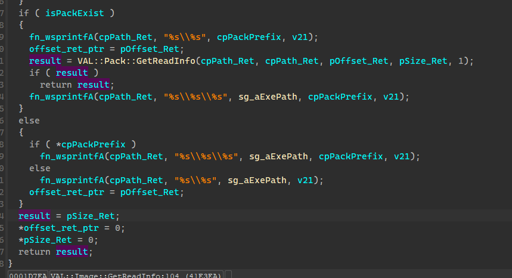

# [Valkyria] 文件读取分析

这里主要讨论目前最新版的Valkyria引擎，也就是目录下封包为data01-00.dat这种命名的

这里选用プレイ！プレイ！プレイ！ロック！为目标游戏进行分析


## 观察

首先观察一下封包，不难发现，除去开头4个字节外，每一个文件名的间隔都是268个字节，所以把每268字节看成一项，观察每一项的后8个字节，可以发现有offset--size的递推关系，可以猜测结构如下

```c
struct VAL_Pack_Entry
{
  char aFileName[260];
  uint32_t uiOffset; // after index
  uint32_t uiSize;
};

struct VAL_Pack
{
  uint32_t uiIndexSize;
  VAL_Pack_Entry[uiIndexSize / sizeof(VAL_Pack_Entry)]
  // data..
};
```


从这个角度上来看，其文件名是固定260字节长度的，但它并没有去清空写入，导致结构看起来很乱，实际上是很简单的


## 脚本文件索引读取

还是断下CreateFileA/W，调试后第一个打开的封包是 data06-00.dat 位置在 0041DB1C （动态基址自己关）

对刚刚找到的位置进行反复调试分析（就是上上下下自己都摸索一遍，逻辑啥的自己看看，写文章这里没办法展开，而且这个引擎大量内联，一两句话很难说清楚，不过你认真看还是能看出来的）

可以发现这是一个读取脚本文件索引的函数，其函数原型如下

```c
char __cdecl VAL::VFS::Script::ReadIndex(
        char *cpPackPrefix,            // 封包前缀 如 data06-,  data01-
        VAL_VFS_Entry *pVFSIndex_Ret,  // 返回读到的索引表
        uint32_t *pScriptCount_Ret,    // 返回索引表中的文件个数
        const char *cpScriptSuffix,    // 搜索目标文件的后缀
        char nReadMod                  // 读取模式
)
```

其逻辑大概如下
```
// count pack entry matching suffiix
entry_count = 0
for ifs : match(data06-*)[data06-01,data06-02,data06-03,data06-04....]
{
  pack_index = ifs.read(ifs.read(4,beg),cur)
  for pack_entry in pack_index
  {
    for if suffix == '.sdt'
    {
      entry_count++
    }
  }
}

// make vfs index
vfs_index = new(entry_count * sizef(vfs_entry))
for ifs : match(data06-*)[data06-01,data06-02,data06-03,data06-04....]
{
  pack_index = ifs.read(ifs.read(4,beg),cur)
  for pak_entry in pack_index
  {
    for if suffix == '.sdt'
    {
      cur_vfs_entry = vfs_entry.back()
      for vfs_entry in vfs_index
      {
        if pak_entry.flename == vfs_entry.filename
        {
          cur_vfs_entry(vfs_entry)
        }
      }
      cur_vfs_entry(pack_entry)
    }
  }
}
```

主要就是依据前缀`data06-`来匹配封包，先从`data06-00`的封包名尝试读取，接着是`data06-01`，依此类推

同一封包名的文件会打开两次，第一次是检查其中符合搜索后缀的文件数量，第二次是生成索引表，值得注意的是其会用封包序号更大的其中的文件来替换序号更小封包中的，也就是如果123.sdt文件同时位于 data06-00.dat data06-01.dat 那么会优先读取01里面的，其具体逻辑在165行。


## 脚本文件结点挂载

读取完成了索引，就开始挂载脚本文件了，这块的逻辑主要是生成一个脚本文件的链表，所有的脚本文件都挂在这个链表上，到时候虚拟机就从这个结构上读取需要的数据。

```c
struct VAL_Script_Entry
{
  VAL_Script_Entry *pNext;
  uint16_t uiID;
  uint16_t uiAlign;
  uint32_t* pData;
  uint32_t uiSize;
  uint32_t* pHdrSize;
  uint32_t* pLabelCount;
  uint32_t* pLabelIndex;
  uint32_t* pMsgCount;
  uint32_t* pMsgBuffer;
  uint32_t* pSeletCount;
  uint32_t* pSelectBuffer;
};
```

读取脚本数据的时候会对脚本文件大小进行检测，以此来判断脚本是否被修改过，简单来说每一个sdt脚本文件头中都有一段校验数据，这段数据是游戏的debug_key和脚本大小混合加密后得到的，读取脚本的时候会尝试解密这个数据，来判断解密出来的debug_key是否和原来相等（如果你改了sdt文件的大小自然就不相等了），也就是下面的 aCheckData，这个长度是依据debug_key确定的。

```c
struct SDT_Label
{
	uint8_t aLabelName[??]; // end with '\0', enc-> xor 0xFF
	uint32_t uiLableRVA; // FOA = uiHeaderSize + uiLableRVA :004521B7
};

struct SDT_HDR_Info
{
	uint32_t uiHDRSize;
	uint32_t uiMsgCount;
	uint32_t uiSelectCount;
	uint32_t uiLabelCount;
	uint32_t uiCheckDataFOA;
};

struct SDT_HDR
{
	SDT_HDR_Info
	SDT_Label[SDT_HDR_Info.uiLabelCount]
	uint8_t aCheckData[uiHDRSize - sizeof(SDT_Label[SDT_HDR_Info.uiLabelCount])]; // end with '\0'
};

struct SDT
{
	SDT_HDR
	// Code
};
```


上图这块的逻辑是 sg_bIsPack06Exist == 1 才会执行的，也就是但游戏检测到data06-00.dat封包存在的时候会走的分支

在其上会有个函数来检测各个封包是否存在，以此来设置全局的标志位来切换不同的封包读取目录，即从目录下读取还是从封包里读取


自然而然的脚本封包的读取当然也有从目录下读取的对应逻辑


基本上来说是差不多的逻辑。


## 图片文件索引读取

不同于脚本的读取，图片的读取只读取目标文件的索引，而不是封包中全部索引都读取

```c
char __cdecl VAL::Image::GetReadInfo(
        char isPackExist,         // 是否存在封包
        const char *cpPackPrefix, // data03- data02-
        const char *cpFileName,   // null.mg2
        CHAR *cpPath_Ret,
        _DWORD *pOffset_Ret,
        _DWORD *pSize_Ret)
```

isPackExist这个参数一般都传递刚刚 VAL::CheckPackExist 检测后保存的全部变量的结果

该函数依据isPackExist的值，会走不同的分支，合成不同的cpPath_Ret，也就是返回不同的目标路径



```c
char __cdecl VAL::Pack::GetReadInfo(
        char *cpFilePath0,
        char *cpFilePath1,
        _DWORD *pOffset_Ret,
        _DWORD *pSize_Ret,
        char nReadMod)
```

VAL::Pack::GetReadInfo 主要作用就是查询指定封包前缀下的各封包中是否存在目标文件，如果存在就会返回目标路径+偏移+大小


获得路径、偏移、大小后就可以调用图片加载函数


音频加载类似

## 总结

这个引擎也是可以原生免封包的，只不过不能原生单独一个文件免封包，但可以把文件全部解包出来，放在以封包前缀命名的文件夹里，然后移除封包，引擎就会从这个文件夹下读取文件，比如data06-00.dat，这个封包的前缀是data06- ，所以只需要解包，并创建一个名为 data06- 的文件夹，然后全部文件丢进去，并把data06-00.dat 移除就可以直接读取了。或者可以hook相关函数来直接控制。又或者可以直接把需要替换的文件打包成data06-01.dat也可以替换。

这个引擎内联太还狠了，代码很多都是一坨过渡内联的，看起来会比较恶心，不过总的来说没用什么复杂的结构，有点耐心还是可以解决的。
