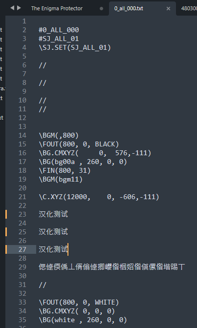
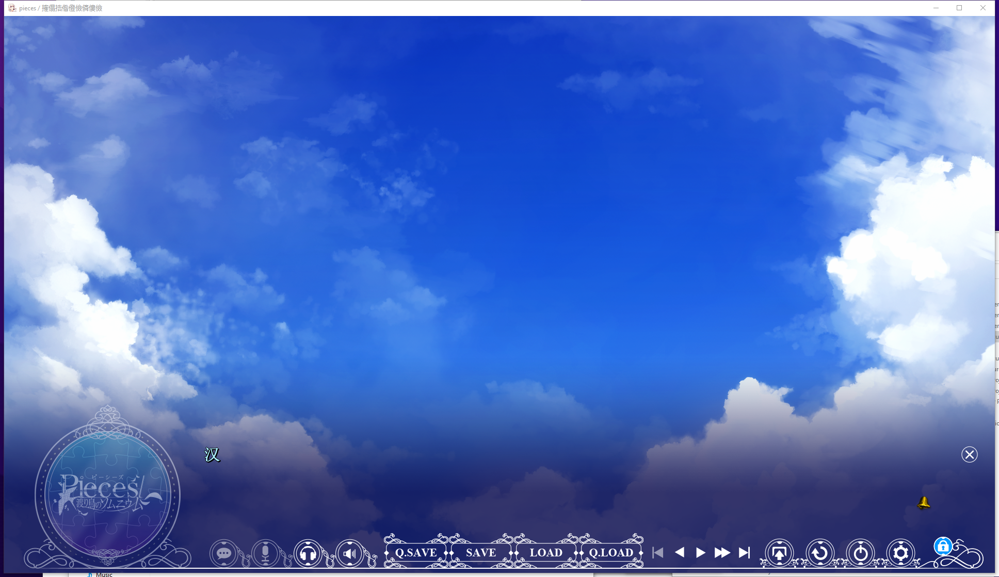

# [YU-RIS引擎]  Whirlpool社的一些观察

对于原版的yuris引擎，只需要解包后对ybn进文本的导出导入，然后把SJIS范围的检查表改成GBK的即可

对于yuris来说CreateFont其实是默认依据系统判断的，一般都可以不用改。


Whirlpool比较奇葩点，他们用的好像是改过的yuris引擎，ybn里不包含游戏的文本部分(这里说的是新版本啦)

他的文本直接就是纯文本格式的，放在 sc.ypf 封包里，解包后是scenario文件夹里面放了一堆txt

看着似乎更方便汉化，其实不然


Whirlpool或者说是改过的yuris，其实有两种显示文本的方法

第一种

是调用Textout函数，在兼容DC上画字，然后贴图，它的Textout还比较奇葩，每次只画一个字符，貌似是全部画完后才贴图。

第二种

是封包里有个字体文件夹，里面其实都是图片，字符就在图片上，把图片上的字一个个切出来显示到屏幕上，这种其实在Gal引擎上也有一部分是这样实现的，一般Whirlpool官中就是这样搞的。

第一种可以说说，第二种其实没啥好讲的，要汉化只能改图片了，第一种看着就和正常yuris没啥区别，确实，没啥区别，但是Whirlpool搞了个很恶心的东西，就是字符的范围校验，之前的那个SJIS的表还在，但是Whirlpool额外还在脚本里写了校验的范围。超出范围的字符表现在游戏里就是直接不显示了，甚至还会强行停止解析，就是当你的字符串一行里某一个位置开始的字符超出了SJIS的编码范围，就会从那个位置直接停止解析后面的字符。所以即使你改了SJIS那个校验的表，也不能过范围校验，因为它后面还会校验一次，特别的傻呗，而且这种校验很难修改，因为不是直接写的汇编，而是通过yuris的虚拟机实现的，所以需要解析op(操作码)，而yuris的脚本是编译的，就和我们exe里的二进制数据一样，只不过在win32下这些数据可以依据x86汇编解析，yuris那种要解析就得逆向yuris虚拟机了。


对此，我们有两种对策

**对策一**：硬刚虚拟机

就是直接硬刚，yuris的虚拟机，找到对应的ybn文件（脚本），然后改掉。由于我水平低下，刚了一天也没刚下来，虚拟机这种东西特别的恶心，很难调试。

一开始我对字符串进行了跟踪，对所有读取目标字符串的的操作都进行了跟踪，但是跟到后面就不知道跑哪去了，这玩意会对字符串进行多次的复制和取字符串取单字节到处复制，非常傻呗，反正这个方法没搞定。

尝试摸索范围，由于超过范围后字符在游戏里会直接不显示并停止解析下一个字符，我尝试摸索出了范围，和SJIS的范围是一致的，也就是 0x81-0x9F,0xE0-0xFC 既然有这个范围那么典型的来说，必然有cmp xx,0x81这种东西，而且0x81，0x9F，0xE0, 0xFC如果没有各种位移异或应该就是直接躺在脚本里的某个位置的。了解了这个情况，开在脚本里摸索。一般的这四个值肯定不可能挨在一起，中间应该会隔有操作码，ybn文件也太多了，搞不懂从哪个开始看，其实跟踪虚拟机也是可以定位到相应脚本的，不过太麻烦了，于是想了个办法。

首先正确提取并解密全部ybn，然后全部合并成一个文件，可以直接用bat批处理，挺快的

```bat
copy /b "%~dp0"\*.ybn  "%~dp0"\new.ybn
```

然后搜索一下边界那些常量，下面这段代码是有问题的，会越界，反正就随便搜一下，乱写了。

```C++
//原理很简单，先一个个字节搜索0x81，找到后从这个位置搜0x9F,找到后搜0xE0以此类推
//searchSize就是搜到0x81往下找0x9F的长度，因为0x81-0x9F这两个之间的距离我们是不确定的
//searchSize尽量在20以内，大了没意义，而且搜索结果很多。
void FindRange()
{
	std::ofstream oFile("1.txt");
	std::ifstream iFile("new.ybn", std::ios::binary);
	size_t szFile = GetFileSize(iFile);
	unsigned char* pBuffer = new unsigned char[szFile];
	iFile.read((char*)pBuffer, szFile);

	size_t searchSize = 20;

	for (size_t i = 0; i < szFile; i++)
	{
		if (pBuffer[i] == 0x81)
		{
			for (size_t j = 0; j < searchSize; j++)
			{
				if (pBuffer[i + j] == 0x9F) 
				{
					for (size_t x = 0; x < searchSize; x++)
					{
						if (pBuffer[i + j + x] == 0xE0)
						{
							for (size_t y = 0; y < searchSize; y++)
							{
								if (pBuffer[i + j + x + y] == 0xFC)
								{
									oFile << std::hex << (i + j + x + y) << std::endl;
									i = i + j + x + y;
								}
							}
						}
					}
				}
			}
		}
	}
	oFile.flush();
}
```

用改代码对 **pieces/渡り鳥のソムニウム** 的ybn进行搜索，可以找到yst00054.ybn在file offset:0x30D0处，是符合的，对二进制数，进行一定的断行，就真像是那么回事，不过由于没有对yuris虚拟机进行仔细的逆向分析，这里面的操作码都看不懂，只有0x81 0x9F这些是实实在在的。
```c++
unsigned AnsiChar data[56] = {
	0xFC, 0x0A, 0x57, 0x02, 0x00, 
	0x81, 0x00, 0x5A, 0x00, 0x00, 0x48, 0x03, 0x00, 0x40, 0xFC, 0x0A, 
	0x57, 0x02, 0x00, 
	0x9F, 0x00, 0x53, 0x00, 0x00, 0x26, 0x00, 0x00, 0x48, 0x03, 0x00, 0x40, 0xFC, 0x0A,
    	0x57, 0x02, 0x00, 
	0xE0, 0x00, 0x5A, 0x00, 0x00, 0x48, 0x03, 0x00, 0x40, 0xFC, 0x0A, 
	0x57, 0x02, 0x00, 
	0xFC, 0x00, 
	0x53, 0x00, 0x00, 0x26
};
```

不管那么多，先把9F改成0xFE FC改成0xFE看看效果

把exe的SJIS校验表改了，然后改一下文件读取顺序，变成可以免封包读取txt文件，然后修改一下txt文件的内容。更改修改的ybn文件也放到目录下ysbin文件夹里（ybn记得xor会去）





可以看到汉（0xBABA）这个字出来了，但是后面的字符都没了，汉这个字的GBK已经是超过SJIS原来的边界了，不过至于为什么这里也会出问题，你可能会说是判断了第二个字节，其实不是，或第二个字，其实也不是，这里只有第一个字解除了限制可以出来，只要是GBK里的都行，但是后面第二个字符只有写SJIS范围内的才能出来，否则就像图上那样。可能还有地方限制了范围，但是没找到。

[Notes.txt](https://github.com/arcusmaximus/VNTranslationTools/blob/main/VNTextPatch.Shared/Scripts/Yuris/Notes.txt) 后面搜到了这个东西，有人取逆了虚拟机和大部分文件结构，照着解析了一下脚本

```c++
48030040 FB0A pushscalarvar FB0A
4201005F      pushint8 0x5F
3D0000	      equal
48030040 FF0A pushscalarvar FF0A
420100   5E   pushint8 0x5E
48030040 FB0A pushscalarvar FB0A
420100   2E   pushint8 0x2E
3D0000 	      equal
48030040 FF0A pushscalarvar FF0A
420100   5F   pushint8 0x5F
48030040 FC0A pushscalarvar FC0A
570200   8100 pushint16 0x8100
5A0000 	      ge
48030040 FC0A pushscalarvar FC0A
570200   9F00 pushint16 0x9F00
530000 	      le
260000	      logand
48030040 FC0A pushscalarvar FC0A
570200   E000 pushint16 0xE000
5A0000 	      ge
48030040 FC0A pushscalarvar FC0A
570200   FC00 pushint16 0xFC00
530000 	      le
260000	      logand
7C0000	      logor
48030040 FF0A pushscalarvar FF0A
420100   60   pushint8 0x60
48030040 FB0A pushscalarvar FB0A
420100   22   pushint8 0x22
3D0000 	      equal
48030040 FF0A pushscalarvar
420100   16   pushint8 0x16
48030040 FB0A pushscalarvar
420100   20   pushint8 0x20
3D0000 	      equal

```

没看出什么名堂，由于最近又一堆考试和课，这里就没继续研究下去了，做一个记录，就此打住。


**对策二**：映射码表

之前提到Textout那个函数是一个个字符输出的，其实可以搞一个映射，原理很简单，我们在SJIS范围内重新给汉字编号，然后Hook Textout这个函数，比如传入这个函数的是 0x8130 我们就查一下自己的表看看这个是不是要映射，比如表里记录了 0x8130 -> 0xBABA 那么我们就把BABA覆盖进去就好了。当然还有一种是直接改字体的也行。这个后面有空我会写一个放上来。


**对策三**：直接看答案

之前有些大佬逆过了，给出了关键点，直接搜索以下特征码即可。
```
C1 E0 08 ?? ?? ?? ?? ?? ?? 99 E9
```

```asm
00455B23  | E9 0DF9FFFF           | jmp pieces.new.455435
00455B28  | C1E0 08               | shl eax,8
00455B2B  | 0FB64A 01             | movzx ecx,byte ptr ds:[edx+1]
00455B2F  | 03C1                  | add eax,ecx
00455B31  | 99                    | cdq
00455B32  | E9 40F9FFFF           | jmp pieces.new.455477
```

改成
```ASM
00455B23  | E9 0DF9FFFF           | jmp pieces_crack1121.new.455435
00455B28  | 66:B8 009F            | mov ax,9F00
00455B2C  | 90                    | nop
00455B2D  | 90                    | nop
00455B2E  | 90                    | nop
00455B2F  | 90                    | nop
00455B30  | 90                    | nop
00455B31  | 99                    | cdq
00455B32  | E9 40F9FFFF           | jmp pieces_crack1121.new.455477
```

ax里面的数值只要是SJIS范围内的都行啦，不限于0x9F00，写eax也行啦。

最后JMP会去的地方往上看也能看到SJIS那个编码检查的表，所以改这个也还要改SJIS的检查表。

