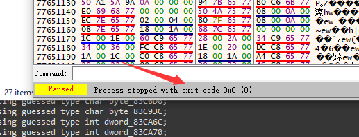
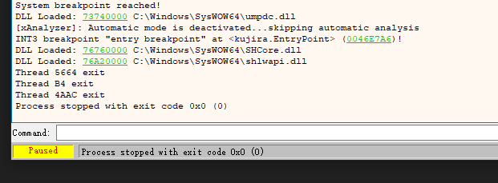
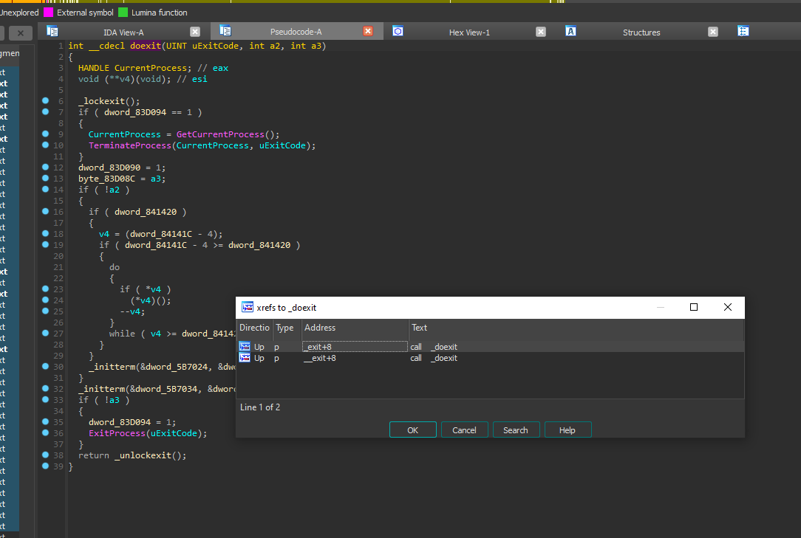
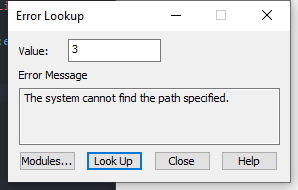

# [YU-RIS] 中文路径无法运行

## 0x00 背景

今天发现个游戏 `鯨神のティアスティラ`

一般来说`yuris`的游戏，双击是可以打开的，即使没转区，顶多也就乱码嘛，但是这游戏还确定有点奇葩，双击打不开，转区可以打开，然后把路径全部换成英文也可以打开。这种情况BGI之前遇到过，BGI那个是`MultiByteToWideChar`的问题。

这种打不开的情况是连窗口都出不来的，其实更多的游戏不转区打不开的情况通常是脚本和文件读取的编码问题，就是游戏可以跑起来，但是会黑屏之类的。

## 0x01 观察

我们用x64dbg运行一下游戏看看，发现游戏自己退出了。



查看log窗口也没发现什么异常，估计是调用了`ExitProcess()`函数来结束程序的



给 `ExitProcess()`函数下个断点，重新跑一下，发现确实断下来了。为了方便跟踪退出的原因，我们先用IDA分析一下游戏执行文件。

我们先来到看看断下来的地方，找到压入栈里的返回地址（也就是来到调用 `ExitProcess()`函数的地方）也就是找到 `call dword ptr ds:[&ExitProcess]`,复制一下地址，在IDA里按G转到相应的地方，然后反编译成C语言



可以发现这个是在`doexit`这个函数里执行的，对`doexit`按x来查看谁调用了这个函数，有两个结果，然后用x64dbg对他们下断点，看看是谁调用的，重复该动作（注意观察传入函数的值），`ExitProcess(uExitCode);`反编译后有IDA可以看到这个，`uExitCode`这个我们已经从x64dbg里可以看到是0，所以这也是一个关键是线索，往回追的时候要注意看这个变量什么时候变成了0。

```C
  v5 = WinMain(ModuleHandleA, 0, lpCmdLine, v3);
  exit(v5);
```

最终会来到这个地方，可以发现0其实是v5，也就是`WinMain`的返回值。

现在进到`WinMain`里看看谁Return了0，配合x64dbg方便定位。

```C
 hMutex = CreateMutexA(0, 0, lpMutexName);
  if ( hMutex )
  {
    if ( GetLastError() == 183 )
    {
      CloseHandle(hMutex);
      v6 = 1;
    }
    else
    {
      v6 = 0;
    }
  }
  else
  {
    v6 = -1;
  }
  if ( v6 )
  {
    sub_41194C();
    sub_411CFC();
    return 0;
  }
```

最终可以发现，其实是`WinMain`里第二次调用`CreateMutexA`的时候出了问题，导致了程序退出。

## 0x02 理解

`CreateMutexA`是什么呢？你搜一下可以发现这个是创建互斥体的，哎，不懂也没关系，其实你也不要管他干啥的，可以先看看它的返回值，判断一下是什么问题导致这个函数执行失败。

在x64dbg里调试观察该函数执行完毕收的`eax`的值，发现是0

```
If the function succeeds, the return value is a handle to the newly created mutex object.

If the function fails, the return value is NULL. To get extended error information, call GetLastError.
```

MSDN里对返回值的描述是这样的，叫我们调用`GetLastError()`，整好，下面就一个

```ASM
00403C52  | 33C0                        | xor eax,eax                                   |
00403C54  | 68 C0606800                 | push kujira.6860C0                            |
00403C59  | 50                          | push eax                                      |
00403C5A  | 50                          | push eax                                      |
00403C5B  | FF15 78F25800               | call dword ptr ds:[<&CreateMutexA>]           |
00403C61  | A3 B4CC8300                 | mov dword ptr ds:[83CCB4],eax                 |
00403C66  | 85C0                        | test eax,eax                                  |
00403C68  | 0F84 7D020000               | je kujira.403EEB                              |
00403C6E  | FF15 94F25800               | call dword ptr ds:[<&GetLastError>]           |
00403C74  | 3D B7000000                 | cmp eax,B7                                    |
00403C79  | 75 13                       | jne kujira.403C8E                             |
00403C7B  | FF35 B4CC8300               | push dword ptr ds:[83CCB4]                    |
00403C81  | FF15 7CF25800               | call dword ptr ds:[<&CloseHandle>]            |
00403C87  | B8 01000000                 | mov eax,1                                     |
00403C8C  | EB 02                       | jmp kujira.403C90                             |         |
```

但是`eax=0`的时候并不会调用，所以我们可以改一下标志寄存器，或者把`eax`改成1之类的。

```
EAX : 00000003
EBX : 002DE000
ECX : 00E50000
EDX : 00E50000
```

发现是3，可以用vs的tools栏里的error lookup查一下



看样子是说的路径问题，但是这函数的参数好像也没路径吧

```C
HANDLE CreateMutexA(
  [in, optional] LPSECURITY_ATTRIBUTES lpMutexAttributes,
  [in]           BOOL                  bInitialOwner,
  [in, optional] LPCSTR                lpName
);
```

在x64dbg里看看 `lpName`这个东西是，发现看着还挺像路径的，而且还是GBK编码的

```
c::users:dir-a:desktop:鯨神のティアスティラ\kujira.exe
```

在MSDN看看这个参数的说明

```
The remainder of the name can contain any character except the backslash character (\)
```

他说这个参数里不能包含`\`这个字符，显然这里可以看到，这玩意传进来的参数里居然有`\`那肯定是不行了。我们先把这个反斜杠去掉看看，可以发现，这个函数成功执行过去了，返回值也是正常的，但是游戏还是退出了，后面应该还有问题。

## 0x03 思索

现在就有两种思路了，继续去跟踪后面是什么问题导致了退出，或往前跟踪看看是什么导致了这个问题，也就是第三个参数里有反斜杠。

这里我选择了第二种思路，然后我试着转区运行了，这是可以打开的，然后观察刚刚的地方，这次第三个参数的编码是SJIS的了，并且没有反斜杠。猜测一下问题可能就出在SJIS和GBK的编码问题上。

再到x64dbg看看`CreateMutexA`的第三个参数，可以看到这个直接push了一个具体的地址，应该是一个全局的变量，然后运行后把字符串写了进来，我们直接对这个地址下硬件断点，执行后就可以知道谁往这里写了字符串了

```
00411880  | 46                          | inc esi                                       |
00411881  | 84D2                        | test dl,dl                                    |
00411883  | 75 F6                       | jne kujira.41187B                             |
00411885  | BA C0606800                 | mov edx,kujira.6860C0                         |
0041188A  | 0FBE02                      | movsx eax,byte ptr ds:[edx]                   |
0041188D  | 85C0                        | test eax,eax                                  |
0041188F  | 74 27                       | je kujira.4118B8                              |
00411891  | 0FB6F0                      | movzx esi,al                                  |
00411894  | 0FB68E A0745B00             | movzx ecx,byte ptr ds:[esi+5B74A0]            |
0041189B  | 41                          | inc ecx                                       |
0041189C  | 0FBEF9                      | movsx edi,cl                                  | edi:":\\users\\dir-a\\desktop\\鯨神のティアスティラ\\kujira.exe"
0041189F  | 83FF 02                     | cmp edi,2                                     | edi:":\\users\\dir-a\\desktop\\鯨神のティアスティラ\\kujira.exe"
004118A2  | 0F84 8E000000               | je kujira.411936                              |
004118A8  | 83F8 5C                     | cmp eax,5C                                    | 5C:'\\'
004118AB  | 75 03                       | jne kujira.4118B0                             |
004118AD  | C602 3A                     | mov byte ptr ds:[edx],3A                      | 3A:':'
004118B0  | 42                          | inc edx                                       |
```

可以发现是这个地方，可以看到有5C 3A的常数，看着像是把反斜杠替换成冒号，对这个地方进行跟踪后发现，确实是这样，但是有个地方的反斜杠没换到，具体原因是这里

```
movzx ecx, byte ptr ds:[esi+0x5B74A0]
```

我们直接上IDA反编译的代码吧(我稍微对变量命名了一下)

```C
  strcpy(lpMutexName, FullPath);
  iteString_ = lpMutexName;
  for ( iChar = lpMutexName[0]; *iteString_; iChar = *iteString_ )
  {
    if ( (SJIS_Range_Table[iChar] + 1) == 2 )
    {
      iteString_ += 2;
    }
    else
    {
      if ( iChar == 0x5C )
        *iteString_ = 0x3A;
      ++iteString_;
    }
  }
```

0x5B74A0 这个地址其实是SJIS_Range_Table，也就是`yuris`常见的那个SJIS范围检查的表，没想到这玩意居然会拿来检查路径，这个路径是这样获取的

```C
GetModuleFileNameA(0, FullPath, 0x105u);
```

获取的路径放到`FullPath`里，然后通过`strcpy`拷贝到`lpMutexName`里，拷贝完成后对这个路径进行检查，并把反斜杠替换成冒号，但是这东西并不是机械的扫描过去发现5C就干成3A的，如果路径里有日文字符的话，SJIS编码的第二位也有可能是5C，所以这玩意用SJIS的范围校验表来检查字符串里的日文字符，并跳过。

但是在中文区域的系统下，`GetModuleFileNameA()`获取的是GBK编码的字符，这就导致了它在检查字符的时候出现了问题，把一些GBK编码的字符当成了ASCII的单字节字符，而有些当成了双字节字符，恰巧就出现了一个地方，前面的字节在SJIS内，后面刚好是0x5C，`iteString_ += 2;` 直接跳过了。如果全部范围都不在SJIS里，其实也是可以的，就是机械的把这段字符串全部3A换成5C，至少`CreateMutexA()`这个函数执行不会出问题。

## 0x04 解决

好了，现在就很好办了，直接把SJIS的这个范围检查表个改成GBK的就行了，这个以前说过了，这里就不多说了。

