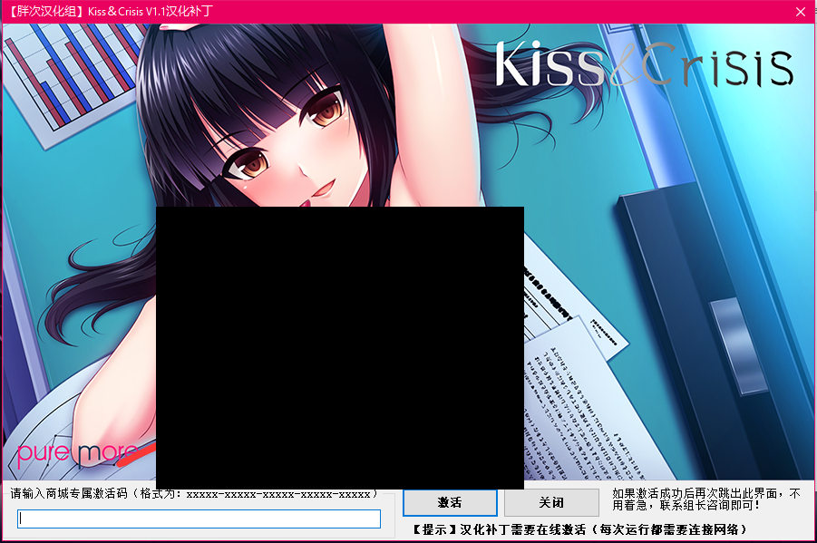
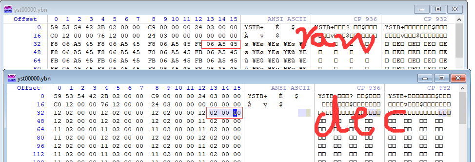
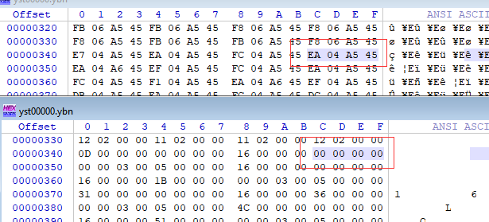
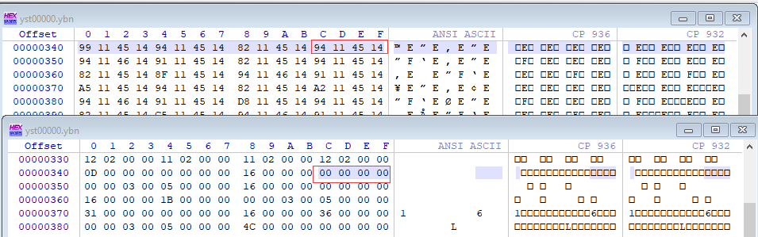
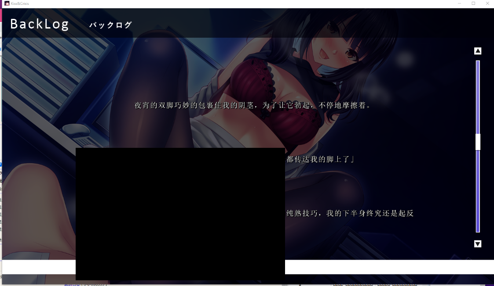

# [YU-RIS引擎] 收费组补丁破解之Kiss&Crisis

以前发的贴，转到Github保存一下，略有改动。2022年05月29日 04点27分

------

今天整理文件的时候，看了下YU-RIS的YSTB 文件的解密算法，
突然想到之前屋子的马甲 `胖次汉化组`
这个组之前屋子没被抓的时候，有个网站，挂了一些他们的焊化补丁
屋子那个是要付费才能下载的，这个是可以直接下载，下载后要买激活码才能进去

------

当然了，这种能直接下载的一般都是白给，但是后面他们换了加密，没有之前的漏洞了，不过有几个游戏没换的
当然了老的加密直接bypass也是有点难的，我就直接利用他们老加密的漏洞，把汉化的文件提取出来，程序自己处理一下就好了。其实如果有老弟买了的话，能直接进游戏会方便很多。

------

这里处理一个**Pure More** 社的，叫：**Kiss & Crisis**
我没破，因为是YU-RIS的，这引擎我没怎么研究过，当时dump完文件，发现密钥和原来的游戏不一样，就放着没看了，因为加壳，验证的时候，解密的只有壳和验证程序的代码，很难去找密钥。

今天傍晚看了下YSTB的加密，就是简单的xor，xor？哦？那岂不是不用密钥了？
毕竟我有日文版的文件，肯定不可能全部脚本都改掉

**原文件  ---->xor{key} ---->加密文件**

按照这个思路，我甚至能读出密钥 ヽ(✿ﾟ▽ﾟ)ノ

------

首先到日文版的exe里找了下YSTB的密钥 **0xEA04A545**
然后找个老的工具，提取**ysbin.ypf**搞出原始**加密的ybn**
然后可以直接用**GarBro**来提取出**解密的ybn**，**GarBro**支持猜密钥（
注意看上下两个文件，一个是加密的，一个是解密的
除去signature，盯着00看，图中红框两个，后面00 00（这加密是四位的）
很显然这个xor{key}的后两个就是 **A545** ,那么前两位呢？

------

别急我们再往下翻，看有个居然是 **00 00 00 00** ，
说明，这个对应上面的加密文件，就是我们的密钥啊！ **0xEA04A545** ┌(。Д。)┐
好了，到这就分析完成了，如何从原文件到加密文件读出密钥，接着迁移到屋子那个文件上看看。

------

还是那个位置，我们打开dump好的屋子的文件。读出密钥为 **0x94114514** (°ー°〃) 居然这么简单？
当然这个位置焊化的文件可能变了，xor后就不是密钥了，那么我们可以找多处 **00 00 00 00** 的地方来比对
总之一番操作后，确定密钥就是这个了，接下来就简单了，先decrypt然后用原游戏的密钥xor回去

------

当然了，这个时候还得结合一下汉化yuris的经验，读取封包，校验表改掉，放入ybn文件
启动！芜湖，完美（当然了，这只是想象的，实际上我还改了一堆东西T_T

