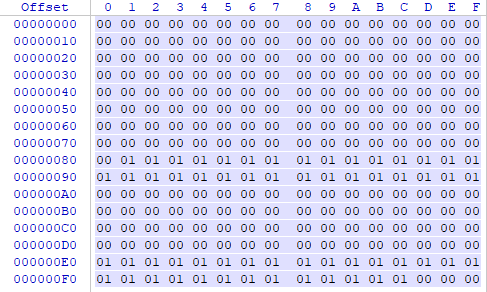
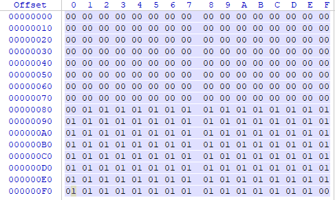
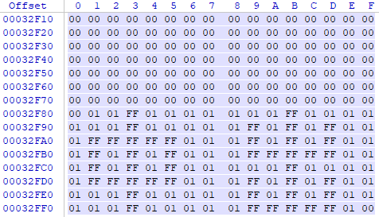

# [YU-RIS引擎] 编码范围分析

## 0x00 背景

对于`yuris`这个引擎，编码的检验范围和这种经典的范围校验是不一样的

```assembly
00406896  | 85C9                  | test ecx,ecx
00406898  | 74 1D                 | je ハナヒメ＊アブソリュート！.4068B7
0040689A  | 8B10                  | mov edx,dword ptr ds:[eax]
0040689C  | 8A4411 FF             | mov al,byte ptr ds:[ecx+edx-1]
004068A0  | 3C 81                 | cmp al,81
004068A2  | 72 04                 | jb ハナヒメ＊アブソリュート！.4068A8
004068A4  | 3C 9F                 | cmp al,9F
004068A6  | 76 08                 | jbe ハナヒメ＊アブソリュート！.4068B0
004068A8  | 3C E0                 | cmp al,E0
004068AA  | 72 0B                 | jb ハナヒメ＊アブソリュート！.4068B7
004068AC  | 3C EF                 | cmp al,EF
004068AE  | 77 07                 | ja ハナヒメ＊アブソリュート！.4068B7
004068B0  | BB 5C000000           | mov ebx,5C
004068B5  | EB 7F                 | jmp ハナヒメ＊アブソリュート！.406936
004068B7  | 8B46 38               | mov eax,dword ptr ds:[esi+38]
004068BA  | 8B08                  | mov ecx,dword ptr ds:[eax]
004068BC  | 8D51 FF               | lea edx,dword ptr ds:[ecx-1]
004068BF  | 8910                  | mov dword ptr ds:[eax],edx
004068C1  | 85C9                  | test ecx,ecx
```

尽管在`yuris`的游戏中你可以搜索到上述几乎相同的校验代码

但那个并不是拿来校验游戏里显示的文本的。


## 0x01 理解校验原理

0x81,0x9F,0xE0,0xEF如果你搜索`SJIS`编码范围

不难发现这就是`SJIS`第一个字节的编码范围(自定义区就不去管他了)

也就是说其实这个校验范围只是验证了第一个字节。

```
SJIS:第一个字节的范围 0×81-0×9F、0xE0-0xEF
GBK:第一个字节的范围 0×81-0xFE
```

这边就取常见的范围，一般游戏趋向于取这种范围
其实还有自定义字符的范围，SJIS还能再大一些
有些游戏SJIS可能是0x80-0xA0、0xE0-0xFC
反正大致是这个范围，我们不去纠结这多少一点。


如果你有仔细阅读我之前的文章
应该可以知道，ASCII和SJIS的关系
为什么第一个字节不是从0x00开始的原因


这个范围的作用也很明显，比如一堆日文里夹杂了一个英文字符
大家肯定知道，日文字符用的是两个字节编码的，而英文字符是一个(讨论窄字节)
有了这个范围可以正常解析，如果是机械的两个两个字节解析成一个字符
那到了那个英文字符后面肯定就全部错位了

```
0x83, 0x6E, 0x83, 0x69, 0x83, 0x71, 0x83, 0x81 //SJIS
ハナヒメ
0x83, 0x6E, 0x83, 0x69, 0x41, 0x83, 0x71, 0x83, 0x81 //SJIS
ハナAヒメ
```


还有些时候是用来过滤一些显示不出来的字符
可以看到SJIS在9F到E0断了一大截，
如果你写的中文字符恰好在这个断掉的范围内，自然是会被过滤掉的
在一些引擎里表现为只能显示出几个汉字，或干脆直接没字了。


## 0x02 另一种校验方式的实现

除了上面那种一堆`cmp`的实现方法，还有另一种校验方式的实现

不管你能不能看懂最开头那段汇编代码
究其本质就是在字符串中一个个字节取出来比对
判断取出来的这个字节是不是在0×81-0×9F、0xE0-0xEF的范围内

假设我有一个函数
```c++
bool is_SJIS(unsigned char X)
{
	//这里就不写了，不重要
}
```

如果输入的 X 是在 0×81-0×9F、0xE0-0xEF的范围内 那么返回true，反之。

我们知道，一个字节的范围是 0x00-0xFF
那么也就是说这个函数的输入值，也就是 X 只可能是 0x00-0xFF
如果SJIS的范围是确定的，那么 X 的每一个输入的值都可以是确定的。

说白了，如果都是确定的，那么我们可以直接计算出结果来
然后保存成一张表，下次直接查表即可，不用再次计算了。

就像是99乘法表，`AxB=C`
A{0 - 9}, B{0 - 9} 即A和B的值是有限且确定的，所以C的值也是有限且确定的
我们背了99乘法表，就是把所有可能结果都记住了，下次就不用去算了。

对此，我们可以引入一张is_SJIS的表

```C++
unsigned char is_SJIS[] = 
{
	0x00,0x00,0x00,0x00,0x00,0x00,0x00,0x00,0x00,0x00,0x00,0x00,0x00,0x00,0x00,0x00,
	0x00,0x00,0x00,0x00,0x00,0x00,0x00,0x00,0x00,0x00,0x00,0x00,0x00,0x00,0x00,0x00,
	0x00,0x00,0x00,0x00,0x00,0x00,0x00,0x00,0x00,0x00,0x00,0x00,0x00,0x00,0x00,0x00,
	0x00,0x00,0x00,0x00,0x00,0x00,0x00,0x00,0x00,0x00,0x00,0x00,0x00,0x00,0x00,0x00,
	0x00,0x00,0x00,0x00,0x00,0x00,0x00,0x00,0x00,0x00,0x00,0x00,0x00,0x00,0x00,0x00,
	0x00,0x00,0x00,0x00,0x00,0x00,0x00,0x00,0x00,0x00,0x00,0x00,0x00,0x00,0x00,0x00,
	0x00,0x00,0x00,0x00,0x00,0x00,0x00,0x00,0x00,0x00,0x00,0x00,0x00,0x00,0x00,0x00,
	0x00,0x00,0x00,0x00,0x00,0x00,0x00,0x00,0x00,0x00,0x00,0x00,0x00,0x00,0x00,0x00,
	0x00,0x01,0x01,0x01,0x01,0x01,0x01,0x01,0x01,0x01,0x01,0x01,0x01,0x01,0x01,0x01,
	0x01,0x01,0x01,0x01,0x01,0x01,0x01,0x01,0x01,0x01,0x01,0x01,0x01,0x01,0x01,0x01,
	0x00,0x00,0x00,0x00,0x00,0x00,0x00,0x00,0x00,0x00,0x00,0x00,0x00,0x00,0x00,0x00,
	0x00,0x00,0x00,0x00,0x00,0x00,0x00,0x00,0x00,0x00,0x00,0x00,0x00,0x00,0x00,0x00,
	0x00,0x00,0x00,0x00,0x00,0x00,0x00,0x00,0x00,0x00,0x00,0x00,0x00,0x00,0x00,0x00,
	0x00,0x00,0x00,0x00,0x00,0x00,0x00,0x00,0x00,0x00,0x00,0x00,0x00,0x00,0x00,0x00,
	0x01,0x01,0x01,0x01,0x01,0x01,0x01,0x01,0x01,0x01,0x01,0x01,0x01,0x01,0x01,0x01,
	0x01,0x01,0x01,0x01,0x01,0x01,0x01,0x01,0x01,0x01,0x01,0x01,0x01,0x00,0x00,0x00
};
```


如果以0为基准，你从左往右数0x82个字节，可以发现是0x1
即图中0ffset0x80那一行的第二。
而且从这里开始一排都是01，数到这一堆01结束的地方是0x9F
以此类推，下面那一块01是E0开始FC结束

如果以数组的下标来访问
```c++
is_SJIS[0x82] -> 01 -> true -> SJIS
is_SJIS[0x87] -> 01 -> true -> SJIS
is_SJIS[0xC6] -> 00 -> false -> No SJIS
is_SJIS[0x07] -> 00 -> false -> No SJIS
```

那么这时候就相当于把一堆`cmp`转换成了查表操作
也就是手算 一位数x一位数 乘法变为了背诵乘法表
结果都是一样的，速度反而更快。（没有人会再手算一位数乘法吧？）


## 0x03 制作一张GBK范围校验表

明白了上述的原理，我们也可以来制作一张GBK范围的校验表

先来复习一下GBK的范围
```
0×81-0xFE
```

那么也就是说，我们的表，大小为0x100
且从第0x81个字节开始，一直写01直到第0xFE个字节

为了偷懒，我们直接在原来的SJIS表上改改
```C++
unsigned char is_GBK[] = 
{
	0x00,0x00,0x00,0x00,0x00,0x00,0x00,0x00,0x00,0x00,0x00,0x00,0x00,0x00,0x00,0x00,
	0x00,0x00,0x00,0x00,0x00,0x00,0x00,0x00,0x00,0x00,0x00,0x00,0x00,0x00,0x00,0x00,
	0x00,0x00,0x00,0x00,0x00,0x00,0x00,0x00,0x00,0x00,0x00,0x00,0x00,0x00,0x00,0x00,
	0x00,0x00,0x00,0x00,0x00,0x00,0x00,0x00,0x00,0x00,0x00,0x00,0x00,0x00,0x00,0x00,
	0x00,0x00,0x00,0x00,0x00,0x00,0x00,0x00,0x00,0x00,0x00,0x00,0x00,0x00,0x00,0x00,
	0x00,0x00,0x00,0x00,0x00,0x00,0x00,0x00,0x00,0x00,0x00,0x00,0x00,0x00,0x00,0x00,
	0x00,0x00,0x00,0x00,0x00,0x00,0x00,0x00,0x00,0x00,0x00,0x00,0x00,0x00,0x00,0x00,
	0x00,0x00,0x00,0x00,0x00,0x00,0x00,0x00,0x00,0x00,0x00,0x00,0x00,0x00,0x00,0x00,
	0x00,0x01,0x01,0x01,0x01,0x01,0x01,0x01,0x01,0x01,0x01,0x01,0x01,0x01,0x01,0x01,
	0x01,0x01,0x01,0x01,0x01,0x01,0x01,0x01,0x01,0x01,0x01,0x01,0x01,0x01,0x01,0x01,
	0x01,0x01,0x01,0x01,0x01,0x01,0x01,0x01,0x01,0x01,0x01,0x01,0x01,0x01,0x01,0x01,
	0x01,0x01,0x01,0x01,0x01,0x01,0x01,0x01,0x01,0x01,0x01,0x01,0x01,0x01,0x01,0x01,
	0x01,0x01,0x01,0x01,0x01,0x01,0x01,0x01,0x01,0x01,0x01,0x01,0x01,0x01,0x01,0x01,
	0x01,0x01,0x01,0x01,0x01,0x01,0x01,0x01,0x01,0x01,0x01,0x01,0x01,0x01,0x01,0x01,
	0x01,0x01,0x01,0x01,0x01,0x01,0x01,0x01,0x01,0x01,0x01,0x01,0x01,0x01,0x01,0x01,
	0x01,0x01,0x01,0x01,0x01,0x01,0x01,0x01,0x01,0x01,0x01,0x01,0x01,0x01,0x01,0x00
};
```


## 0x04 丧心病狂

其实如果你写过C语言，并且有一定的基础和了解
if( ？) -> 这个？只要不是0其实都相当于true

所以这样写也是完全OK的



当然如果是这样的当我没说` if(charX == 1)`

## 0x05 修改游戏程序

这里就不用说了吧

直接在游戏exe搜索那张表就行了。


## 0x06 一点拓展

其实在编码转换上也是可以有同样的道理的

比如GBK->UTF16

每一个GBK编码的字符都有唯一确定的UTF16编码的字符(其实不是，但大部分是)  
为此我们可以生成一张表，通过查表来进行编码的转换

SJIS->UTF16同理
