# CMVS 文件读取分析

这个引擎主要是[Purple software](https://vndb.org/p132)用的，其实该引擎默认就可以免封包读取，关键是如何自由控制来达到替换文件的目的

这次主要两个目标

- 找到并控制免封包
- 分析读取文件逻辑

这里选用[クナド国記](https://vndb.org/v32021)进行演示

相关链接

- [免封包略谈](https://github.com/Dir-A/Dir-A_Essays_MD/blob/main/方法论/[封包] 免封包略谈.md#封包-免封包略谈)

- [VFS的实现思路](https://github.com/Dir-A/Dir-A_Essays_MD/blob/main/方法论/[方法论] VFS的实现思路.md#方法论-vfs的实现思路)

- [封包逆向入门](https://github.com/Dir-A/Dir-A_Essays_MD/blob/main/方法论/[方法论] 封包逆向入门.md#封包逆向入门)


## 寻找免封包代码

这个没有统一的方法，需要去分析从封包读取文件的逻辑才能确定

所以这里就是按照正常的封包逆向思路进行分析，并在途中偶遇免封包逻辑 :P

首先我们肯定会想到断下`CreateFile`定位到打开封包的地方

可以看到游戏导入了三个相关函数，断 `CreateFileA\W` 即可，至于map有没可能？当然有了，但一般不会用，待我们先观察再说。

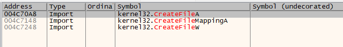

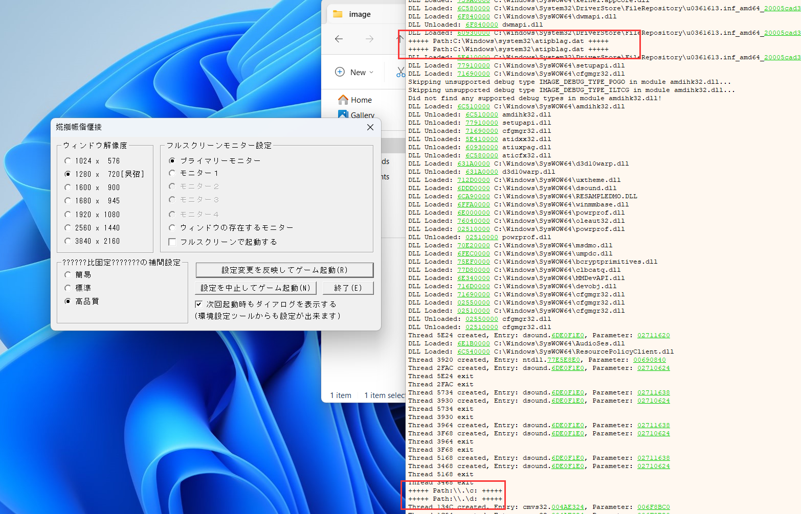

可以发现，直到打开游戏的开始设置窗口也没打开任何封包文件（啊？怎么在log窗口打印打开的文件？当然是条件断点了）

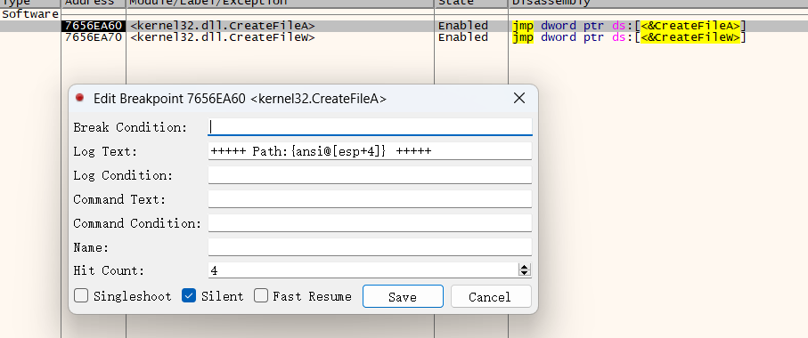

那我们点启动游戏吧！

启动游戏后可以发现`CreateFileW`打开的基本都不是目标文件，把它断点去掉，继续调试`CreateFileA`发现打开了一个`start.ps3`文件，如果你仔细看过游戏目录就知道，这个`start.ps3`文件其实`script.cpz`封包里也有一个，如果提取出来对比会发现，两个文件其实是不一样的。

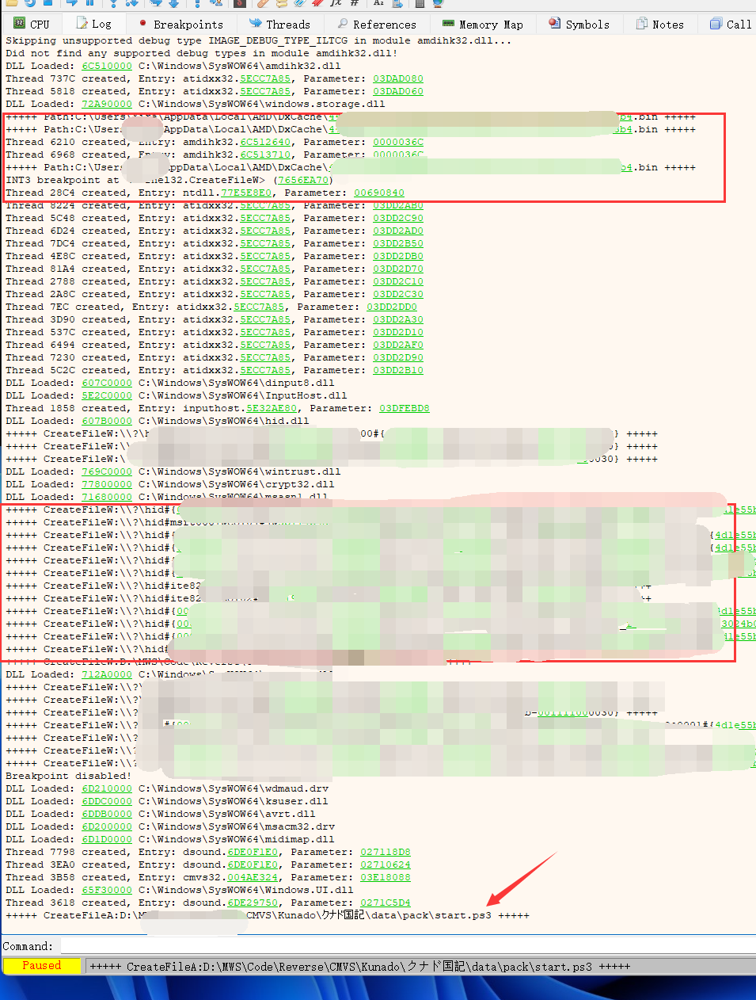

那这不就是免封包读取？对吧？

如果你多打开几个封包观察就会发现，有些文件，它是打包到封包里的，有些则直接丢在了目录下，比如它有个`music`和`video`目录里面的文件都没封包

说到这其实也就是一个经验了，如果观察到，游戏有些资源没封包有些又封了，那是不是证明游戏引擎应该有某种机制来读取没封包的资源文件？当然很多引擎的视频文件一般不封包，因为视频文件比较大，跟踪视频文件的读取通常也是一个找免封包位置的突破口，当然也有可能引擎对视频文件的读取单独写了一个逻辑。

好了我们继续往下走，现在可以继续观察`CreateFileA`它后续就一直在打开存档或封包了

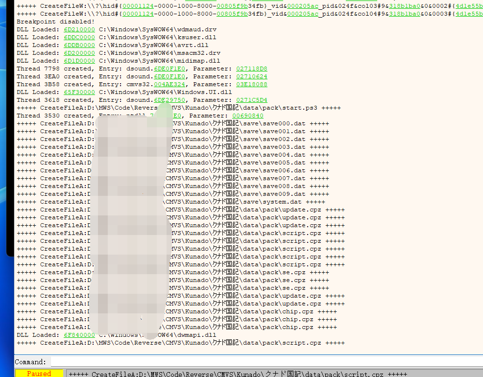

那么我们就从`start.ps3`这个未封包的脚步文件入手来看看它是怎么读取的，重新载入游戏，运行，断到打开`start.ps3`的位置

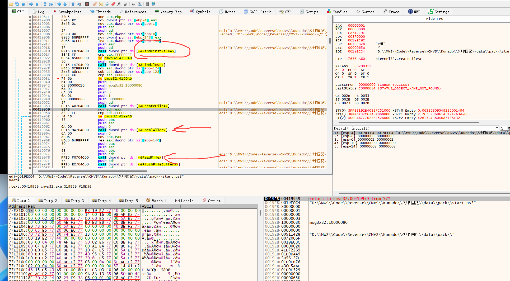

可以发现，它上面就有个查找文件的操作，后面就是分配内存和读取文件了，我们用IDA Pro来看大概的逻辑，整理一下，大概就这样

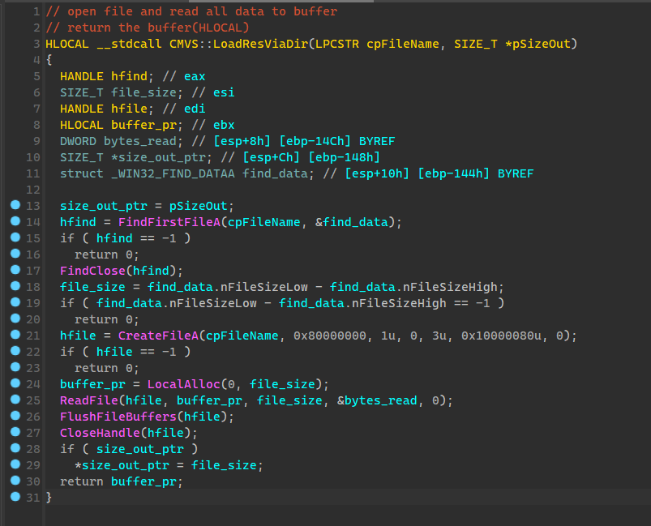

这个函数有两个参数，第一个是要读取的文件路径，第二个参数用来返回读取文件的大小，函数返回值是读取文件分配的内存的地址

这个函数首先用`FindFirstFileA` 来查找给定路径下是否存在这个文件，如果查找到了文件，就关闭查找句柄，接着把文件的大小读出来，然后打开文件，并分配一块内存，把文件整个读进去

对函数名按一下`x`发现有好多地方都使用了这个函数（当然，你那看到的肯定都是sub_xxxxx）

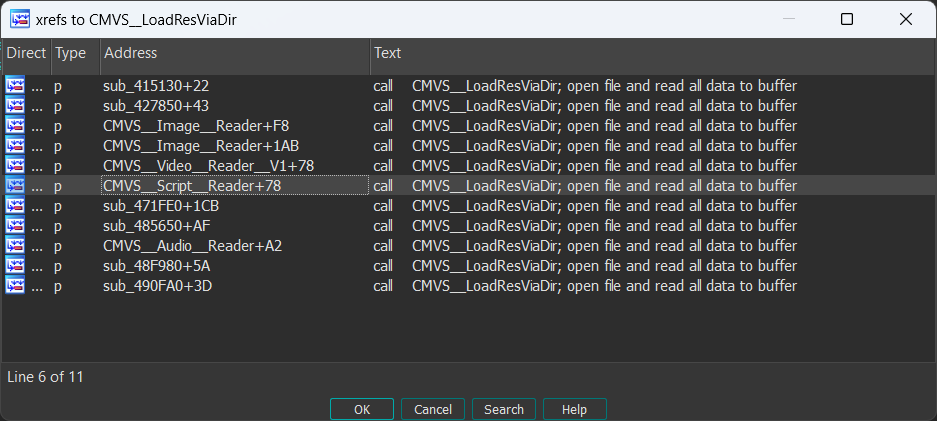

由于不能确定是哪个函数调用过来的，我们继续调试，看看返回到哪了。

这个函数我已经整理过了（整理的过程很简单，不断调试这个函数，搞清楚每一个变量的用途就行了）

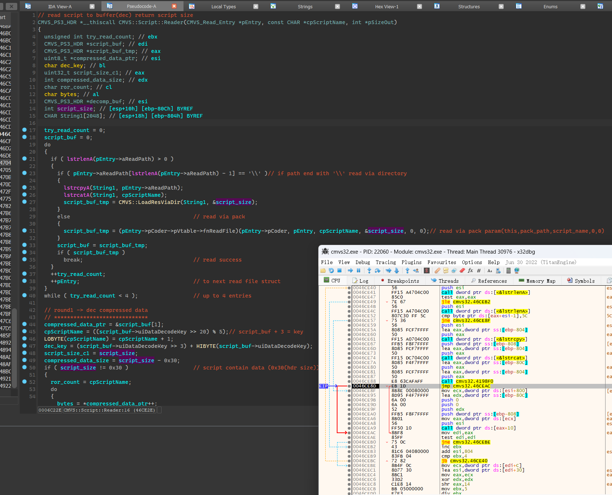

来看看这个读取过程，首先函数输入的参数分别是 一个对象的指针，需要读取的文件名，指针用来返回读取的大小，函数的返回值是ps3文件的内存地址

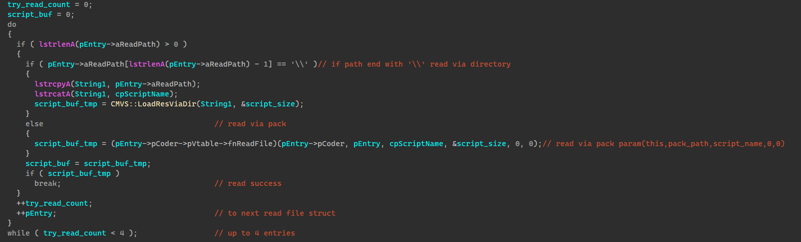

重点来看看这块

是一个`do--while`循环，这个循环最多尝试4次，每个循环对`pEntrt`加`CMVS_Read_Entry`结构的大小，从这我们不难看出，至少有四个 `CMVS_Read_Entry`结构

该的结构如下

```C
struct CMVS_Read_Entry
{
  char aReadPath[2048];
  CMVS_Pack_Coder *pCoder;
};
```

首先会判断`aReadPath`是否为空，不为空就判断末尾是否是`\\`也就是Windows路径的斜杠，为什么要判断这个呢？对这个部分不断调试就可以知道

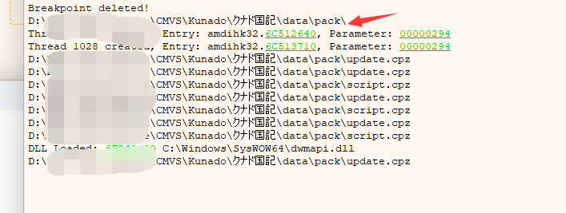

只有读取 `start.ps3`的时候末尾才是`\\`换句话说，其它时候输入的都是封包路径，而读取 `start.ps3`的时候输入的是一个文件夹的路径

那么接下来也就不难看出来了，如果输入的是文件夹路径，就把文件夹路径和要读取的文件名拼接后调用`CMVS::LoadResViaDir`直接把文件读进来，如果是个封包路径就走`CMVS_Read_Entry`里面的`CMVS_Pack_Coder`对象指针通过虚表里的函数从封包读取

说到这，就很容易想到hook这个函数，或者hook判断斜杠的地方就来控制免封包读取了

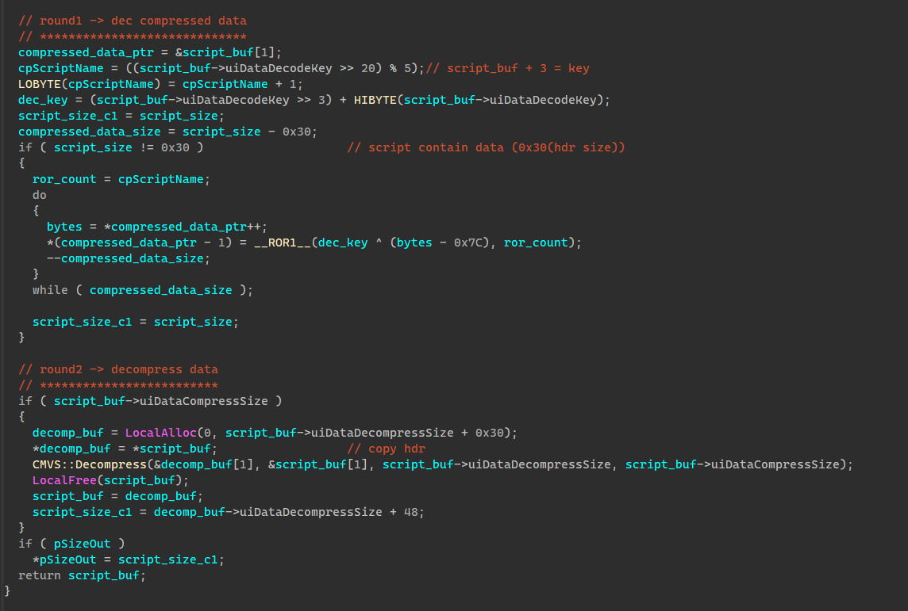

不过还有点要注意的是，如果免封包读取的话，要记得搞清楚文件的加密，这里可以看到这部分对文件进行了解密和解压，如果用garbro提取的ps3文件，它都是解密好的，直接免封包是不行的，要么把ps3文件加密回去，要么把这些解密代码跳过，跳过也得分是从封包还是从目录下读取的，因为从封包读取的依然是加密的。

这个函数是对ps3文件也就是脚本文件的读取，pb3也就是图片文件也有类似的逻辑，对`CMVS::LoadResViaDir`按`x`就能定位到pb3读取的部分，pb3同样有一层加密，但因为cmvs会自动判断图片文件的格式，所以直接用png代替即可

以下实现直接hook判断`\\`的地方和跳过解密

```c
	void __declspec(naked)CMVS_380_PS3Hook()
		{
			__asm
			{
				pushfd;
				pushad;
				mov eax, dword ptr[esp + 0x10];
				mov sg_cpFileName, eax;
			}

			if (FileExist())
			{
				__asm mov dword ptr[esp + 0x18], offset sg_aHookFolder;
				*sg_asDecodeScript = 0xEB;
				*sg_asDecompScript = 0xEB;
			}
			else
			{
				*sg_asDecodeScript = 0x74;
				*sg_asDecompScript = 0x74;
			}

			__asm
			{
				popad;
				popfd;
				ret;
			}
		}

		void __declspec(naked)CMVS_380_PB3Hook()
		{
			__asm
			{
				pushfd;
				pushad;
				mov eax, dword ptr[esp + 0x2C];
				mov sg_cpFileName, eax;
			}

			if (FileExist())
			{
				__asm mov dword ptr[esp + 0x4], offset sg_aHookFolder;
			}

			__asm
			{
				popad;
				popfd;
				ret;
			}
		}
```


说到这免封包就结束了。


## 分析读取文件流程

其实上面的知识就足够进行免封包读取了，但我们其实并不知道，那些文件夹路径和封包路径是从哪来的，还有虚表是从哪来的，读取的文件名又是从哪来的

为了搞清楚这些，需要对`pEntry`进行回溯，回溯后可以发现

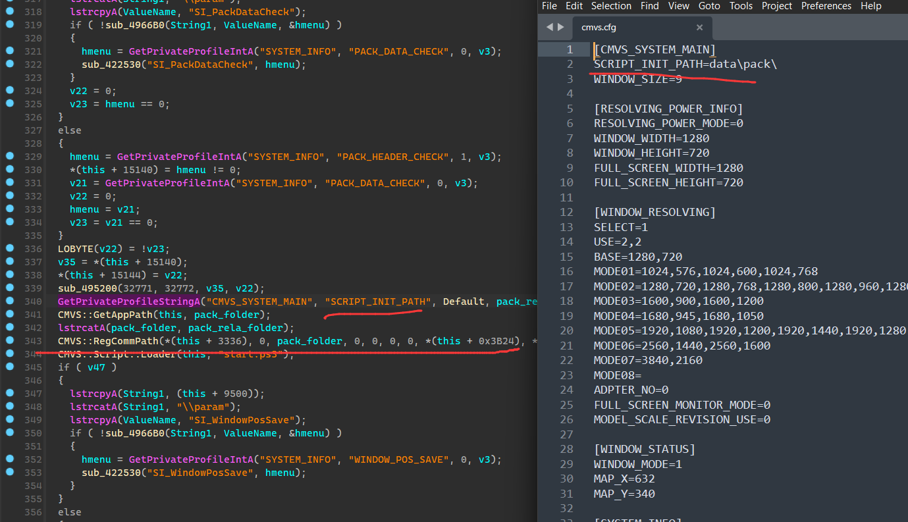

这个文件夹路径是游戏目录下`cmvs.cfg`里读取的，我们跟着这个路径的数据流向，可以发现有一个路径注册函数

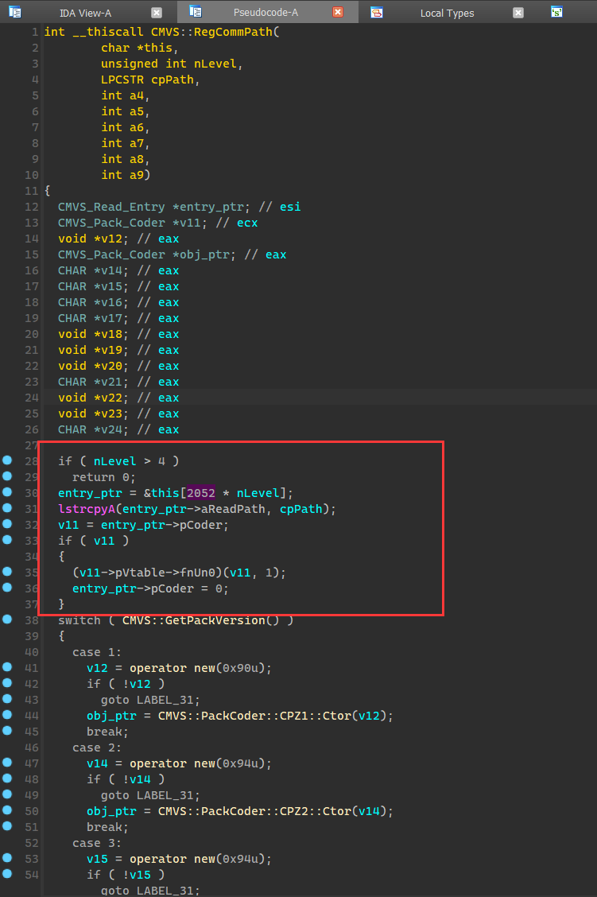

观察这个注册路径函数可以发现，每种类型文件的读取最多可以注册4个`CMVS_Read_Entry`结构，这个结构就是一个定长路径buffer+一个对象指针，对象的指针就是通过下面的switch依据获取设置的封包版本new出来的，也就是说这个对象其实就是封包对象，用来解析封包用的

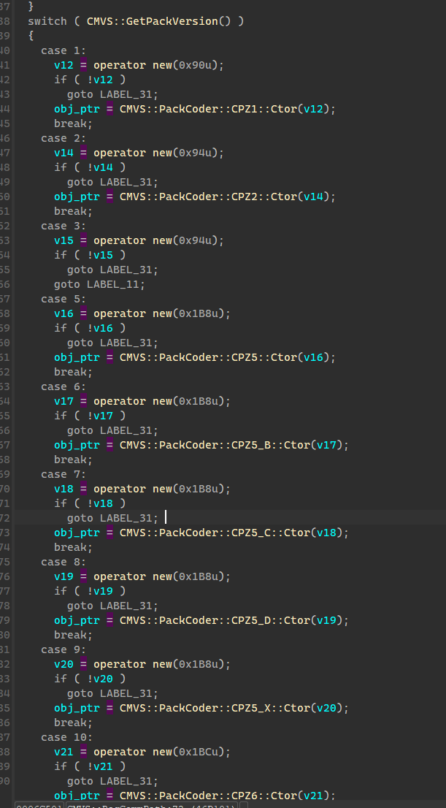

不难发现，最后new一个封包对象后，把指针赋给了`CMVS_Read_Entry`结构

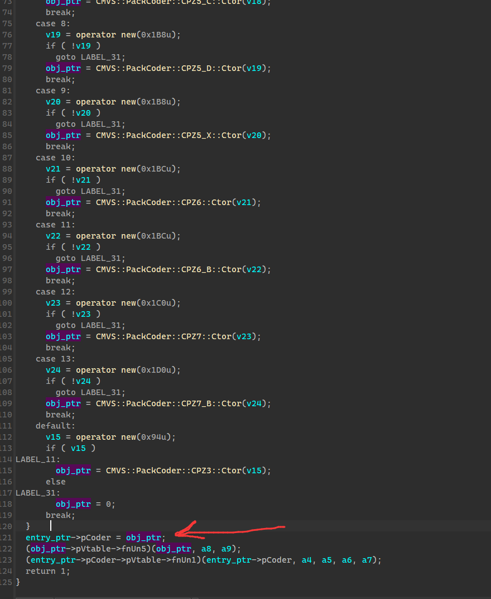

对这个注册函数按一下x可以发现有很多使用的地方，这些部分我都跟踪完了

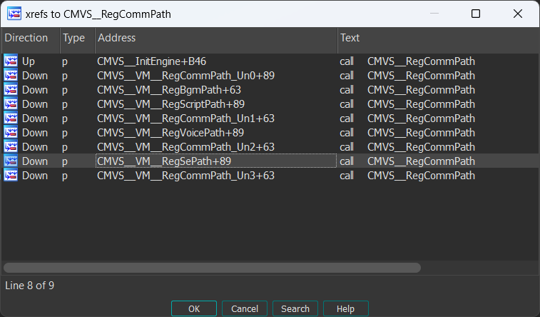

可以看到它对不同类型的资源文件单独设置读取对象，每个对象有四个`CMVS_Read_Entry`结构，这也就是`CMVS`引擎`update`封包读取的实现。

它的更新补丁是一个`update.cpz`封包和`start.ps3`文件，`start.ps3`里面就可以写注册读取路径的虚拟机代码.

比如`script`文件的读取，四个读取路径，最开始把第一个路径注册成`data\pack\`以此来加载目录下的`start.ps3`文件，执行`start.ps3`里的虚拟机代码又进行路径注册，把第一个路径注册成`update.cpz`封包，第二个路径注册成`script.cpz`

在读取`ps3`文件的时候，通过`do--while`循环读取这四个不同的`CMVS_Read_Entry`，这样就可以实现优先读取`update.cpz`封包里的数据，不更新的文件`update.cpz`会读取失败，那就读取下一个`CMVS_Read_Entry`结构，如果四个都失败游戏就会奔溃。

借助这个原理，我们其实可以修改`start.ps3`里的字节码来注册自定义的路径，或者hook注册路径函数来添加读取路径或修改读取的优先级。

当然它这个注册路径的函数也有多个

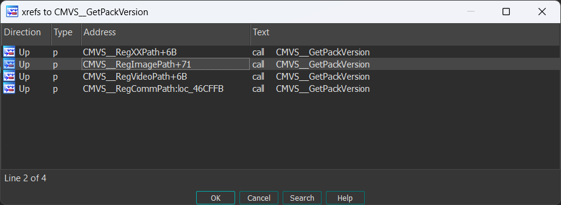

至于文件名是从何而来的？

其实只要回溯`CMVS::Script::Reader`也可以知道，这是从脚本里读出来的文件名字符串，回溯可以发现在一个很多case的switch里调用过来的，那个其实就是在解析虚拟机的字节码

至此读取流程我们就分析完了