# [Minori]英文版引擎汉化处理

你会说，为什么会有这种奇怪的需求？我也布道啊！
你会说，为什么不用日文版？啊？我怎么知道！
就™是用英文版

## 问题

对于一般的情况我们通常可以在日文版的基础上修改CreateFont和改编码检测范围来兼容GBK文本（因为SJIS和GBK只有范围上的差别都是DBCS编码）

但是英文版引擎来内部是单字节处理，也就是读取字符是用单字节，这就和GBK、SJIS有本质区别了。

由于是单字节所以要使用GBK就需要把单字节读取改成双字节读取，这个就很麻烦了

虽然 英文版内部是单字节处理字符的，但脚本还是SJIS格式，
而且很多地方也还保留着双字节处理的代码，当然显示文本的代码已经被它改成单字节处理，
虽然脚本还是SJIS格式，但是内部读取脚本的时候会把一些日文的双字节字符替换成单字节的字符

总结一下就是，这玩意英文版是在日文版的基础上改的，把一些关键部分的代码改成了单字节读取，
现在我们的目标就是让它重新支持双字节读取，这样就可以显示GBK或SJIS编码的文本了。

## 游戏

以下游戏有英文的版本（只列出部分）均在steam有销售

- eden* Steam
- eden* PLUS＋MOSAIC Steam
- ef - the first tale. Steam
- ef - the latter tale. Steam

## 提要

steam 版本记得用steamless脱壳

`eden* PLUS＋MOSAIC` 还会调用 `MultiByteToWideChar` 来转换到宽字节调用 `GetGlyphOutlineW` 获取字形

`ef` 有个线程会检查软件断点，调试的时候要kill掉，否则会导致游戏退出

解包封包密钥寻找参考这个： [FuckGalEngine](https://github.com/Inori/FuckGalEngine/tree/master/Minori)

也可以用这个适配好密钥的省得自己去找和重新编译： [fuckpaz](https://github.com/imKota/fuckpaz)

以上版本的处理完整代码： [Minori_EN_MOD](https://github.com/Dir-A/Minori_EN_MOD/)

## 初次分析

我们选 `2022-10-13 eden* steam eng` 版来分析

这里已经准备好了已经脱壳的游戏

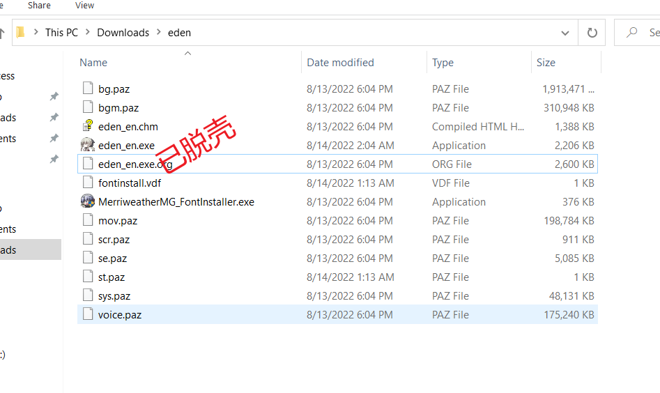

先翻翻导入了啥函数

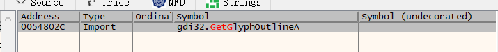

发现有个`GetGlyphOutlineA`
如果有导入这个函数的话，游戏很可能就是通过这个函数来获取单个字符的字形（图形数据）以此来显示文本的，来看一下这个函数的声明

```c
DWORD GetGlyphOutlineA(
  [in]  HDC            hdc,
  [in]  UINT           uChar,
  [in]  UINT           fuFormat,
  [out] LPGLYPHMETRICS lpgm,
  [in]  DWORD          cjBuffer,
  [out] LPVOID         pvBuffer,
  [in]  const MAT2     *lpmat2
);
```

典型的`GDI`函数，注意第二个`uChar`就是需要获取字形的字符，
这个函数一般会调用两次，

- 第一次调用是用来确认字形数据的大小
- 第二次才是读取字形数据，有点类似于 `MultiByteToWideChar `和 `WideCharToMultiByte`

给这个函数下断点，然后运行游戏，点击开始游戏，进入剧情显示文本，发现断下了

（游戏开始菜单不是也有显示文字 `New Game` 之类的嘛？为什么没断下？因为那是图片啊:P）

发现第一个传的是`0x93`，这个明显大于`0x7F`了，
也许是欧洲某些地方的编码会在单字节的情况下使用`0x7F`以上的空间

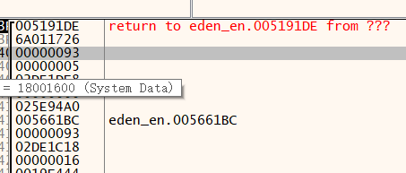

这个`0x93`传了两次，和刚刚说的一样，这时候看看游戏画面

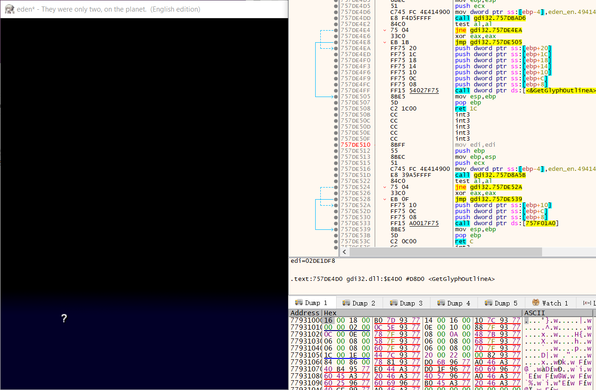

居然是显示一个问号，奇葩了。

直接运行试了一下，发现确实有一部分文字是问号，应该是标点符号之类的，
估计这个只能在英文编码下显示正常，先不管这个了，继续看接下来的调用。


接下来传的是`0x49`显示` ‘ I ’`，确实是符合的，说明这个引擎确实是使用`GetGlyphOutlineA`来获取字形的

那么我们其实可以从 `GetGlyphOutlineA` 的`uChar`参数回溯来找到它读取字符串的地方，

（为什么？因为现在传给 `GetGlyphOutlineA` 的不就是一个字符嘛，字符不就是从字符串上切下来（读取）的？）

回溯的过程就不在这演示了，可以用`IDA Pro`去跟踪参数的传递比较高效

最终在 RVA: `0x10E363` 的地方找到了这个从字符串里读取单个字符的位置

（注意下下面的 `0x5C, 0x20, 0x23`之类的，下次找这个位置就可以搜这些常量了）

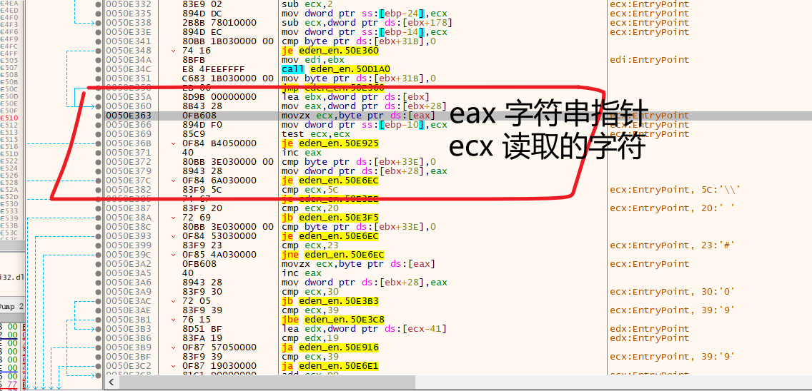

可以看到是byte 读取，也就是只读取一个字节，这块我们就需要Hook让它读取双字节了

（啊？为什么不直接把`byte`改成`word`？因为`SJIS`、`GBK`的双字节是有范围的啊:P）

```ASM
movzx ecx, byte ptr ds:[eax]
mov dword ptr ss:[ebp-0x10], ecx
```

这两行汇编改成call，因为一个`E8 Call`需要5个字节（x32），多出来的一个字节`Nop`，跳到下面的函数，然后处理完成后返回到下一行汇编

```c
static void __declspec(naked) ReadChar_Hook()
{
	_asm
	{
		movzx ecx, byte ptr[eax]; // 先读取一个字节
		cmp ecx, 0x81;
		jb not_DBCS;
        
        is_DBCS: // 如果 大于 0x81 就读取一个字节放 ch
		mov ch, byte ptr[eax];
		inc eax; // eax + 1 然后读一个字节放 cl
		mov cl, byte ptr[eax];
        
         not_DBCS: // 如果 小于 0x81 就写入buffer然后返回
		mov dword ptr[ebp - 0x10], ecx;
		ret; // 返回下一行汇编 也就是 test ecx, ecx 上面的nop
	}
    // ？ 为什么要这样？大小端问题！
    // 这边如果不颠倒字节顺序，那就需要在 GetGlyphOutline 进行字节顺序颠倒
    // 不然输入给 GetGlyphOutline 的字符的字节是倒过来的
    // 看不懂？复习一下GBK和SJIS编码范围吧！
}
```

现在我们解包`scr.paz`（注意里面的脚本是SJIS编码的）

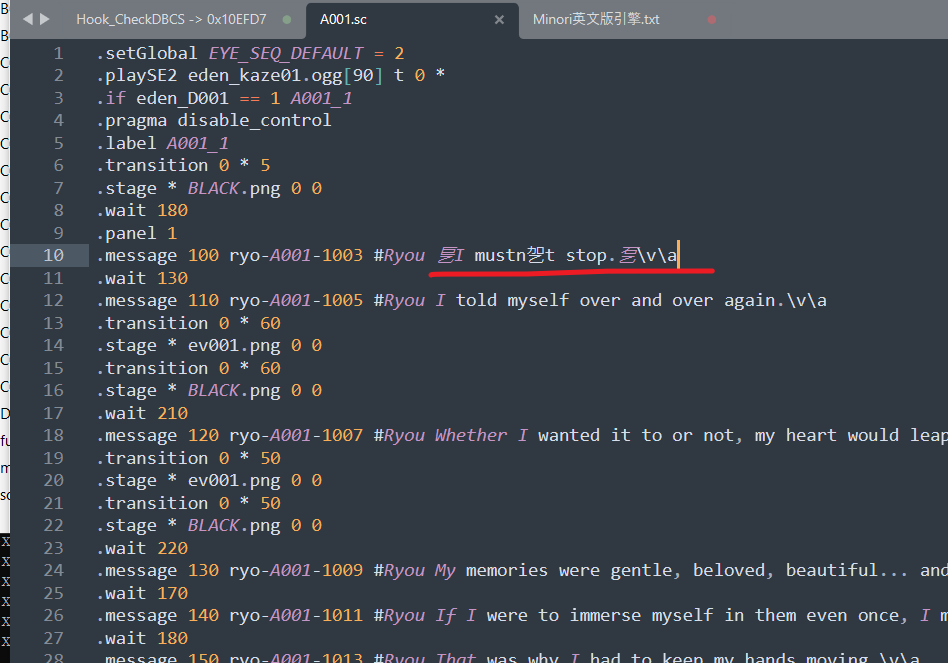

这里用GBK来读取，让大家能看清楚哪些是SJIS的字符（因为这样会乱码），可以发现第一句话就有三个乱码的字符，其实就是三个SJIS编码的标点符号

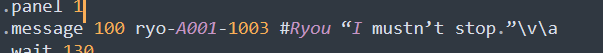

刚刚这里游戏显示的第一个字符是一个`？`，在`GetGlyphOutlineA`传的是`0x93`这个字符，显然单个字节也和SJIS编码扯不上关系，
那么只有一种可能，那就是这个SJIS的字符被替换成了`0x93`这个字符

现在断读取字符的地方（RVA: `0x10E363` ）看看buffer里这些SJIS字符串被替换成啥了

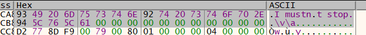

可以发现都给换成大于0x7F的单字节了，来看看这个第一个引号的SJIS十六进制表示

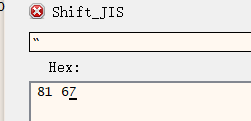

`0x81, 0x67` ，那就是 `0x8167`  ->  `0x93`

如果要替换的话，那显然会在代码里有 `cmp，0x8167`之类的，或者是从内存里读取一个替换表之类的

但是如果直接搜索内存` 0x8167` 显然是不现实的，因为这两个字节的组合并没有唯一性，能搜到一大堆

先尝试常量搜索，如果不行，就需要去跟从封包读取脚本的地方，找到读取进来的脚本buffer从上面找到这一行文本，并下一个硬件断点来跟踪。

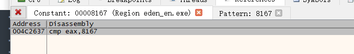

幸运的是常量搜索一搜就有了唯一的结果

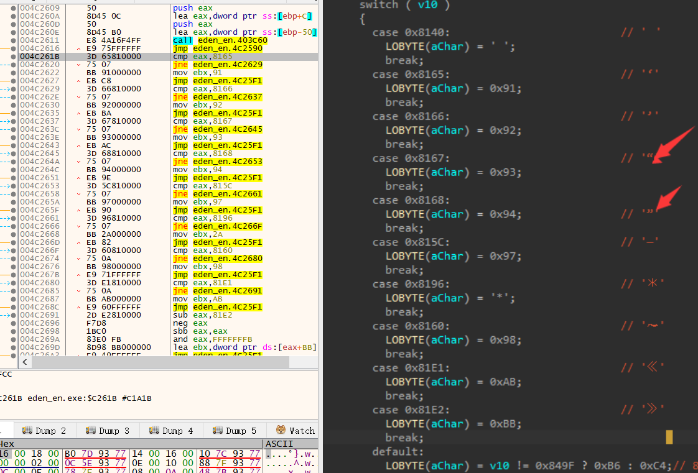

这里在`IDA` 中把上面一堆`cmp`的`SJIS`字符标了出来，可以发现这些字符都被替换成了单字节的

有些是正常的`ASCII`里`0x7F`范围内的字符，有些是超过`0x7F`的

这块我们等下再看吧，先往上翻，然后打开`IDA Pro`反编译一下比较方便看


简单说了一下这个函数的功能，就是一行行读取脚本，然后过滤里面的字符，
比如`0x8140`就替换成`0x20`

过滤的条件是，

- 双字节并在`SJIS`编码范围内，就进下面的`switch`进行替换字符，
- 如果读入的双字节字符不在`switch`的`case`里，就默认换成`0xB6`，也就是`74`


值得注意是最后要把处理完成的字符赋值给`target_char`，但是这里赋值的是`tmp_char也`就是单字节的字符

好了了解完上的内容，我们知道，目前我们至少需要改三处

- `SJIS`范围`0x81 0x9F`
- `switch`里的替换要跳过，或者改成`SJIS`或`GBK`
- 最后的字符要让它写入双字节而不是单字节

```C
static BYTE sjis_range[] = { 0xFE };
WriteMemory((LPVOID)(g_dwExeBase + 0xC25BF), sjis_range, sizeof(sjis_range));
// 还有几处类似的0x81 0x9F -> 搜索常量0x9F下断点判断是否使用
WriteMemory((LPVOID)(g_dwExeBase + 0xD20DE), sjis_range, sizeof(sjis_range));
WriteMemory((LPVOID)(g_dwExeBase + 0x122395), sjis_range, sizeof(sjis_range));
WriteMemory((LPVOID)(g_dwExeBase + 0x10E18D), sjis_range, sizeof(sjis_range));
```

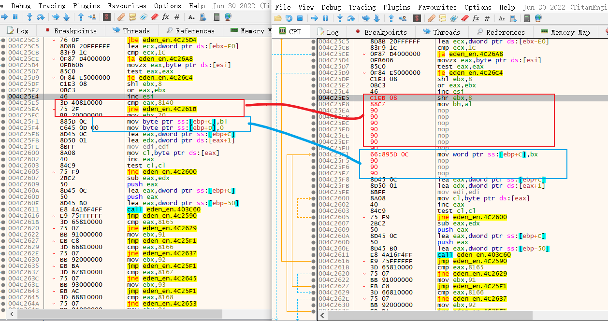

```C
static BYTE asm_skip_map[] =
{
	0xC1, 0xEB, 0x08,                           // shr ebx, 0x8
	0x88, 0xC7,                                 // mov bh, al
	0x90, 0x90, 0x90, 0x90, 0x90, 0x90, 0x90,   // Nop
	0x66, 0x89, 0x5D, 0x0C,                     // mov word ptr ss:[ebp+0xC], bx
	0x90,0x90,0x90                              // Nop
};
WriteMemory((LPVOID)(image_base + 0xC29A5), asm_skip_map, sizeof(asm_skip_map));
```

这样处理后配合`Hook CreateFont` 的`Charset`改成`0x86` 字体改成 `黑体 `

然后修改脚本打包回去，让我们来看看效果

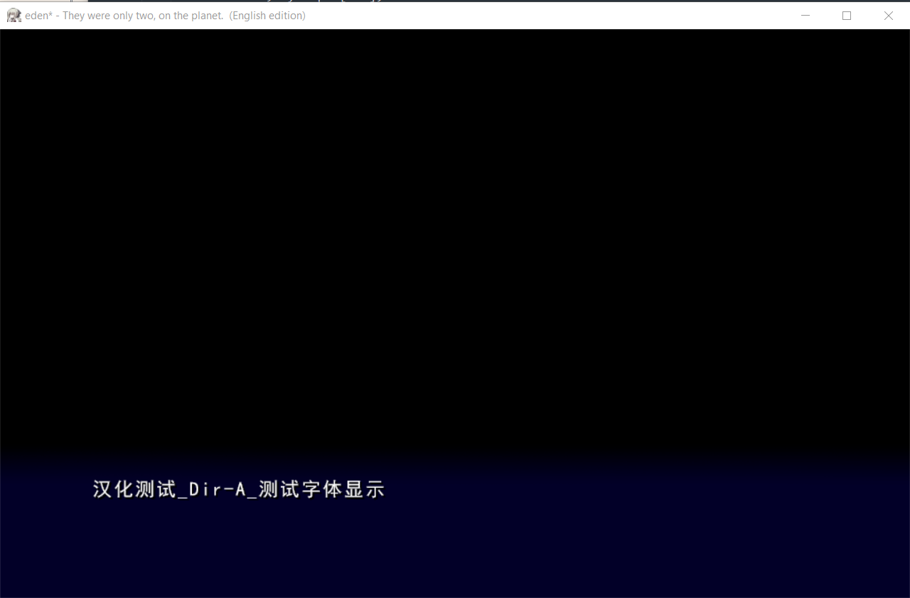

非常的`Amazing`啊，正常显示中文了

（如果显示仍然有问题，要从上面各个点去排查，特别是RVA: `0x10E363`这个地方，可以看到被处理后的脚本字符串啥样，也就是说如果你在 RVA: `0x10E363`下断点，看传进来的字符串，发现居然是有问题的，说明前面处理出了问题，可能是我们上面提到的地方没改好，也可能是还有地方去改动了字符串，或者RVA: `0x10E363`这个地方就没问题，那么就说明其后的处理有问题，这时候断GetGlyphOutlineA 看看传过来的字符有没问题，不断回溯跟踪，说白了就是两点一线的事，头尾看看，逐渐往中心靠近）

## 再次分析

当然了先别高兴太早，为什么？不妨看看人物名


人物名两边有奇奇怪怪的符号，检查脚本文件也没发现人物名有附加符号

这可能还不是什么大问题，那最大的问题是什么？

如果你修改人物名，人物立绘就面瘫了（悲

具体来说，就是这个游戏本来人物说话的时候嘴巴是会动眼睛是会眨的，现在就没这个效果了

好吧我们先来解决人物名前后有奇奇怪怪的字符的问题


我们先检索一下封包里的资源，确认各个封包都没人物名的对照表之类的玩意

好，确认没有后，继续调试

来到  RVA: `0x10E363` 这个地方，看看读进来的字符串是啥

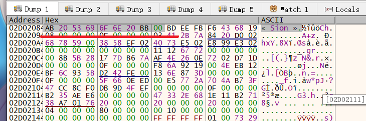

原来是这样的

这个 `‘ « ’` 字符比较奇怪 ，大于`0x7F`，可能是某种欧洲用的单字节编码里的字符，`x64dbg`只有`dump`窗口可以显示出来，`Edit`窗口无法显示（查了一下说是法语里的符号）

而由于这个符号大于`0x7F`也大于`0x81`对`DBCS(SJIS)(GBK)`的读取也产生了影响

所以我们的目标是把这个符号换掉，如果直接搜索`0xAB`怕是很难找到这个符号的位置

之前那个`switch`里也有一个替换`0xAB`的，但是和这个也没什么关系，因为这个字符并不是从脚本里拿出来的

现在的一个入手点就是在`switch`那个地方，等它处理完后对人物名下断点跟踪，看看它拼接字符串的情况

反正不管如何，从`switch`跟踪或者从 RVA: `0x10E363` 回溯都行，最后可以找到这个地方

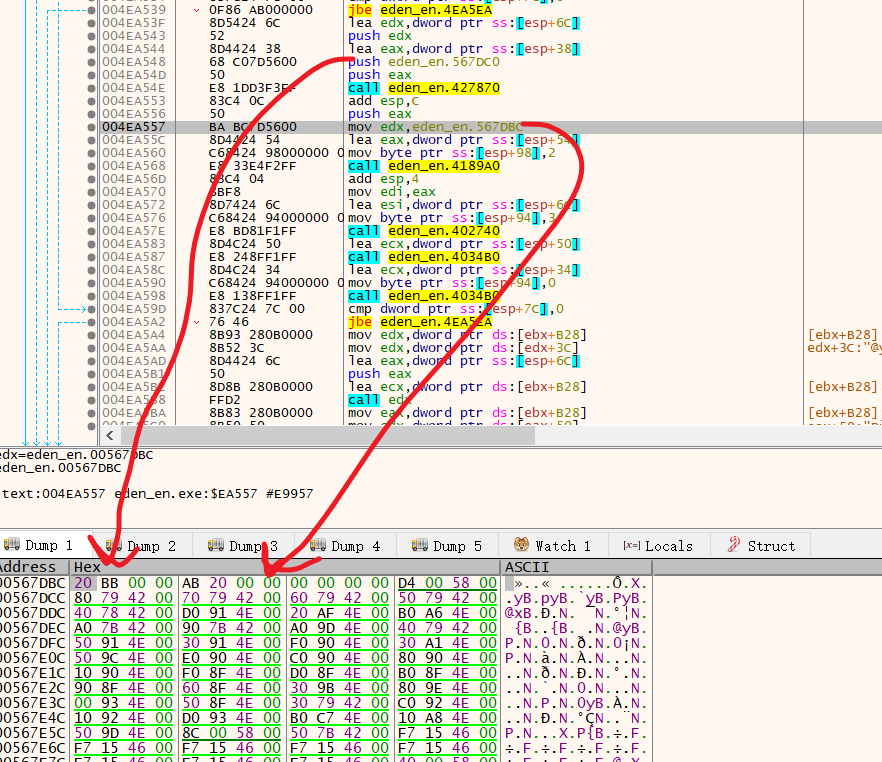

所以下次我们直接搜索 `0x20 0xBB 0x00 0x00 0xAB 0x20 0x00 0x00` 就好了

现在把这个两个符号换掉就可以解决人物名两边的符号问题了

```C
static BYTE bracket_r[] = { 0x20,0xA1,0xBF };
static BYTE bracket_l[] = { 0xA1,0xBE,0x20 };
WriteMemory((LPVOID)(g_dwExeBase + 0x167DBC), bracket_r, sizeof(bracket_r));
WriteMemory((LPVOID)(g_dwExeBase + 0x167DC0), bracket_l, sizeof(bracket_l));
```


下面，来解决人物名的问题，在游戏没运行的状态下搜一下人物名

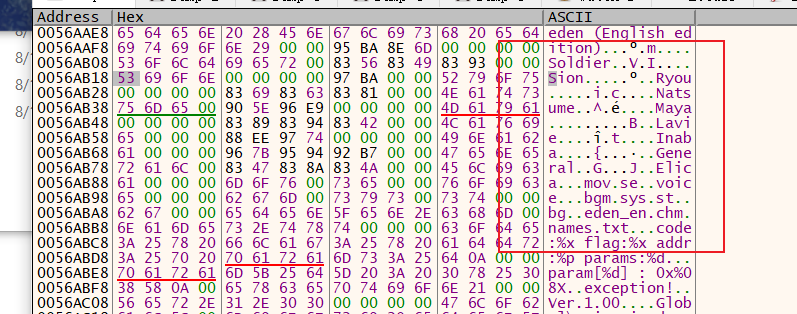

可以发现确实有个表，下个硬件断点，跟踪读取

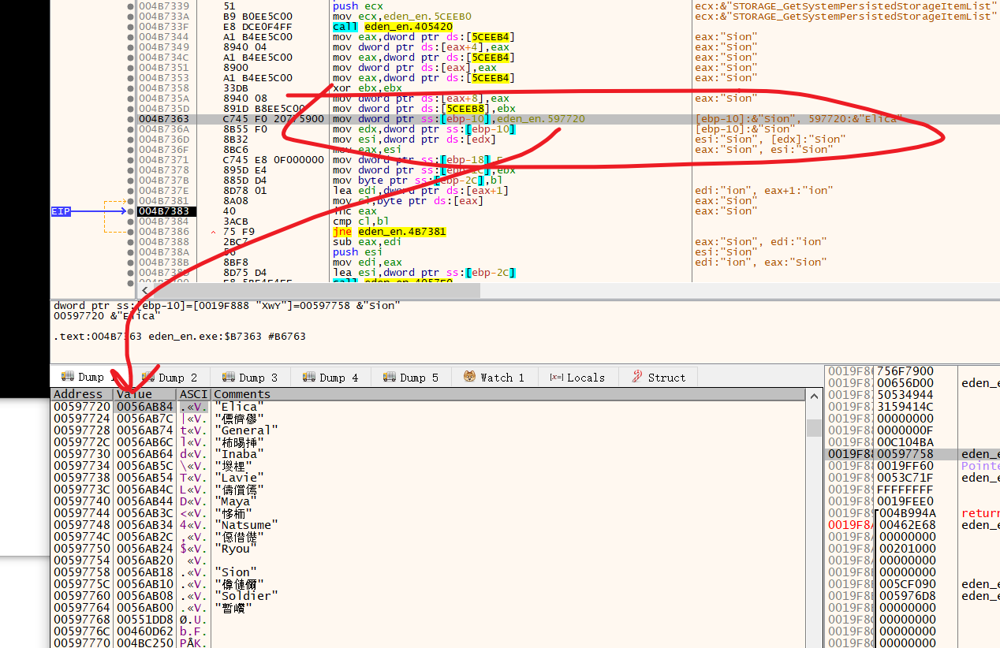

这个表就得到了，由于我们要翻译的人物名可能会比较原来的需要更多的空间，
所以可以直接把这些地址指向一个buffer来达到修改人物名的目的

值得注意的是，日文的人物名也记录在其中，这个不需要修改，因为这个是用来定位动画文件的。

```C
static UCHAR** pTable = (UCHAR**)(g_dwExeBase + 0x197720);
static UCHAR aElica[]   = { 0xB0, 0xAC, 0xC0, 0xF6, 0xBF, 0xA8, 0x00 };
static UCHAR aGeneral[] = { 0xD7, 0xDC, 0xB2, 0xBF, 0xB2, 0xBF, 0xB3, 0xA4, 0x00 };
pTable[0] = aElica;
pTable[2] = aGeneral;
```

## 继续分析

以上就是主要的分析过程了，但不同的游戏还会有一些小差异

比如 `eden* PLUS＋MOSAIC` 调用的是 GetGlyphOutlineW 这是因为在读取到单个字符后，它调用了 `MultiByteToWideChar` 转换成宽字符来输出，所以`MultiByteToWideChar`的`CodePage`需要改，`MultiByteToWideChar`之前还有个`switch`也是用来修改字符的，也需要改， 字节序会颠倒需要自己改过来。

（如果在读取字符的地方没颠倒字节顺序，下面的就可以直接处理，因为下面的汇编eax的数据写到内存里的就是正常的字节顺序了，如果在读取字节的地方调整了字节顺序，下面的代码就需要颠倒字节顺序，总之，去断`GetGlyphOutline`如果发现字节顺序颠倒了，就把去倒回来）

```c
VOID __declspec(naked) ToWideChar_Hook()
{
	__asm
	{
		// Process Return Address
		pop edx;
		add edx, 0x77;
		push edx;

		// If Not DBCS Just Reture
		cmp eax, 0x81;
		jb Not_DBCS;

		// If DBCS Convert to WideChar
		xor edx, edx;
		mov dword ptr ss : [ebp - 0x8] , edx;   // Cls MultiByteStr Buffer
		mov dword ptr ss : [ebp - 0xC] , edx;   // Cls WideCharStr Buffer
		mov word ptr ss : [ebp - 0x8] , ax;     // Write MultiByteStr
		push 0x1;                               // Param6: cchWideChar
		lea eax, ss: [ebp - 0xC] ;              // &WideCharStr
		push eax;                               // Param5: lpWideCharStr
		push 0x2;                               // Param4: cbMultiByte
		lea ecx, ss: [ebp - 0x8] ;              // &MultiByteStr
		push ecx;                               // Param3: lpMultiByteStr
		push 0;                                 // Param2: dwFlags
		push 0x3A4;                             // Param1: CodePage
		call MultiByteToWideChar;
		mov edx, dword ptr ss : [ebp - 0xC] ;
		mov dword ptr ss : [ebp - 0x8] , edx;
		mov dword ptr ss : [ebp - 0x4] , edx;   // Out Buffer

	Not_DBCS:
		ret;
	}
}
```

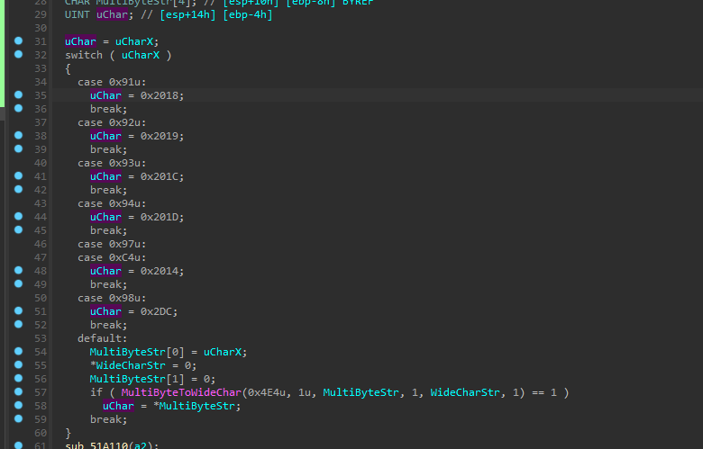

`ef` 前面也说过，过程差不多，但是会有一个线程扫软件断点，这个很简单，下断点后，转到dump窗口，对下断点的地方下一个硬件读取断点，就可以轻松定位检测线程，kill掉即可，实际hook的时候不影响，所以无需处理。
